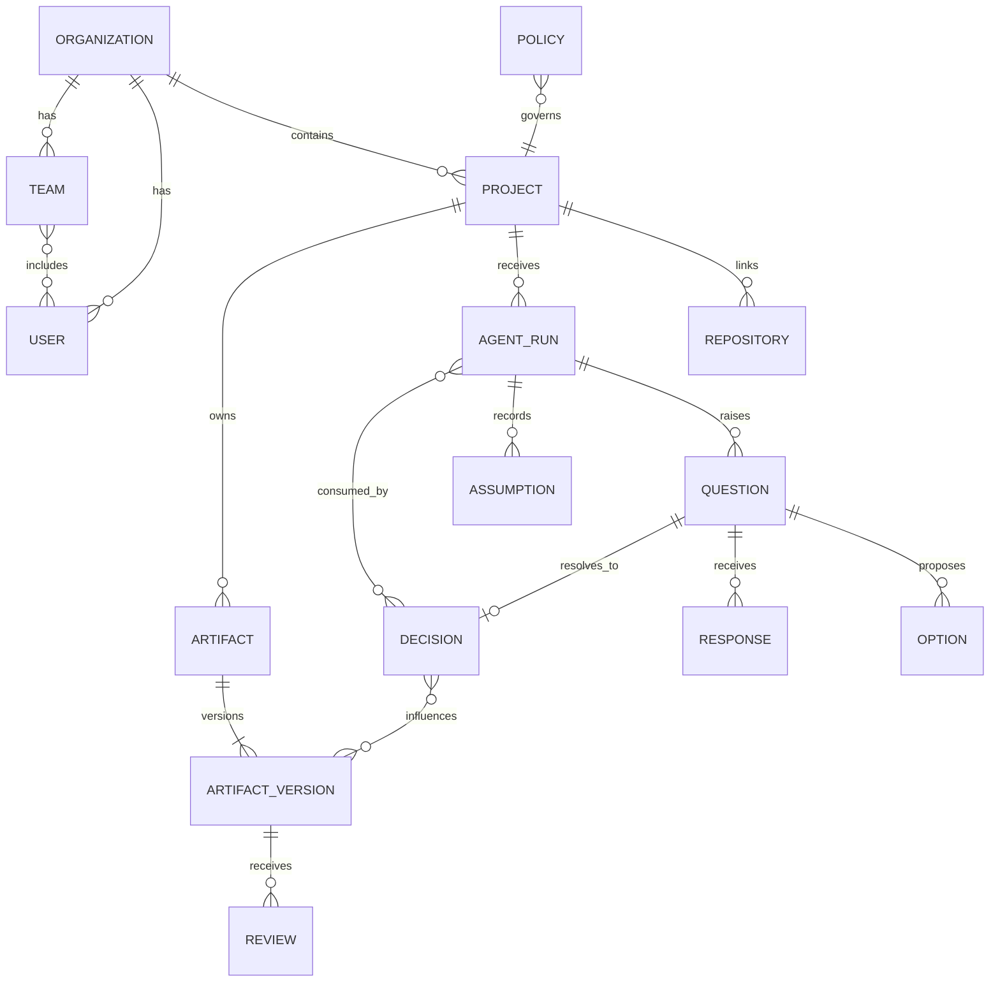
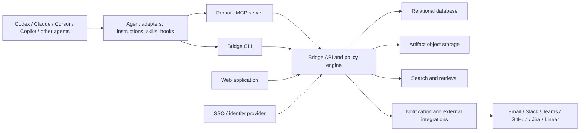

# Bridge Product Requirements Document

| Field | Value |
|---|---|
| Product name | Bridge (working name) |
| Document status | Draft for founder review |
| Version | 0.1 |
| Last updated | 2026-08-07 |
| Initial product type | Hosted web application, API, remote MCP server, and CLI |

## 1. Executive summary

Bridge is a shared decision and specification control plane for teams working with AI agents.

Coding and knowledge-work agents regularly encounter questions that require business, architecture, data, security, QA, design, or operational judgment. Today, those questions and their answers usually remain inside one private agent session. The current user may accept a recommended default despite not owning the decision, future agents cannot reliably discover the answer, and the team cannot see which assumptions shaped the resulting work.

Bridge gives agents a structured way to search approved project context, raise consequential questions, record low-risk assumptions, and publish specifications. It routes requests to the appropriate people, lets an authorized decision owner accept an answer, and makes the resulting decision available to current and future agent runs.

The product is not intended to store every agent message. It records durable project knowledge: questions, decisions, assumptions, specifications, approvals, provenance, and their relationship to work products.

## 2. Product thesis

> Every consequential agent action should be backed by approved precedent, an explicit human decision, or a visible and reversible assumption.

Bridge should become the system of record for why an agent-assisted team built something a particular way.

The initial wedge is software teams using more than one AI coding agent. The underlying model can later support product, analytics, operations, finance, legal, and other agent-assisted domains.

## 3. Problem statement

### 3.1 Primary problems

1. **Expertise mismatch:** The person operating an agent is often not the owner of architecture, business, security, data, or QA decisions.
2. **Session-local knowledge:** Questions, answers, plans, and specifications disappear into private agent conversations.
3. **Unsafe defaults:** Recommended answers are frequently selected only to unblock the agent.
4. **No provenance:** Teams cannot identify who approved a choice, why it was selected, or which work depended on it.
5. **Repeated questions:** New sessions and different agents repeatedly ask questions the organization has already answered.
6. **Conflicting implementations:** Agents can make contradictory assumptions across branches, repositories, or work items.
7. **Specification drift:** Agent-generated plans and specifications are not consistently reviewed, versioned, or kept aligned with implementation.
8. **Poor handoff:** Another teammate or agent cannot reliably continue from the same approved context.

### 3.2 Why existing tools are insufficient

Issue trackers manage work, chat tools manage discussion, documentation systems store pages, and observability products inspect runs. None is optimized for the lifecycle:

```text
agent uncertainty -> role routing -> human decision -> approved context -> agent reuse
```

Bridge should integrate with these systems rather than replace them.

## 4. Goals and non-goals

### 4.1 MVP goals

- Give agents one vendor-neutral interface for retrieving approved project context.
- Capture consequential questions in a structured, reviewable form.
- Route questions to a role, team, or named decision owner.
- Allow discussion while preserving one authoritative accepted answer.
- Convert accepted answers into durable, versioned decisions.
- Record low-risk assumptions without unnecessarily blocking work.
- Publish, review, approve, and supersede specifications.
- Link decisions and artifacts to projects, repositories, work items, agent runs, commits, and pull requests.
- Provide auditable identity, authorization, and history.
- Support continuation in a later agent session using the same approved context.

### 4.2 Non-goals for the MVP

- Replacing Jira, Linear, GitHub, Slack, Teams, or documentation platforms.
- Recording complete private conversations or hidden model reasoning.
- Guaranteeing automatic resumption of every vendor's exact agent session.
- Building a general-purpose workflow engine.
- Using majority voting as the source of decision authority.
- Automatically approving security, privacy, legal, destructive, or production-sensitive actions.
- Supporting every agent client and enterprise integration at launch.
- Building an autonomous panel of expert agents that can overrule humans.

## 5. Target customers and personas

### 5.1 Initial ideal customer profile

- A software organization with approximately 10–250 contributors.
- Uses at least two coding-agent clients or expects agent usage to expand.
- Works asynchronously across multiple roles or time zones.
- Has repeated architecture, product, security, data, or testing decisions.
- Experiences rework caused by hidden assumptions or inconsistent agent output.

### 5.2 Personas

#### Agent operator

A developer, analyst, product manager, or other contributor directing an agent. Wants work to continue without being forced to answer questions outside their authority.

#### Decision owner

The accountable architect, product owner, domain expert, data steward, security owner, QA lead, designer, or operational owner. Wants concise context, meaningful options, and explicit control over final decisions.

#### Reviewer

A subject-matter expert who recommends, challenges, or adds constraints but does not necessarily own the final answer.

#### Team lead or delivery manager

Wants visibility into blocked agent work, unanswered questions, decision latency, and implementation risk.

#### Organization administrator

Configures SSO, projects, roles, policies, retention, integrations, and access controls.

#### AI agent

A non-human actor that searches approved context, submits structured questions, records assumptions, publishes artifacts, and reports run state. An agent does not normally have permission to approve its own output.

## 6. Jobs to be done

- When an agent asks a question outside my expertise, route it to the person who owns that decision so I do not guess.
- When a team has already answered a similar question, give the agent the accepted decision before it interrupts anyone.
- When an agent must proceed under uncertainty, make its assumption visible and reversible.
- When an agent creates a specification, make it reviewable and reusable outside the session.
- When a decision changes, show what specifications and implementation work may be affected.
- When another person or agent continues the work, provide the same approved context with provenance.
- When reviewing a pull request, show which decisions and specifications guided the change.

## 7. Product principles

1. **Approved context over raw history:** Retrieve concise, relevant, authoritative information rather than entire conversation logs.
2. **Authority over popularity:** Discussion and voting may inform a decision, but an authorized owner accepts it.
3. **Provenance by default:** Every durable item identifies its source, actor, scope, and history.
4. **Risk-proportional interruption:** Low-risk reversible uncertainty becomes an assumption; high-risk uncertainty blocks affected work.
5. **Humans control consequential approval:** Agents can recommend but cannot self-approve protected actions.
6. **Vendor neutrality:** Canonical data and policy live in Bridge, with adapters for individual agent products.
7. **Explicit scope:** Decisions state where they apply: organization, project, repository, component, branch, environment, region, customer, or work item.
8. **No silent mutation:** Material changes create a new version or superseding record.
9. **Integration rather than replacement:** Existing systems remain the source of truth for work items, source code, and team communication where appropriate.

## 8. Core domain model

### 8.1 Entities

| Entity | Purpose |
|---|---|
| Organization | Tenant boundary for identity, policy, and billing |
| User | Human identity authenticated through SSO or local development login |
| Team | Group of users used for routing and access |
| Role | Configurable competency or decision authority, such as product owner or security reviewer |
| Project | Primary context and access boundary |
| Repository | Source repository linked to a project |
| Component | Optional subsystem with an owner and policies |
| Work item | External or internal task, issue, story, incident, or feature |
| Agent identity | Service identity representing an agent integration |
| Agent run | One execution or session, including status and provenance |
| Question | Structured request for information, a decision, review, or approval |
| Option | Proposed answer and its trade-offs |
| Response | Comment, proposed answer, clarification, or recommendation |
| Decision | Accepted authoritative answer with rationale and scope |
| Assumption | Unapproved but visible temporary premise used to continue work |
| Artifact | Logical specification or project document |
| Artifact version | Immutable version of artifact content and metadata |
| Review | Request and response associated with an artifact version |
| Policy | Machine-readable rule controlling routing, approval, and agent behavior |
| Link | Relationship to a file, commit, pull request, issue, URL, or other entity |
| Audit event | Immutable security and lifecycle event |

### 8.2 Entity relationships



## 9. Classification and lifecycle

### 9.1 Question types

- **Information:** A factual answer is needed from a trusted human or system.
- **Decision:** One option must be selected by an accountable owner.
- **Approval:** Permission is required for a protected action.
- **Review:** An artifact or proposed approach requires expert feedback.
- **Assumption challenge:** An agent has proceeded under an assumption that should be validated.
- **Blocker:** Work cannot safely continue without resolution.

### 9.2 Question lifecycle

```text
Draft -> Open -> In discussion -> Answer proposed -> Accepted -> Closed
                  |                    |
                  |                    +-> Rejected -> In discussion
                  +-> Needs clarification

Open/In discussion -> Expired | Cancelled | Duplicate | Superseded
```

An accepted question creates or updates a Decision. Closing a question without acceptance must record a reason.

### 9.3 Decision lifecycle

```text
Active -> Under review -> Active
   |
   +-> Superseded
   +-> Expired
   +-> Revoked
```

Old decisions remain readable for audit and impact analysis but are excluded from current context unless explicitly requested.

### 9.4 Artifact lifecycle

```text
Draft -> In review -> Approved -> Superseded -> Archived
```

Approved content is immutable. A material update creates a new version.

### 9.5 Assumption lifecycle

```text
Active -> Confirmed as decision
       -> Rejected
       -> Expired
       -> Superseded
```

## 10. Risk and interruption policy

Bridge must let each organization configure risk rules. The default policy should be conservative:

| Risk level | Agent behavior | Example |
|---|---|---|
| Low, reversible | Record assumption and continue | Internal naming or formatting choice |
| Medium | Ask asynchronously; continue unaffected work | UX behavior with limited impact |
| High | Block affected work | Public API contract or persistent data model |
| Protected | Require authorized explicit approval | Production deletion, auth, privacy, security exception |

Every question should include risk, reversibility, blocking status, affected scope, and a proposed fallback. Server-side policy may override the agent's classification.

## 11. Primary user journeys

### 11.1 Agent preflight retrieves project context

1. An agent starts a meaningful task.
2. It identifies the project, repository, branch, component, and work item.
3. It calls `bridge_get_context` with a concise task description.
4. Bridge returns relevant active decisions, approved artifact versions, policies, and unresolved assumptions with provenance.
5. The agent acknowledges the context IDs it used in its run record.
6. The agent begins work without repeating answered questions.

### 11.2 Agent raises a blocking decision

1. The agent cannot safely choose between alternatives.
2. It searches for an existing decision and finds none.
3. It calls `bridge_create_question` with context, intended roles, options, trade-offs, recommendation, risk, and links.
4. Bridge deduplicates the question or creates a new record.
5. Routing policy assigns a decision owner and reviewers.
6. The agent receives a question ID and marks the affected run `waiting_for_human`.
7. Bridge notifies the assignees.
8. Humans discuss and propose answers.
9. An authorized owner accepts one answer with rationale and scope.
10. Bridge creates a Decision and notifies the operator.
11. The same or a later agent run retrieves the decision and continues.

### 11.3 Agent records a reversible assumption

1. The agent identifies low-risk uncertainty.
2. Policy permits progress without blocking.
3. The agent calls `bridge_record_assumption`, including the proposed behavior, rationale, confidence, reversal cost, expiry, and affected scope.
4. Bridge makes the assumption visible in the project and optionally requests later validation.
5. If rejected, Bridge identifies linked work that may require changes.

### 11.4 Agent publishes a specification

1. The agent generates a PRD, architecture note, API contract, test plan, or other artifact.
2. It publishes a draft using `bridge_publish_artifact`.
3. Bridge records the source run and decisions used.
4. The agent or operator requests review from configured roles.
5. Reviewers comment or request changes.
6. An authorized owner approves a version.
7. Future context retrieval returns the approved version by default.

### 11.5 Decision is changed after implementation

1. A decision owner opens an active decision and selects **Supersede**.
2. The owner supplies the replacement answer, rationale, and effective scope.
3. Bridge creates a new Decision and preserves the original.
4. Bridge identifies dependent artifacts, open agent runs, work items, branches, commits, and pull requests.
5. Owners receive an impact summary and can create follow-up work.

## 12. Functional requirements

Priority uses **P0** for launch-critical, **P1** for near-term, and **P2** for later value.

### 12.1 Identity and organization

> **Scope update (2026-08-10):** The founder reopened organization and authentication work. AUTH-01 and the durable membership foundation are active; AUTH-02/03 agent flows and AUTH-05 enterprise provisioning remain staged follow-up work.

| ID | Priority | Requirement |
|---|---|---|
| AUTH-01 | P0 | Authenticate web users through OIDC; support SAML for enterprise plans later. |
| AUTH-02 | P0 | Authenticate CLI and remote MCP clients using OAuth with browser-based login. |
| AUTH-03 | P0 | Support scoped agent and CI service identities separate from human identities. |
| AUTH-04 | P0 | Enforce organization and project tenant boundaries on every request. |
| AUTH-05 | P1 | Provision users and groups from an identity provider. |

### 12.2 Project and scope management

| ID | Priority | Requirement |
|---|---|---|
| PRJ-01 | P0 | Create projects and associate repositories. |
| PRJ-02 | P0 | Define roles, teams, component owners, and decision owners. |
| PRJ-03 | P0 | Scope records to project, repository, component, work item, branch, and environment where applicable. |
| PRJ-04 | P1 | Support region-, customer-, and release-specific scopes. |

### 12.3 Questions and routing

| ID | Priority | Requirement |
|---|---|---|
| QST-01 | P0 | Create structured questions from web, API, CLI, or MCP. |
| QST-02 | P0 | Store context, category, options, trade-offs, recommendation, risk, blocking status, fallback, links, and provenance. |
| QST-03 | P0 | Assign a named owner, role, or team and request reviewers. |
| QST-04 | P0 | Permit comments, proposed answers, clarification, reassignment, and acceptance. |
| QST-05 | P0 | Allow only authorized decision owners or approvers to accept protected answers. |
| QST-06 | P0 | Provide status, due date, escalation, and notification behavior. |
| QST-07 | P1 | Detect likely duplicate questions and recommend existing decisions. |
| QST-08 | P1 | Explain or rewrite a question for a selected audience without changing its underlying meaning. |
| QST-09 | P1 | Batch related low-priority questions into a decision digest. |

### 12.4 Decisions and assumptions

| ID | Priority | Requirement |
|---|---|---|
| DEC-01 | P0 | Create an immutable active decision from an accepted answer. |
| DEC-02 | P0 | Store decision owner, rationale, alternatives, scope, validity, provenance, and dependencies. |
| DEC-03 | P0 | Supersede, expire, or revoke a decision without deleting history. |
| DEC-04 | P0 | Search active decisions using metadata and full text. |
| DEC-05 | P1 | Identify conflicts between active decisions with overlapping scopes. |
| DEC-06 | P1 | Identify records potentially affected by a decision change. |
| ASM-01 | P0 | Record assumptions with confidence, reversibility, expiry, and links. |
| ASM-02 | P0 | Confirm, reject, expire, or supersede assumptions. |

### 12.5 Specifications and artifacts

| ID | Priority | Requirement |
|---|---|---|
| ART-01 | P0 | Publish Markdown-based artifact drafts with typed metadata. |
| ART-02 | P0 | Create immutable artifact versions. |
| ART-03 | P0 | Request reviews from roles, teams, or individuals. |
| ART-04 | P0 | Approve a version and expose it as current project context. |
| ART-05 | P0 | Link artifact versions to decisions, assumptions, runs, and external work. |
| ART-06 | P1 | Display semantic and text diffs between versions. |
| ART-07 | P1 | Detect potential drift between approved artifacts and linked implementation. |

### 12.6 Agent context and runs

| ID | Priority | Requirement |
|---|---|---|
| CTX-01 | P0 | Return task-relevant approved context with source identifiers and scope. |
| CTX-02 | P0 | Exclude superseded and expired records by default. |
| CTX-03 | P0 | Enforce a configurable context-size budget and rank results by relevance and authority. |
| CTX-04 | P0 | Let agents acknowledge which context records influenced a run. |
| RUN-01 | P0 | Record agent client, agent identity, project, task summary, status, timestamps, and links. |
| RUN-02 | P0 | Support running, waiting-for-human, completed, failed, and cancelled statuses. |
| RUN-03 | P1 | Trigger continuation through vendor adapters where the client supports it. |

### 12.7 Notifications, audit, and administration

| ID | Priority | Requirement |
|---|---|---|
| NTF-01 | P0 | Notify assignees of new questions, reviews, escalations, and accepted answers. |
| NTF-02 | P0 | Support in-app and email notifications; add one team-chat integration for the pilot. |
| AUD-01 | P0 | Record immutable audit events for identity, permission, approval, decision, artifact, and policy changes. |
| ADM-01 | P0 | Configure risk rules, routing, ownership, retention, and agent permissions. |
| ADM-02 | P1 | Export decisions, artifacts, and audit history. |

## 13. Decision routing and authority

Bridge should determine routing in this order:

1. Explicit named owner supplied by an authorized user.
2. Component or repository ownership mapping.
3. Category-to-role policy.
4. Project default decision owner.
5. Escalation to a project administrator if no owner can be resolved.

Routing input may include repository ownership files and external team directories, but Bridge remains the authoritative decision-rights layer.

### 13.1 Default permissions matrix

| Action | Agent | Contributor | Reviewer | Decision owner | Project admin | Org admin |
|---|---:|---:|---:|---:|---:|---:|
| Read approved project context | Scoped | Yes | Yes | Yes | Yes | Yes |
| Create question | Yes | Yes | Yes | Yes | Yes | Yes |
| Comment or propose answer | No by default | Yes | Yes | Yes | Yes | Yes |
| Reassign question | No | Limited | Limited | Yes | Yes | Yes |
| Accept ordinary decision | No | No | No | Yes | Yes | Yes |
| Accept protected approval | No | No | Policy-based | Policy-based | Policy-based | Policy-based |
| Record assumption | Yes | Yes | Yes | Yes | Yes | Yes |
| Publish artifact draft | Yes | Yes | Yes | Yes | Yes | Yes |
| Approve artifact | No | No | Policy-based | Yes | Yes | Yes |
| Supersede decision | No | No | No | Yes | Yes | Yes |
| Change project policy | No | No | No | No | Yes | Yes |
| Manage organization | No | No | No | No | No | Yes |

## 14. MCP contract

### 14.1 Design rules

- Use a remote MCP server as the canonical cross-client integration where supported.
- Provide a local STDIO wrapper for clients or development environments that require it.
- Use MCP tools as the compatibility baseline; optional MCP resources or prompts must not be required for core functionality.
- Keep tools narrowly scoped and return stable machine-readable IDs.
- Require an idempotency key for create and publish operations.
- Treat all authorization as a server-side responsibility.
- Return provenance and scope with every context item.
- Do not expose human-only approval tools to ordinary agent identities.

### 14.2 MVP agent tools

| Tool | Mode | Purpose |
|---|---|---|
| `bridge_get_context` | Read | Retrieve ranked current decisions, artifacts, policies, and assumptions for a task |
| `bridge_search_decisions` | Read | Search decisions before raising a new question |
| `bridge_get_question` | Read | Retrieve question status and accepted decision, if available |
| `bridge_list_pending` | Read | List unresolved items associated with a run or work item |
| `bridge_create_question` | Write | Submit a structured question for routing |
| `bridge_record_assumption` | Write | Record a reversible premise used by the agent |
| `bridge_publish_artifact` | Write | Publish a new draft or artifact version |
| `bridge_get_artifact` | Read | Retrieve an artifact's current approved version or a specified version |
| `bridge_request_artifact_review` | Write | Route a draft for human review |
| `bridge_report_run` | Write | Create or update high-level agent-run status and links |

### 14.3 `bridge_get_context` input

```json
{
  "project_id": "prj_123",
  "task": "Implement retry handling for failed bank transfers",
  "scope": {
    "repository": "payments-api",
    "component": "transfers",
    "branch": "feature/transfer-retry",
    "environment": "production"
  },
  "categories": ["product", "architecture", "security", "qa"],
  "max_items": 20
}
```

### 14.4 `bridge_get_context` response

```json
{
  "context_snapshot_id": "ctx_456",
  "items": [
    {
      "id": "dec_101",
      "type": "decision",
      "title": "Retry only transient transfer failures",
      "summary": "Permanent validation errors must not be retried.",
      "scope": {"component": "transfers", "environment": "production"},
      "authority": "approved",
      "source_url": "https://bridge.example/decisions/dec_101",
      "updated_at": "2026-08-07T10:30:00Z"
    }
  ],
  "warnings": [],
  "truncated": false
}
```

### 14.5 `bridge_create_question` input

```json
{
  "idempotency_key": "run_42-transfer-retry-policy",
  "project_id": "prj_123",
  "run_id": "run_42",
  "title": "Which failures should trigger an automatic transfer retry?",
  "type": "decision",
  "category": "architecture",
  "context": "The current implementation treats every non-success response as retryable.",
  "why_it_matters": "Retrying permanent failures can duplicate load and delay user feedback.",
  "intended_roles": ["payments-architect", "product-owner"],
  "risk": "high",
  "reversible": false,
  "blocking": true,
  "options": [
    {
      "key": "transient-only",
      "label": "Retry transient failures only",
      "tradeoffs": "Requires an explicit error classification but avoids useless retries."
    },
    {
      "key": "all-failures",
      "label": "Retry all failures",
      "tradeoffs": "Simpler implementation but can retry invalid requests."
    }
  ],
  "recommendation": {
    "option_key": "transient-only",
    "rationale": "It limits retries to failures that may succeed later."
  },
  "fallback": null,
  "scope": {
    "repository": "payments-api",
    "component": "transfers",
    "branch": "feature/transfer-retry"
  },
  "links": [
    {"type": "work_item", "url": "https://tracker.example/PAY-142"}
  ]
}
```

### 14.6 Common MCP errors

| Code | Meaning | Expected agent behavior |
|---|---|---|
| `UNAUTHENTICATED` | Login or token refresh is required | Ask operator to authenticate; do not retry continuously |
| `FORBIDDEN` | Identity lacks scope or action permission | Report the missing permission |
| `PROJECT_NOT_FOUND` | Project mapping is missing or invalid | Run setup guidance |
| `VALIDATION_FAILED` | Required structured information is absent | Correct the request |
| `POSSIBLE_DUPLICATE` | Similar question or decision exists | Review returned candidates before creating |
| `POLICY_BLOCKED` | Server policy prohibits the requested behavior | Stop affected work and surface the policy |
| `CONFLICT` | Another version or state change won the race | Fetch current state and reconcile |
| `RATE_LIMITED` | Client exceeded a limit | Retry with bounded backoff |

### 14.7 Server instructions for agents

The MCP server should provide concise instructions equivalent to:

1. Retrieve Bridge context before making consequential project decisions.
2. Search existing decisions before creating a question.
3. Create questions only for meaningful ambiguity; batch minor related items.
4. Record low-risk reversible assumptions when policy allows progress.
5. Never represent an agent recommendation as human approval.
6. Do not proceed with protected or high-risk blocked work until an authorized decision exists.
7. Cite Bridge record IDs in generated artifacts and implementation summaries.

## 15. CLI contract

### 15.1 Commands

| Command | Purpose |
|---|---|
| `bridge init` | Associate a repository with a Bridge project and generate canonical CLI instructions |
| `bridge install <adapter>` | Generate configuration for a supported agent client |
| `bridge doctor` | Validate project mapping and API connectivity |
| `bridge context` | Display the approved context for the current repository or task |
| `bridge pending` | Display unresolved project questions |
| `bridge ask --file <json>` | Create a structured question from a file or standard input |
| `bridge assumption add` | Record an assumption manually |
| `bridge spec publish` | Publish a local Markdown file as an artifact version |
| `bridge spec get <id>` | Retrieve a specification and immutable version history |
| `bridge spec pull` | Materialize only currently approved specification bodies and provenance |
| `bridge question get <id>` | Display current question status |
| `bridge wait <id>` | Wait or poll for a bounded period and return the accepted answer |
| `bridge sync` | Materialize approved Markdown/JSON context for network-restricted agents |

`bridge login` and `bridge logout` are deferred with authentication. CLI failures use documented machine-readable JSON and stable exit codes, including a distinct pending-answer code.

### 15.2 Repository configuration

Canonical Bridge configuration should live outside vendor-specific folders:

```text
.bridge/
  project.yaml
  agent-instructions.md
  question.example.json
  context.md
  context.json
  decisions.json
  sync-metadata.json
  roles.yaml
  policies.yaml
  ownership.yaml
```

`bridge install` generates or updates client-specific MCP and instruction files. Generated files must clearly identify their source and avoid overwriting unrelated user content.

Example `project.yaml`:

```yaml
version: 1
project_id: "prj_payments"
api_url: "http://127.0.0.1:4000"
repository: "payments-api"
```

## 16. Web application information architecture

### 16.1 Primary navigation

- My Inbox
- Questions
- Decisions
- Specifications
- Assumptions
- Agent Runs
- Project Settings
- Organization Administration

### 16.2 My Inbox wireframe

```text
+--------------------------------------------------------------------------------+
| Bridge / Payments                                      Search        Profile     |
+--------------------------------------------------------------------------------+
| My Inbox | Questions | Decisions | Specs | Assumptions | Agent Runs             |
+--------------------------------------------------------------------------------+
| Filters: [Needs my decision] [Reviews] [Role: Architect] [Due soon]             |
|                                                                                |
| BLOCKING  Which transfer failures should be retried?                            |
|           payments-api / PAY-142     Asked by Codex      Due in 3h              |
|           Intended: Payments Architect + Product Owner                         |
|                                                                                |
| REVIEW    API contract v3                                                       |
|           Requested by Claude Code       2 unresolved comments                  |
|                                                                                |
| ASSUMPTION NEEDS REVIEW  Pagination defaults to 25                              |
|           Used by 2 agent runs            Expires tomorrow                      |
+--------------------------------------------------------------------------------+
```

### 16.3 Question detail wireframe

```text
+--------------------------------------------------------------------------------+
| Q-184  Which transfer failures should be retried?     HIGH / BLOCKING           |
| Owner: Payments Architect     Reviewers: Product Owner, SRE                     |
+--------------------------------------------------------------------------------+
| Context                                                                        |
| The current implementation retries every non-success response...               |
|                                                                                |
| Option A: Retry transient failures only        Agent recommendation             |
| + Avoids retrying invalid requests                                              |
| - Requires explicit error classification                                       |
|                                                                                |
| Option B: Retry all failures                                                    |
| + Simpler implementation                                                       |
| - Can create load and confusing delays                                          |
|                                                                                |
| [Propose another answer] [Explain for my role] [Reassign]                       |
+--------------------------------------------------------------------------------+
| Discussion                                                                     |
| SRE: Retry budget should also be capped...                                      |
+--------------------------------------------------------------------------------+
| Decision owner: [Accept A] [Accept B] [Accept custom answer]                    |
| Required rationale: [____________________________________________________]       |
+--------------------------------------------------------------------------------+
| Related: PAY-142 | API Retry Spec v2 | run_42 | feature/transfer-retry          |
+--------------------------------------------------------------------------------+
```

### 16.4 Decision detail essentials

- Current status and scope
- Accepted answer and rationale
- Owner and approvers
- Alternatives considered
- Source question and discussion
- Effective and review dates
- Dependencies and influenced artifacts
- Agent runs that consumed it
- Supersede, review, and export actions

### 16.5 Specification detail essentials

- Artifact type, owner, lifecycle state, and current version
- Rendered content and version diff
- Required reviewers and review status
- Decisions and assumptions cited by the artifact
- Linked repositories, work items, commits, and pull requests
- Agent source and generation timestamp

## 17. System architecture



### 17.1 Suggested initial technical shape

- Stateless web/API services behind an authenticated tenant boundary.
- PostgreSQL as the system of record.
- PostgreSQL full-text search initially; add vector retrieval only after measured need.
- Object storage for larger artifact bodies and attachments.
- Background job queue for notifications, indexing, deduplication, impact analysis, and integrations.
- Transactional outbox for reliable external events.
- OAuth authorization server integration for CLI and MCP access.
- Append-only audit-event storage with appropriate retention controls.

## 18. Agent integration maturity

Bridge should support three integration levels:

### Level 1: Instruction adapter

Generated rules tell the agent when and how to use Bridge. Fastest to ship but best-effort because an agent can omit the workflow.

### Level 2: MCP tools

The agent can retrieve context and create structured records. This is the cross-client capability baseline.

### Level 3: Hooks or orchestrated execution

Vendor-specific hooks, SDKs, or a Bridge wrapper enforce preflight retrieval, record run lifecycle, and trigger supported continuation. This provides the strongest compliance but requires client-specific work.

The UI must disclose which integration level generated each run.

## 19. Notifications and continuation

### 19.1 Human notifications

Notify users when:

- A question or review is assigned.
- A blocking item approaches or exceeds its SLA.
- Clarification is requested.
- An answer is accepted, rejected, or superseded.
- An assumption is nearing expiry or is rejected.
- A decision change may affect owned work.

Users must be able to configure immediate, digest, and muted notifications without muting protected approvals.

### 19.2 Agent continuation

MVP continuation behavior:

1. A blocked agent receives the question ID.
2. The run is marked `waiting_for_human`.
3. Bridge notifies the operator when the decision is accepted.
4. The operator continues the session where supported or starts a new run.
5. The run retrieves the accepted decision using the question or work-item context.

Automatic continuation is adapter-specific and must not be promised for unsupported clients.

## 20. Search, relevance, and conflict handling

### 20.1 Context ranking

Rank context using:

1. Approval authority and lifecycle status.
2. Exact scope match.
3. Explicit links to the work item, component, or repository.
4. Semantic and keyword relevance to the task.
5. Recency, while respecting still-active older decisions.

Bridge must return source IDs and explain why an item matched when requested.

### 20.2 Duplicate detection

Before creating a question, compare title, description, category, scope, and linked work. Return likely active decisions and open questions. The agent or human chooses whether to reuse, link, or create.

### 20.3 Conflict detection

Flag, but do not automatically resolve:

- Active decisions with incompatible answers and overlapping scopes.
- Approved artifacts that cite superseded decisions.
- Assumptions that contradict active decisions.
- Concurrent artifact versions or decision acceptance races.

## 21. Security, privacy, and trust requirements

### 21.1 Security

- Encrypt data in transit and at rest.
- Enforce tenant and project boundaries in application and data access layers.
- Use short-lived, scoped tokens and rotation-capable credentials.
- Store local CLI credentials in the operating-system keychain.
- Apply least privilege to human, agent, and CI identities.
- Provide server-side tool authorization independent of prompts.
- Audit authentication, permission, approval, export, and policy events.
- Perform secret detection and configurable redaction before persistence.
- Support retention and deletion policies consistent with audit obligations.

### 21.2 Privacy and model reasoning

Bridge must not request or advertise storage of hidden chain-of-thought. It should store:

- Task summaries
- Structured questions
- Stated recommendations and concise rationale
- Human discussion and decisions
- Explicit assumptions
- Artifacts
- Tool and lifecycle events
- Links to work products

Raw session capture, if ever added, must be separate, opt-in, access-controlled, and governed by retention policy.

### 21.3 Prompt-injection resistance

- Treat external text and linked artifacts as untrusted data, not system instructions.
- Label provenance and trust level on retrieved content.
- Prefer approved Bridge records for agent behavior.
- Separate policy instructions from user-provided artifact content.
- Sanitize rendered content and external links.
- Require human confirmation for protected actions regardless of retrieved text.

## 22. Non-functional requirements

| Area | MVP requirement |
|---|---|
| Availability | Target 99.9% monthly availability after pilot stabilization |
| API latency | P95 under 500 ms for ordinary metadata operations, excluding external integrations |
| Context retrieval | P95 under 2 seconds for a typical project corpus |
| Consistency | Strong consistency for acceptance, approval, and policy writes |
| Idempotency | All agent create/publish endpoints support idempotent retries |
| Accessibility | Web workflows target WCAG 2.2 AA |
| Auditability | Material state changes are attributable and immutable |
| Portability | Export questions, decisions, assumptions, artifacts, and links in documented formats |
| Observability | Metrics, structured logs, traces, and correlation IDs across MCP/API/jobs |
| Degradation | If search or notifications fail, core records remain readable and writable where safe |

## 23. Success metrics

### 23.1 North-star metric

**Consequential agent decisions with durable provenance:** the percentage of sampled consequential agent choices backed by an active decision, explicit approval, or recorded assumption.

### 23.2 Product metrics

- Percentage of agent questions resolved using existing approved context.
- Median time from question creation to accepted decision.
- Repeated-question rate per project.
- Percentage of agent runs that retrieve context before consequential work.
- Percentage of blocking questions routed to the correct owner on first assignment.
- Assumption confirmation and rejection rates.
- Number of accepted decisions reused by later runs.
- Specification approval cycle time.
- Number of conflicts or stale references detected before merge or release.
- User-reported rework attributable to incorrect agent defaults.

### 23.3 Guardrail metrics

- Question volume per active agent run.
- Percentage of questions marked unnecessary or low quality.
- Notification mute and unsubscribe rates.
- Agent integration compliance rate by client.
- Unauthorized-action attempts.
- Sensitive-data or secret-detection events.
- Context retrieval token/size overhead.

## 24. MVP acceptance criteria

The MVP is ready for a controlled pilot when:

1. A new repository can be linked to a project using the CLI.
2. At least one supported agent client can authenticate to the remote MCP server.
3. The agent can retrieve relevant approved decisions and artifact versions.
4. The agent can create a structured blocking question and receive a stable ID.
5. Routing assigns the question to an appropriate configured owner or fallback administrator.
6. The owner can discuss and accept an answer in the web UI.
7. Acceptance creates an immutable active decision and audit events.
8. A later agent run can retrieve that accepted decision.
9. The agent can record an assumption and publish an artifact draft.
10. An authorized human can approve an artifact version.
11. Agent identities cannot approve their own question, decision, or artifact.
12. Superseding a decision preserves history and identifies directly linked records.
13. Notifications are delivered through in-app, email, and one pilot team channel.
14. Cross-tenant and unauthorized project access tests pass.
15. The system does not require storage of full agent conversations.

## 25. Pilot plan

### 25.1 Pilot cohort

- Two to five teams.
- At least two agent products represented across the cohort.
- A mixture of developer, product, architecture, and QA/security decision makers.
- Real projects with recurring cross-role questions.

### 25.2 Pilot sequence

1. Import or manually create a small set of active project decisions and specifications.
2. Configure roles, owners, and default risk policy.
3. Install one agent adapter and connect MCP.
4. Run in observation mode to measure question quality and context retrieval.
5. Enable blocking behavior only for a small set of protected categories.
6. Review metrics and interviews weekly.
7. Expand policies only after teams trust routing and retrieval quality.

### 25.3 Pilot validation questions

- Did Bridge prevent users from guessing outside their authority?
- Did agents reuse previous decisions instead of repeating questions?
- Were questions concise enough for experts to answer quickly?
- Did the product reduce rework without producing notification fatigue?
- Could a new session continue using the accepted context?
- Which decisions were valuable enough to justify maintaining them?

## 26. Roadmap

### Phase 1: Decision registry foundation

- Organization, projects, roles, and ownership
- Questions, responses, accepted decisions, and assumptions
- Web inbox and decision pages
- Authentication, authorization, audit, and email notifications

### Phase 2: Agent interface

- Remote MCP server and local development wrapper
- CLI initialization and diagnostics
- Initial agent adapters
- Context retrieval and run records

### Phase 3: Specifications and integrations

- Artifact versioning, review, approval, and diffs
- One chat notification integration
- One source-control/work-item integration
- Links from decisions to PRs and commits

### Phase 4: Intelligence and governance

- Duplicate and conflict detection
- Impact analysis
- Question explanation and audience translation
- Policy templates, digests, and analytics
- Enterprise SSO provisioning, retention, and export

### Phase 5: Orchestration

- Vendor-specific hooks and run continuation
- CI specification-drift checks
- Pull-request decision context
- Organization-specific agent evaluations

## 27. Major risks and mitigations

| Risk | Consequence | Mitigation |
|---|---|---|
| Agents create too many questions | Noise and slow delivery | Risk policy, deduplication, batching, and quality feedback |
| Agents forget to use Bridge | Incomplete provenance | Progress from instructions to hooks and orchestrated execution |
| Wrong person accepts an answer | Invalid authority | Decision-rights matrix, required approvers, and audit |
| Users accept defaults without reading | False confidence remains | Require rationale for consequential acceptance and display trade-offs |
| Context becomes stale | Incorrect future work | Expiry, review dates, supersession, ownership, and drift checks |
| Sensitive session data is logged | Security or privacy exposure | Structured minimal capture, secret scanning, redaction, and retention |
| Cross-vendor behavior differs | Unreliable experience | Stable MCP contract, adapter capability levels, and conformance tests |
| Automatic resume is not supported | Broken workflow expectations | Make durable continuation the MVP promise; label adapter capabilities |
| Bridge duplicates existing tools | Low adoption | Deep links and integrations; remain focused on decisions and agent context |
| AI-generated routing or summaries are wrong | Missed or distorted decisions | Preserve original context, show confidence, and keep human override |

## 28. Approved pilot decisions

The founder delegated these selections for the private pilot. The complete rationale and review triggers are in the [Bridge Pilot Decisions](./pilot-decisions.md).

| Topic | Pilot decision |
|---|---|
| Agent clients | Codex first; Claude Code second |
| Deployment | Hosted-only in AWS `ap-south-1`; dedicated or self-hosted deployment deferred |
| Team notification | Slack, plus in-app and Amazon SES email |
| Source control and work items | GitHub and GitHub Issues |
| Repository configuration | Commit non-secret `.bridge/` configuration and safely generated client files |
| First-class artifact types | PRD, ADR, API contract, and test plan |
| Protected categories | Auth/access, secrets, privacy, destructive production changes, breaking public APIs, security exceptions, legal/compliance, and high infrastructure spend |
| Review periods | Ordinary decisions 180 days; protected decisions 90 days; assumptions default to 7 days |
| External guests | Not supported in the MVP |
| Code impact | Store repository and work metadata, not source code |
| Product name | Use Bridge through the private pilot; complete legal/name review before public launch |

## 29. Recommended immediate next steps

1. Interview five target users: developer, architect, product owner, QA/security owner, and engineering manager.
2. Validate the question payload and decision-rights model with real examples from past agent sessions.
3. Validate Codex and Claude Code against the shared MCP OAuth and tool conformance suite.
4. Convert the MVP acceptance criteria into an implementation backlog.
5. Produce clickable wireframes for Inbox, Question Detail, Decision Detail, and Specification Review.
6. Build a thin technical spike: authenticate an agent, call `bridge_get_context`, create a question, accept it in a minimal UI, and retrieve the resulting decision from a new run.
