# Bridge MVP Implementation Backlog

| Field | Value |
|---|---|
| Status | Active implementation and follow-up tracker |
| Version | 0.1 |
| Last updated | 2026-08-20 |
| Product requirements | [Bridge PRD](./bridge-prd.md) |
| Technical design | [Bridge Technical Architecture](./technical-architecture.md) |
| Approved choices | [Bridge Pilot Decisions](./pilot-decisions.md) |

## 1. Backlog purpose

This backlog converts the PRD and technical architecture into vertical, testable implementation stories. It is ordered around proving the core product loop:

```text
agent retrieves context
-> agent raises question
-> authorized human accepts answer
-> decision becomes durable
-> later agent retrieves decision
```

The backlog intentionally defers broad integrations, semantic retrieval, complex workflows, and universal automatic session continuation until the central loop is validated.

**Identity scope update (2026-08-10):** The founder explicitly reopened authentication and organization work. Web/API OIDC, interactive CLI PKCE, durable membership administration, revocable scoped service identities, coarse and mapped least-privilege REST/MCP bearer-capability enforcement, MCP protected-resource metadata, forced RLS on the core tenant data plane, security-definer bootstrap-directory lookups, and repeatable PostgreSQL role/grant reconciliation are active; fixed principals are development-only, and unfinished external token issuance, MCP-side authorization-server/token issuance, and live validation prevent a production-security claim.

## 2. Planning conventions

### 2.1 Priority

| Priority | Meaning |
|---|---|
| P0 | Required for controlled MVP pilot |
| P1 | High-value pilot follow-up or required for broader launch |
| P2 | Later enhancement; not part of current MVP commitment |

### 2.2 Size

Sizes are relative and must be re-estimated by the implementation team after technical spikes.

| Size | Meaning |
|---|---|
| S | Small, isolated change with established patterns |
| M | Several coordinated changes or one meaningful workflow |
| L | Cross-component work requiring design, migration, or integration risk |
| XL | Must be split before entering implementation |

### 2.3 Status

| Status | Meaning |
|---|---|
| Resolved | Required selection or decision has been completed |
| Implemented | Acceptance criteria are covered for the explicitly stated prototype scope |
| Partial | A usable vertical slice exists and the remaining criteria are named |
| Ready | Can be refined and estimated without a founder-level product decision |
| Input needed | One of the named open product or architecture decisions blocks final refinement |
| Later | Explicitly outside the controlled MVP |

## 3. Working assumptions

- Hosted MVP in AWS `ap-south-1` using the modular-monolith architecture.
- TypeScript pnpm/Turborepo monorepo with Next.js, Fastify, PostgreSQL, and Drizzle; the worker can adopt pg-boss or a scheduler when deployment is selected.
- Codex is the first remote MCP client and Claude Code is the second conformance client.
- Fixed principals remain available only in development; OIDC web/API, interactive CLI PKCE, durable organization-member administration, REST-administered/CLI-managed revocable service identities, coarse plus mapped least-privilege REST/MCP bearer capabilities, and MCP protected-resource metadata are implemented, while external token issuance, MCP-side authorization-server/token issuance, and enterprise provisioning remain.
- In-app, Amazon SES email, and Slack notifications are P0.
- GitHub is the first source-control and work-item integration.
- Human approval occurs in the Bridge web application.
- Agent identities cannot accept decisions or approve artifact versions.
- Full conversation capture and hidden reasoning storage are out of scope.
- PostgreSQL text search is sufficient for the initial corpus.

## 4. Definition of ready

A story is ready for implementation when:

- User or system outcome is explicit.
- Acceptance criteria are testable.
- PRD requirement links are identified.
- Dependencies and authorization behavior are known.
- API or schema changes are reviewed when applicable.
- Security and tenant-isolation implications are understood.
- Remaining product questions do not materially change the story.

## 5. Definition of done

A story is done when:

- Acceptance criteria pass.
- Unit and integration tests cover material behavior.
- Tenant and permission behavior is tested.
- API/MCP contracts are updated and validated where applicable.
- Audit and outbox behavior is implemented for material state changes.
- Observability includes correlation IDs, structured errors, and relevant metrics.
- User-facing states include loading, empty, denied, conflict, and failure behavior.
- Documentation and local development fixtures are updated.
- No unresolved critical or high-severity security finding remains.

## 6. Milestones

| Milestone | Outcome | Included epics |
|---|---|---|
| M0: Foundation | Deployable prototype skeleton with explicit local principal seams | E0 |
| M1: Human decision registry | Humans can create, discuss, accept, and retrieve decisions | E2, E3, E4, part of E10 |
| M2: Agent decision loop | An MCP agent can retrieve context, raise a question, and later consume the accepted answer | E5, E6, E9 |
| M3: Durable project knowledge | Assumptions and specifications participate in context and review | E7, E8 |
| M4: Controlled pilot | Notifications, security gates, telemetry, recovery, and pilot operations are ready | E10, E11 |

## 7. Epic summary

| Epic | Name | Priority | Outcome |
|---|---|---|---|
| E0 | Product and engineering foundation | P0 | Team can build, test, migrate, and deploy consistently |
| E1 | Identity, principals, and tenant isolation | Deferred | Design reference only; onboarding and authentication are outside active scope |
| E2 | Projects, roles, ownership, and policy | P0 | Work can be scoped and routed to accountable people |
| E3 | Questions, responses, and inbox | P0 | Structured uncertainty becomes shared work |
| E4 | Decisions and lifecycle | P0 | Authorized answers become durable approved context |
| E5 | Agent runs, context, and optional MCP | P0 | Agents participate through a stable transport-independent contract |
| E6 | CLI and agent adapter | P0 | Agents work through CLI and repository snapshots when MCP is unavailable |
| E7 | Assumptions | P0 | Low-risk uncertainty is visible without blocking all work |
| E8 | Specifications and reviews | P0 | Agent-generated artifacts become durable and reviewable |
| E9 | Events and notifications | P0 | Humans and operators learn when action is needed |
| E10 | Security, audit, and reliability | P0 | Pilot meets trust and operational requirements |
| E11 | Pilot operations and analytics | P0 | Product hypotheses can be measured and supported |
| E12 | Post-MVP intelligence and integrations | P1/P2 | Bridge becomes proactive and deeply connected |

## 8. E0 — Product and engineering foundation

### BRG-001 — Resolve pilot platform selections

- **Priority:** P0
- **Size:** S
- **Status:** Resolved
- **Dependencies:** None
- **PRD references:** Approved pilot decisions
- **Decision record:** [Bridge Pilot Decisions](./pilot-decisions.md)

As the founding team, we need to select the first agent client, identity approach, team notification channel, and source-control/work-item integration so that implementation targets a real pilot configuration.

Acceptance criteria:

1. First MCP agent client is named.
2. First instruction/adapter client is named; it may be the same client.
3. Hosted versus private deployment assumption is documented.
4. Identity provider selection criteria and short list are recorded.
5. Pilot team notification channel is selected.
6. First source-control or work-item integration is selected or explicitly deferred.
7. Decisions are recorded as ADRs or product decisions with owner and rationale.

### BRG-002 — Create monorepo and application boundaries

- **Priority:** P0
- **Size:** M
- **Status:** Partial — all package boundaries and root typecheck/test/build commands are implemented; formal lint/format enforcement and per-application health surfaces remain
- **Dependencies:** None
- **PRD references:** All MVP requirements

As an engineer, I need a monorepo containing web, API, MCP, worker, CLI, and shared packages so that contracts and domain behavior can evolve atomically.

Acceptance criteria:

1. Repository contains the application and package boundaries defined in the architecture.
2. Type checking, linting, unit tests, and builds run through root commands.
3. Dependency rules prevent domain code from importing transports or infrastructure.
4. Each application exposes a health command or endpoint.
5. A contributor can install dependencies and run checks using documented commands.

### BRG-003 — Establish local development environment

- **Priority:** P0
- **Size:** M
- **Status:** Partial — explicit migrations, seeded in-memory/PostgreSQL fixtures, and documented startup are implemented; bundled PostgreSQL/object-storage startup and reset automation remain
- **Dependencies:** BRG-002
- **PRD references:** Non-functional requirements

As a contributor, I need reproducible local PostgreSQL and object-storage services with seed data so that the product can be developed and demonstrated without shared infrastructure.

Acceptance criteria:

1. One documented command starts required local services.
2. Migrations create a clean database successfully.
3. Seed data creates two organizations, users, projects, one agent identity, questions, and decisions.
4. Local development authentication cannot be enabled in production configuration.
5. Resetting local data targets only the documented local environment.

### BRG-004 — Add continuous integration and contract checks

- **Priority:** P0
- **Size:** M
- **Status:** Partial — GitHub Actions runs deterministic format/boundary/REST-MCP surface/secret gates, typecheck, tests, builds, isolated PostgreSQL integration, and a production dependency audit; full formatter/linter integration, request/response schema compatibility, and deeper dependency-policy gates remain
- **Dependencies:** BRG-002
- **PRD references:** MVP acceptance criteria 14

As the engineering team, we need automated quality gates so that schema, contract, security, and tenant regressions are detected before merge.

Acceptance criteria:

1. CI runs formatting, linting, type checking, unit tests, and builds.
2. Integration tests run against an isolated PostgreSQL instance.
3. REST and MCP schemas are checked for breaking changes.
4. Dependency and secret scanning are enabled.
5. Failed cross-tenant isolation tests block merge.

## 9. E1 — Identity, principals, and tenant isolation

### BRG-010 — Authenticate human web users

- **Priority:** P2
- **Size:** L
- **Status:** Partial — Auth0-compatible Authorization Code + PKCE web sign-in/sign-out, encrypted bounded sessions, issuer/audience/signature/expiry/state/nonce validation, active organization membership resolution, disabled-member denial, safe correlation-aware request logging, and durable human web sign-in/logout audit events are implemented; failed/unknown authentication attribution and live-tenant validation remain
- **Dependencies:** BRG-001, BRG-002
- **PRD references:** AUTH-01, AUTH-04

As a human user, I need to sign in and establish organization membership so that I can safely access only my projects.

Acceptance criteria:

1. Browser sign-in and sign-out work through the selected OIDC provider.
2. Issuer, audience, signature, expiry, and nonce/state are validated.
3. A new authenticated identity requires valid organization membership.
4. Disabled membership immediately prevents new authorized requests.
5. Authentication and denial events include correlation IDs and safe audit metadata.

### BRG-011 — Define principal and scope authorization framework

- **Priority:** P0
- **Size:** L
- **Status:** Partial — fixed and OIDC-derived principals use the same policy, durable membership supplies organization/project access, project roles are target-project scoped, non-human REST/MCP principals support coarse `bridge:read`/`bridge:write`/`bridge:admin` compatibility plus mapped least-privilege resource/admin scopes, and organization admins can provision versioned scoped service identities; external token issuance and live authorization evidence remain
- **Dependencies:** BRG-002
- **PRD references:** AUTH-03, AUTH-04, QST-05, ADM-01

As the system, I need one authorization framework for humans, agents, CI, integrations, and workers so that every transport enforces identical rules.

Acceptance criteria:

1. `PrincipalContext` supports each required principal type.
2. Application commands declare and check required capabilities.
3. Record-specific policy can evaluate organization, project, role, owner, scope, and risk.
4. Agent principals cannot satisfy a human-approver requirement.
5. Denials return stable reasons without disclosing inaccessible record data.

### BRG-012 — Implement tenant-aware database foundation

- **Priority:** P0
- **Size:** L
- **Status:** Partial — tenant/project keys, application authorization, transaction-local organization scope, forced RLS on 22 tenant/project tables, security-definer protection for the three pre-tenant authentication directories, repeatable production role/grant reconciliation, static migration checks, an opt-in live isolation test, and an explicitly separate maintenance-store boundary are implemented; live deployment evidence remains
- **Dependencies:** BRG-003, BRG-011
- **PRD references:** AUTH-04, PRJ-03, MVP acceptance criterion 14

As the system, I need tenant-scoped repositories and database policies so that data from one organization cannot be read or modified by another.

Acceptance criteria:

1. All tenant-owned tables include organization identity.
2. Project-owned records include project identity.
3. Database transactions set tenant context and fail closed when absent.
4. Row-level security protects externally accessible tenant tables.
5. Automated tests attempt cross-tenant reads, writes, references, search, and ID guessing.
6. Maintenance access uses a separate explicitly named database role.

### BRG-013 — Authenticate CLI and MCP principals

- **Priority:** P2
- **Size:** L
- **Status:** Partial — the API accepts audience-validated bearer tokens, validates scope claims, enforces mapped REST resource-family capabilities for non-human principals, and distinguishes server-side principal types; CLI public-client PKCE, loopback callback hardening, macOS/Linux OS credential storage, refresh, status, revoking logout, and fine-grained service-identity scope selection are implemented; standalone MCP bearer validation, dedicated audience checks, protected-resource metadata, mapped per-tool capabilities, and a REST-administered revocable scoped service-identity path are also implemented, while MCP-side token issuance, external workload-identity federation, and live-provider validation remain
- **Dependencies:** BRG-001, BRG-010, BRG-011
- **PRD references:** AUTH-02, AUTH-03

As a CLI user or agent client, I need standards-based authentication with scoped tokens so that non-web access is secure and revocable.

Acceptance criteria:

1. CLI browser login uses a public-client-safe flow.
2. MCP accepts only the configured MCP audience and scopes.
3. Agent identities are distinguishable from delegated human users.
4. CI can use a narrowly scoped noninteractive identity. **Implemented through REST-created and CLI-managed expiring, revocable Bridge service tokens; workload-identity federation remains pending.**
5. Refresh, expiry, revocation, and invalid-token behavior are tested.
6. Tokens and authorization headers never appear in application logs.

## 10. E2 — Projects, roles, ownership, and policy

### BRG-020 — Manage organizations, projects, and repositories

- **Priority:** P2
- **Size:** M
- **Status:** Implemented for the controlled MVP slice — durable organization/membership tables, protected first-admin bootstrap, authorized project registration, membership-enforced discovery, version-checked member/project-access administration UI, REST-canonical repository records, and administrator web/CLI list/link surfaces are implemented; provider-backed repository validation and source synchronization remain deferred
- **Dependencies:** BRG-010, BRG-012
- **PRD references:** PRJ-01, PRJ-03

As an administrator, I need to create projects and associate repositories so that knowledge and permissions have an explicit scope.

Acceptance criteria:

1. Authorized users can create and view projects.
2. Repository records support provider, owner, repository name, and canonical URL.
3. Repository identifiers are unique within the relevant organization/provider scope.
4. Project membership is separate from organization membership.
5. Unauthorized users cannot discover project or repository metadata.

### BRG-021 — Configure roles, teams, and ownership

- **Priority:** P0
- **Size:** L
- **Status:** Implemented for the controlled MVP slice — project administrators can atomically manage versioned role definitions, reusable human teams, and ordered project/repository/component/category owner and reviewer rules; equal-priority overlapping responsibility lanes are rejected and every change is audited
- **Dependencies:** BRG-020
- **PRD references:** PRJ-02, QST-03, QST-05

As a project administrator, I need configurable roles and ownership rules so that questions reach accountable people rather than fixed hardcoded titles.

Acceptance criteria:

1. Administrators can create roles and teams and assign human members.
2. Ownership rules can target project, repository, component, or category.
3. Rules support owner and reviewer responsibilities separately.
4. The system detects ambiguous equal-priority ownership rules.
5. Changes are versioned or audited.

### BRG-022 — Configure risk, routing, and protected-action policy

- **Priority:** P0
- **Size:** L
- **Status:** Implemented for the controlled MVP slice — project administrators can atomically manage versioned exact category/scope rules for assume-and-log, asynchronous ask, blocking, and protected approval; configured minimum risk can only raise agent input, protected pilot floors cannot be weakened, equal-priority overlap is rejected, required owner/reviewer roles are preserved on questions, and governed audits record policy version
- **Dependencies:** BRG-021
- **PRD references:** ADM-01, QST-05, risk and interruption policy

As a project administrator, I need declarative policy for risk and approvals so that agent behavior and human authority are consistent.

Acceptance criteria:

1. Default policy supports assume-and-log, ask-asynchronously, block, and protected approval.
2. Policy can match category and scope.
3. Server policy can raise but not silently lower agent-declared risk.
4. Protected policy specifies required owner/reviewer roles.
5. Invalid or ambiguous policy cannot be activated.
6. Active policy version is included in relevant audit events.

## 11. E3 — Questions, responses, and inbox

### BRG-030 — Create a structured question

- **Priority:** P0
- **Size:** L
- **Status:** Implemented for the fixed-principal prototype
- **Dependencies:** BRG-020, BRG-022
- **PRD references:** QST-01, QST-02, QST-06

As a human or agent, I need to create a structured question so that decision owners receive enough information to act.

Acceptance criteria:

1. API validates title, type, category, context, risk, reversibility, blocking state, and scope.
2. Decision questions can include options, trade-offs, recommendation, rationale, and fallback.
3. Server assigns authoritative actor, timestamps, organization, and project.
4. Protected policy rejects an invalid fallback or assumption path.
5. Idempotent retries return the original question.
6. Creation writes audit and outbox events atomically.

### BRG-031 — Route and assign a question

- **Priority:** P0
- **Size:** M
- **Status:** Implemented for the controlled MVP slice — question creation resolves explicit owners, scoped ownership, category rules, project defaults, and an administrator-visible fallback; owner/reviewer lanes and rule/version explanations are persisted separately, while administrator-only unresolved-question reassignment preserves append-only history and emits audit, notification, and outbox events
- **Dependencies:** BRG-021, BRG-022, BRG-030
- **PRD references:** QST-03, QST-06

As the system, I need to route questions using explicit ownership and policy so that the right owner and reviewers are assigned.

Acceptance criteria:

1. Routing follows explicit owner, scoped ownership, category role, project default, then admin fallback.
2. The resolved route records which rule produced it.
3. Required owners and reviewers are represented separately.
4. Unroutable questions remain visible to project administrators.
5. Reassignment preserves history and emits an event.

### BRG-032 — Display personalized inbox and question lists

- **Priority:** P0
- **Size:** L
- **Status:** Implemented for the controlled MVP slice — direct/role owner and reviewer routes, discussion/protected/admin visibility, server-derived action authority, optional due timestamps, overdue/due-soon prioritization, status/risk/category/owner-or-reviewer-role/due filters, URL-persisted web filter state, shared Questions, reviewer switching, approval summaries, and the human notification feed are implemented; quorum enforcement remains owned by BRG-043 rather than inbox policy
- **Dependencies:** BRG-030, BRG-031
- **PRD references:** QST-06, NTF-01

As a decision owner or reviewer, I need a prioritized inbox so that I can find questions and reviews requiring my action.

Acceptance criteria:

1. Inbox includes directly assigned, role-assigned, review, clarification, blocking, and due-soon items.
2. Users can filter by project, role, state, category, risk, and due date.
3. Default ordering prioritizes protected/blocking and overdue work.
4. Empty, loading, unauthorized, and error states are implemented.
5. Users cannot infer inaccessible projects through counts or filters.

### BRG-033 — Discuss and propose answers

- **Priority:** P0
- **Size:** M
- **Status:** Implemented for the controlled MVP slice — human proposed answers and threaded clarification comments support optimistic edits with explicit revision history, validated human mentions/notifications, owner clarification requests, and governed reopening of cancelled or expired discussions; accepted decisions remain outside this reopen path
- **Dependencies:** BRG-030
- **PRD references:** QST-04

As a contributor or reviewer, I need to ask clarifying questions, comment, and propose an answer so that the decision owner can evaluate informed alternatives.

Acceptance criteria:

1. Authorized humans can add comments and proposed answers.
2. Proposed answers can cite or extend an original option.
3. Question owners can request clarification and reopen discussion.
4. Responses are immutable after a short correction policy or use explicit edit history.
5. Agent principals cannot impersonate human discussion.

### BRG-034 — Display complete question detail

- **Priority:** P0
- **Size:** M
- **Status:** Implemented for the controlled MVP slice — project-scoped detail includes discussion responses, related repository/work-item/branch/artifact/run links, revision history, human mentions, run/scope provenance, approval summaries, and server-derived edit/clarification/reopen authority; provider synchronization and decision reopening remain separate work
- **Dependencies:** BRG-031, BRG-033
- **PRD references:** QST-02, QST-04

As a human participant, I need one question page containing context, options, trade-offs, assignments, discussion, provenance, and related work so that I can decide without opening the source agent session.

Acceptance criteria:

1. The page shows all structured question fields and current lifecycle state.
2. Agent recommendation is visually distinct from accepted human authority.
3. Related project, repository, work item, branch, run, and artifact links are visible.
4. Available actions reflect actual server authorization.
5. State conflicts return refreshed current state rather than losing input.

### BRG-035 — Suggest likely duplicate questions

- **Priority:** P1
- **Size:** M
- **Status:** Partial — deterministic pilot slice complete
- **Dependencies:** BRG-030, BRG-041
- **PRD references:** QST-07

As an agent or contributor, I need likely existing questions and decisions suggested before creation so that the team avoids repeated work.

Acceptance criteria:

1. Exact idempotent duplicates are automatically reused.
2. Similar titles and full-text candidates are returned with scope and status.
3. Semantic candidates are never merged automatically.
4. User or agent can link to a duplicate or explicitly create a new question.

Implementation checkpoint:

- Exact normalized, policy-equivalent unresolved questions and active accepted decisions are reused and linked to the new run.
- Related candidates are ranked with deterministic token overlap and remain advisory.
- REST, optional MCP, CLI, and offline unresolved-question export are implemented.
- PostgreSQL full-text/trigram indexing and an explicit decision-reopening workflow remain follow-up work.

## 12. E4 — Decisions and lifecycle

### BRG-040 — Accept an answer atomically

- **Priority:** P0
- **Size:** L
- **Status:** Implemented for the fixed-principal prototype
- **Dependencies:** BRG-011, BRG-022, BRG-033
- **PRD references:** QST-05, DEC-01, DEC-02

As an authorized decision owner, I need to accept a proposed or custom answer with rationale so that it becomes durable approved project context.

Acceptance criteria:

1. Server verifies question state, response relationship, owner authority, scope, and policy.
2. Consequential acceptance requires a rationale.
3. Acceptance creates an immutable decision and closes the question in one transaction.
4. Acceptance creates audit and outbox events in the same transaction.
5. Concurrent acceptance permits one winner and returns a conflict to the loser.
6. Agent and unauthorized human principals receive a deterministic denial.

### BRG-041 — Browse and search active decisions

- **Priority:** P0
- **Size:** M
- **Status:** Implemented for the MVP — authorized active-by-default browsing, weighted PostgreSQL full-text search with deterministic local fallback, explicit lifecycle history, category/owner/date/exact-scope filters, detail/source navigation, and shared REST/MCP query semantics are implemented
- **Dependencies:** BRG-040
- **PRD references:** DEC-04

As a project member, I need to browse and search decisions so that I can understand current project rules and rationale.

Acceptance criteria:

1. Decision list filters by project, category, owner, scope, status, and date.
2. Default results include active decisions only.
3. Detail page shows accepted answer, rationale, authority, alternatives, scope, source question, and dependencies.
4. Full-text search returns only authorized tenant/project records.
5. Superseded and expired records are accessible through explicit history views.

### BRG-042 — Supersede, expire, and revoke decisions

- **Priority:** P0
- **Size:** L
- **Status:** Implemented for the MVP — owner/admin-authorized, version-checked supersede/expire/revoke transitions preserve immutable content and lifecycle provenance, remove retired decisions from context, report directly linked impact, and write audit plus notification/outbox records; deeper transitive impact analysis remains BRG-123
- **Dependencies:** BRG-040, BRG-041
- **PRD references:** DEC-03, DEC-06

As a decision owner, I need to replace or retire a decision without deleting history so that agents receive current context and affected work remains traceable.

Acceptance criteria:

1. Authorized owners can supersede a decision with a replacement and rationale.
2. Original content remains immutable and linked to its replacement.
3. Expired, revoked, and superseded decisions are excluded from default context.
4. Directly linked artifacts, assumptions, runs, and work items are listed as potentially affected.
5. Lifecycle actions are audited and emit events.

### BRG-043 — Enforce protected and multi-role approvals

- **Priority:** P0
- **Size:** L
- **Status:** Implemented for the controlled MVP slice — protected questions, separate policy-required human review records, configurable distinct-human quorum per reviewer role, approval-status summaries, audited project-administrator override, reviewer-only reassignment, and owner acceptance only after every required role is satisfied are implemented
- **Dependencies:** BRG-022, BRG-040
- **PRD references:** QST-05, protected approvals

As an organization, I need protected decisions to require configured human authority so that security, privacy, legal, destructive, and production-sensitive actions cannot be approved casually.

Acceptance criteria:

1. Protected categories cannot use agent self-approval or assume-and-log behavior.
2. Policy can require one or more distinct human roles.
3. Approval status shows satisfied and missing requirements.
4. Final decision is created only after all required approvals exist.
5. Administrative override requires a reason, elevated scope, and explicit audit event.

## 13. E5 — Agent runs, context, and MCP

### BRG-050 — Record agent runs and capability level

- **Priority:** P0
- **Size:** M
- **Status:** Implemented
- **Dependencies:** BRG-013, BRG-020
- **PRD references:** RUN-01, RUN-02

As an agent integration, I need to register and update a run so that questions, context snapshots, assumptions, artifacts, and continuation state share provenance.

Acceptance criteria:

1. Run stores agent identity, client, capability level, scope, task summary, status, and timestamps.
2. Supported states are running, waiting-for-human, completed, failed, and cancelled.
3. Invalid transitions are rejected.
4. Full prompts, outputs, and hidden reasoning are not required.
5. Run detail exposes linked records to authorized project users.

### BRG-051 — Retrieve ranked project context

- **Priority:** P0
- **Size:** L
- **Status:** Implemented
- **Dependencies:** BRG-041, BRG-050
- **PRD references:** CTX-01 through CTX-04

As an agent, I need relevant approved context for my task so that I do not repeat decisions or rely on stale information.

Acceptance criteria:

1. Query accepts task text, scope, categories, and item budget.
2. Active approved decisions rank above assumptions and drafts.
3. Expired, revoked, and superseded records are excluded by default.
4. Response includes record ID, type, concise summary, authority, scope, source URL, and update time.
5. Context snapshot persists the exact record IDs and versions returned.
6. Response respects configured size and item limits.

### BRG-052 — Expose authenticated MCP endpoint

- **Priority:** P0
- **Size:** L
- **Status:** Partial — Streamable HTTP initialization and versioned tools run through shared PostgreSQL state; standalone MCP now validates external OIDC bearer tokens against a dedicated audience, resolves active membership through the shared directory, publishes protected-resource metadata, and enforces mapped per-tool capabilities with coarse-scope compatibility, while MCP-side authorization-server/token issuance and live-provider validation remain
- **Dependencies:** BRG-013, BRG-051
- **PRD references:** AUTH-02, CTX-01, MCP contract

As a supported agent client, I need an authenticated remote MCP endpoint so that I can use Bridge through a standard tool interface.

Acceptance criteria:

1. Selected pilot client can initialize an MCP session using OAuth.
2. Server exposes only tools permitted for the agent scopes.
3. Tool schemas match the versioned contracts.
4. Server instructions define preflight, search-before-question, risk, and approval behavior.
5. Correlation ID connects MCP call, API/application operation, database transaction, and logs.
6. Invalid audience, missing scope, and expired tokens return stable errors.

### BRG-053 — Implement MCP context and decision read tools

- **Priority:** P0
- **Size:** M
- **Status:** Implemented for the fixed-principal prototype
- **Dependencies:** BRG-052
- **PRD references:** CTX-01 through CTX-04, DEC-04

As an agent, I need `bridge_get_context`, `bridge_search_decisions`, `bridge_get_question`, and `bridge_list_pending` so that I can discover approved knowledge and unresolved blockers.

Acceptance criteria:

1. Each tool delegates to the same application query used by REST.
2. Tools enforce project scope and tenant isolation.
3. Read/write metadata accurately marks tools as read-only.
4. Responses remain within configured size limits.
5. Errors use the PRD-defined stable error codes.

### BRG-054 — Implement MCP question and run write tools

- **Priority:** P0
- **Size:** M
- **Status:** Implemented for the fixed-principal prototype
- **Dependencies:** BRG-030, BRG-050, BRG-052
- **PRD references:** QST-01, RUN-01, RUN-02

As an agent, I need `bridge_create_question` and `bridge_report_run` so that I can externalize uncertainty and declare when work is blocked.

Acceptance criteria:

1. Tool schema supports the complete structured question payload.
2. Client idempotency key is required and enforced.
3. Question creation returns question ID, routing summary, status, and review URL.
4. Blocking question can update the source run to waiting-for-human atomically or through a safe follow-up.
5. Agent cannot set authoritative actor, owner approval, or accepted state.

### BRG-055 — Provide durable continuation descriptor

- **Priority:** P0
- **Size:** M
- **Status:** Implemented for explicit/manual continuation
- **Dependencies:** BRG-040, BRG-050, BRG-054
- **PRD references:** RUN-02, durable continuation journey

As an agent operator, I need a durable continuation reference when a run blocks so that the same or a later session can retrieve the answer.

Acceptance criteria:

1. Waiting run returns run ID, blocking question IDs, opaque resume context key, and review URL.
2. Resume key grants no access without authentication.
3. A new authorized run can resolve accepted answers and remaining blockers.
4. Accepted decision notification includes a safe continue instruction.
5. Unsupported automatic resume is not represented as successful.

## 14. E6 — CLI and agent adapter

### BRG-060 — Implement CLI authentication and secure credential storage

- **Priority:** P2
- **Size:** M
- **Status:** Partial — CLI Authorization Code + S256 PKCE, exact `127.0.0.1` callback hardening, macOS Keychain/Linux Secret Service storage, refresh-or-login behavior, status, token-safe output, revoking logout, and service-identity create/list/rotate/revoke commands are implemented; Windows Credential Manager and workload-identity federation remain
- **Dependencies:** BRG-013
- **PRD references:** AUTH-02, CLI contract

As a CLI user, I need browser login with credentials stored in the operating-system keychain so that I can use Bridge without copying long-lived secrets.

Acceptance criteria:

1. `bridge login`, `bridge logout`, and session status work on pilot operating systems. **Implemented for macOS Keychain and Linux Secret Service.**
2. Tokens are stored in the OS credential facility, not repository files. **Implemented.**
3. Expired sessions refresh or request login safely. **Implemented and covered for refresh-token preservation/rotation.**
4. Logs and errors never reveal tokens. **Implemented for CLI output/errors and existing structured API logging.**
5. Noninteractive mode requires a separate service-identity mechanism.

### BRG-061 — Initialize repository project configuration

- **Priority:** P0
- **Size:** M
- **Status:** Implemented for the local REST-canonical prototype — repository metadata detection, authorized-project selection, Bridge-owned file protection, interactive diff confirmation, non-mutating dry-run previews, and API-side project mapping validation are covered; provider-backed repository validation remains outside this story
- **Dependencies:** BRG-002
- **PRD references:** PRJ-01, repository configuration

As a repository maintainer, I need `bridge init` to connect the repository to a Bridge project so that agent adapters use a shared canonical scope.

Acceptance criteria:

1. Command detects repository metadata and asks the user to select an authorized project. **Implemented through bridge init --interactive; explicit project IDs remain supported for automation.**
2. Command writes a versioned `.bridge/project.yaml` without unrelated changes.
3. Existing conflicting configuration produces a diff and confirmation requirement. **Implemented for interactive runs; --force remains an explicit noninteractive override and --yes supports separately approved automation.**
4. `--dry-run` prints proposed changes without mutating the API or repository. **Implemented with create/update/unchanged actions.**
5. Command validates the mapping against the API. **Implemented through the authorized REST project read before any repository file is written.**

### BRG-062 — Install and diagnose the first agent adapter

- **Priority:** P0
- **Size:** L
- **Status:** Partial — Codex/Claude Code/Cursor/Copilot native instruction paths, safe managed-block merging, adapter-only `bridge install`, dry-run previews, project-scoped Codex/Claude MCP configuration generation, API/project/instruction doctor checks, opt-in MCP endpoint initialization probes, and bounded REST persistence of doctor status/check metadata are implemented; MCP authentication, Cursor/Copilot vendor configuration, hooks, and expanded integration diagnostics remain
- **Dependencies:** BRG-001, BRG-052, BRG-061
- **PRD references:** MCP and CLI design

As a repository maintainer, I need `bridge install <adapter>` and `bridge doctor` so that the selected agent client is configured safely and problems are understandable.

Acceptance criteria:

1. Installer generates MCP and instruction configuration appropriate to the selected client. **Implemented for Codex project-scoped `.codex/config.toml` and Claude Code project-scoped `.mcp.json` when an approved `mcp_url` is configured; Cursor and Copilot remain instruction-only.**
2. Generated content includes a version marker and source ownership.
3. Existing unrelated configuration is preserved. **Implemented with managed TOML markers/JSON ownership metadata and conflict refusal for an unrelated `bridge` server.**
4. Dry-run displays file changes. **Implemented through `bridge init --dry-run` and `bridge install --dry-run`.**
5. Doctor verifies endpoint reachability, project mapping, and required instructions. **Implemented; when `mcp_url` is configured, doctor also verifies an MCP JSON-RPC `initialize` response. Authentication and vendor discovery are intentionally not claimed.**
6. Capability level is reported accurately. **Implemented for instructions/CLI plus `instructions+mcp`, `instructions+mcp-failed`, and `not_configured` MCP states; hooks remain unconfigured.**

### BRG-063 — Add essential human CLI commands

- **Priority:** P0
- **Size:** M
- **Status:** Implemented for the essential prototype commands, including opt-in human-readable success output and stable JSON automation/error behavior
- **Dependencies:** BRG-061
- **PRD references:** CLI contract

As an operator, I need CLI access to context, inbox, questions, assumptions, specifications, and bounded waiting so that I can work without opening the web app for every read.

Acceptance criteria:

1. Commands implement context, inbox, question get, ask, assumption add, spec publish, and wait.
2. Human and JSON output modes are supported. **Implemented globally through `--output human|json`, with JSON remaining the default.**
3. Wait is bounded, interruptible, and does not busy-poll.
4. Exit codes distinguish success, invalid input, configuration, connection failure, unresolved wait, policy denial, not found, and conflict.

### BRG-064 — Bootstrap a fresh agent repository into Bridge

- **Priority:** P0
- **Size:** M
- **Status:** Implemented and independently validated for the fixed-principal Codex-first local prototype
- **Dependencies:** BRG-030, BRG-054, BRG-061, BRG-062, BRG-080
- **PRD references:** Founder-defined fresh-project acceptance journey

As a repository maintainer, I need one initialization command to register a distinct project and activate the selected agent's Bridge workflow so that an ordinary greenfield build prompt creates shared questions and reviewable specifications.

Acceptance evidence:

1. `bridge init --name` idempotently registers a project without organization onboarding or authentication.
2. The locally packaged CLI writes `.bridge/project.yaml` and safely merges the selected client's native repository instructions.
3. MCP is not required.
4. The web UI loads registered projects and scopes questions/specifications to the selected project.
5. A packaged Hospital Management System simulation produced a protected question and PRD, ADR, API contract, and test plan visible in the browser.
6. A real independent Codex CLI session received only `Build a Hospital Management System.`, linked its context/run/question/specification records without MCP, and finished at `waiting_for_human` with every observable `bridge conformance` check passing.
7. The conformance command returns named pass/fail evidence and a stable pending exit code; universal hard interception is still not claimed because vendor-private clarification UI may be unobservable.
8. Claude Code and later-client independent runs remain cross-vendor validation work rather than a blocker for the Codex-first slice.

### BRG-065 — Distribute an immutable CLI release artifact

- **Priority:** P1
- **Size:** S
- **Status:** Partial — GitHub Release automation, checksum generation, global tarball installation documentation, and packaged-binary smoke coverage are implemented; the first version tag and any registry publication remain explicit maintainer actions
- **Dependencies:** BRG-063, BRG-064
- **PRD references:** CLI distribution and MCP-optional adoption

As a repository maintainer, I need a verified CLI artifact that can be installed without an npm organization so that teams can adopt Bridge in fresh repositories before a registry namespace is selected.

Acceptance criteria:

1. `pnpm check` packages the CLI and executes the globally installed tarball from an isolated temporary prefix. **Implemented.**
2. The smoke test covers the installed symlinked entrypoint and a no-mutation fresh-project dry run. **Implemented.**
3. A version tag must match the CLI package version before release creation. **Implemented in the tag workflow.**
4. The GitHub Release contains the immutable tarball and a SHA-256 checksum. **Implemented in automation; awaits the first maintainer-pushed tag.**
5. Global and repository-local installation are documented, including the direct local binary fallback. **Implemented.**
6. Registry publication is not attempted until the owner selects and verifies a controlled package scope. **Preserved as an explicit boundary.**

## 15. E7 — Assumptions

### BRG-070 — Record a policy-compliant assumption

- **Priority:** P0
- **Size:** M
- **Status:** Implemented for the fixed-principal prototype
- **Dependencies:** BRG-022, BRG-050
- **PRD references:** ASM-01

As an agent or contributor, I need to record a reversible assumption so that low-risk work can continue visibly.

Acceptance criteria:

1. Assumption requires statement, rationale, risk, confidence, reversibility, reversal cost, expiry, scope, and source.
2. Server rejects assumption behavior for protected categories.
3. Exact contradiction with an active decision returns a policy conflict.
4. Accepted record creates audit and outbox events.
5. MCP `bridge_record_assumption` uses the same command and authorization.

### BRG-071 — Review and resolve assumptions

- **Priority:** P0
- **Size:** M
- **Status:** Implemented — status-filtered list/detail UI, REST/API resolution, context filtering, provenance, human-controlled decision link/creation, and scheduled maintenance expiry notifications are covered
- **Dependencies:** BRG-070, BRG-040
- **PRD references:** ASM-02

As a decision owner, I need to confirm, reject, expire, or supersede assumptions so that temporary premises do not silently become permanent rules.

Acceptance criteria:

1. Project view filters active, expiring, confirmed, rejected, and expired assumptions.
2. Confirmation can create or link an authoritative decision.
3. Rejection requires rationale and lists directly linked work.
4. Expiry job marks overdue active assumptions and notifies owners.
5. Resolved assumptions are excluded or clearly labeled in agent context.

Implementation note: `POST /v1/assumptions/:assumptionId/resolve` remains the canonical human command. Confirmation may link an active same-project decision or explicitly create one from the assumption; the worker runs the expiry cycle through the application service using the maintenance database role, and each automatic expiry creates owner/creator in-app notifications plus transactional outbox intents.

## 16. E8 — Specifications and reviews

### BRG-080 — Publish typed artifact drafts and immutable versions

- **Priority:** P0
- **Size:** L
- **Status:** Implemented for Markdown MVP artifact types
- **Dependencies:** BRG-020, BRG-050
- **PRD references:** ART-01, ART-02, ART-05

As a human or agent, I need to publish a typed Markdown artifact version so that specifications become durable outside one session.

Acceptance criteria:

1. Supported initial types include product requirement, architecture decision, API contract, and test plan.
2. Publishing creates immutable content hash, source run, scope, and version metadata.
3. New content creates a new version rather than overwriting an approved version.
4. Decisions, assumptions, work items, and repository links can be cited.
5. MCP `bridge_publish_artifact` uses idempotent create behavior.

### BRG-081 — Review and approve artifact versions

- **Priority:** P0
- **Size:** L
- **Status:** Implemented for the Markdown MVP — publication resolves configured direct users, roles, teams, scoped ownership rules, and the project decision-owner fallback into active human reviewers; each immutable version freezes a bounded required approval count, exposes server-derived progress, counts each authorized human once, and becomes authoritative only when quorum is satisfied; append-only comments, approvals, request-changes, single current approval, audit/outbox, and web review/approval are implemented
- **Dependencies:** BRG-021, BRG-080
- **PRD references:** ART-03, ART-04

As an artifact owner or reviewer, I need to review and approve a version so that agents can distinguish current authoritative specifications from drafts.

Acceptance criteria:

1. Owner can request review from configured users, teams, or roles. **Implemented through the canonical publish contract, project ownership configuration, CLI flags, and the shared optional MCP schema.**
2. Reviewers can comment, approve, or request changes. **Implemented as append-only review records; an approval rationale is retained with each human vote.**
3. Server verifies approval authority. **Implemented with distinct-principal counting and server-derived pending/blocked/satisfied status.**
4. One exact-scope version is current and approved at a time.
5. Agent identities cannot approve versions.
6. Approval writes audit and outbox events atomically.

### BRG-082 — Retrieve current artifact and display version history

- **Priority:** P0
- **Size:** M
- **Status:** Implemented for the Markdown MVP
- **Dependencies:** BRG-081
- **PRD references:** ART-04, CTX-01

As a project member or agent, I need the current approved specification and its provenance so that I use the correct version.

Acceptance criteria:

1. Artifact detail shows current state, owner, type, scope, versions, reviews, and citations.
2. Current approved version is returned by default.
3. MCP `bridge_get_artifact` can request current or an explicit version.
4. Superseded versions remain readable to authorized users.
5. Approved artifact summaries participate in context retrieval.

### BRG-083 — Display artifact version diff

- **Priority:** P1
- **Size:** M
- **Status:** Implemented for MVP — authorized REST/application comparison and the Specifications UI render exact or bounded line diffs without mutating stored versions
- **Dependencies:** BRG-082
- **PRD references:** ART-06

As a reviewer, I need a readable diff between artifact versions so that I can review agent-generated changes efficiently.

Acceptance criteria:

1. UI renders added, removed, and changed Markdown safely.
2. Reviewer can choose any two authorized versions.
3. Large diffs degrade without browser failure.
4. Diff generation does not alter stored artifact content.

## 17. E9 — Events and notifications

### BRG-090 — Implement transactional outbox and worker

- **Priority:** P0
- **Size:** L
- **Status:** Partial — typed transactional events, claim leases, bounded retry/dead-letter handling, project-admin inspection, point-in-time metrics, optimistic audited replay, Slack delivery, destination idempotency, scheduled assumption expiry, and a bounded maintenance-role worker runtime are implemented; live email delivery, jitter, telemetry export, and deployment validation remain
- **Dependencies:** BRG-003, BRG-012
- **PRD references:** NTF-01, AUD-01, reliability requirements

As the system, I need reliable asynchronous event processing so that decisions remain committed even when notifications or integrations fail.

Acceptance criteria:

1. Material commands write outbox events in their domain transaction. **Implemented for core in-app notification events.**
2. Worker claims and processes events at least once. **Implemented through the injected `runOutboxCycle` handler boundary.**
3. Handlers are idempotent by event and destination. **Event IDs are stable for handler-side idempotency; destination adapters remain.**
4. Retries use bounded exponential backoff and dead-letter state. **Implemented with configurable attempt and backoff settings.**
5. Operators can inspect and safely replay failed jobs. **Implemented through project-admin REST operations; replay preserves the event ID and requires the last observed attempt count.**
6. Queue lag and failure metrics are available. **Implemented as a project-scoped point-in-time operations snapshot; time-series export and alerts remain BRG-104 work.**

### BRG-091 — Provide durable in-app notifications

- **Priority:** P0
- **Size:** M
- **Status:** Partial — core durable in-app notification records, assumption-expiry owner alerts, human-only REST reads, scoped mark-read commands, web feed, transactional outbox linkage, role-directory fanout for active human project members, and the human-owned email preference record are implemented; external channels, deletion reconciliation evidence, and operator delivery controls remain
- **Dependencies:** BRG-031, BRG-090
- **PRD references:** NTF-01

As a user, I need in-app notifications for assignments, reviews, clarifications, accepted answers, and expiring assumptions so that I know when action is required.

Acceptance criteria:

1. Notification record is durable and linked to the target record. **Implemented for the core question, response, comment, review, decision, and artifact events.**
2. Users can mark one or all notifications read. **Implemented with project-scoped REST commands and the web feed.**
3. Recipient resolution respects current membership and authorization. **Role targets resolve at notification creation from the active human organization/project directory, while direct recipients and read-time organization/project/recipient checks remain supported; live deletion/reconciliation evidence remains.**
4. Protected/blocking events are visually distinguishable. **Protected review notifications carry a distinct event type; richer severity styling remains.**
5. Deleted access removes the ability to open notification targets. **Read/mark-read rechecks project access; production deletion/membership lifecycle remains.**

### BRG-092 — Deliver essential email notifications

- **Priority:** P0
- **Size:** M
- **Status:** Partial — provider-neutral safe templates, REST-managed human email preferences, recipient/preference and sender contracts, idempotent handler behavior, durable privacy-minimized delivery receipts, and retry/dead-letter observability are implemented; a live SES sender/directory, digest scheduler, blocking-escalation producer, and authenticated deployment link remain
- **Dependencies:** BRG-090, BRG-091
- **PRD references:** NTF-02

As a user, I need email notification for important Bridge events so that I do not have to keep the application open.

Acceptance criteria:

1. Assignment, clarification, blocking escalation, accepted answer, and artifact review templates exist. **Implemented as bounded plain-text templates; the blocking-escalation producer remains scheduled-policy work.**
2. Emails contain minimal safe context and a signed-in Bridge link. **Minimal context, an auth-ready review URL, and OIDC web sign-in are implemented; hosted callback/link validation remains deployment work.**
3. Delivery status and provider message ID are recorded without storing secrets. **Implemented with a destination hash, sanitized errors, and no persisted address or credentials.**
4. Ordinary events honor notification preferences. **Human-owned immediate, muted, and digest email preferences persist through the canonical REST/application path and override the injected directory default; digest batching/sending remains. Protected review mail bypasses muting.**
5. Retry and permanent failure behavior are observable. **The email receipt and existing outbox retry/dead-letter state are returned by project-admin operations.**

### BRG-093 — Integrate one pilot team channel

- **Priority:** P0
- **Size:** L
- **Status:** Partial — Slack Incoming Webhook installation/configuration, deployment-secret-backed project mapping, bounded question metadata/Bridge links, injected sender delivery, sanitized receipts, retry behavior, duplicate-event suppression, and a bounded maintenance-role worker runtime are implemented; live workspace installation, secret provisioning, and deployment/failure-window validation remain
- **Dependencies:** BRG-001, BRG-090
- **PRD references:** NTF-02

As a pilot team, I need important Bridge events in our existing collaboration channel so that decision work appears where the team already communicates.

Acceptance criteria:

1. Installation uses the selected platform's supported authorization model.
2. Project-to-channel mapping is configurable.
3. Messages include question status, owner, risk, and Bridge link.
4. Final protected acceptance remains in Bridge for the MVP.
5. Duplicate event delivery does not duplicate visible notifications.

Implementation note: Slack is intentionally notification-only. Incoming Webhooks are a Slack-supported app installation mechanism for the pilot, project mapping is supplied through deployment configuration, and the handler does not provide chat-side approval or acceptance. Production workspace installation and composition with the deployment worker remain operational work rather than repository-local claims.

## 18. E10 — Security, audit, and reliability

### BRG-100 — Implement immutable audit events

- **Priority:** P0
- **Size:** M
- **Status:** Partial — append-only events plus tenant-scoped project/organization administrator browsing, filters, bounded JSON/CSV export, self-auditing exports, and durable human web sign-in/logout events are implemented; broader policy/assignment coverage, failed/unknown authentication attribution, and production retention controls remain
- **Dependencies:** BRG-011, BRG-012
- **PRD references:** AUD-01

As an administrator, I need material actions attributable to actors and sources so that decisions and approvals are auditable.

Acceptance criteria:

1. Audit envelope includes actor, effective principal, action, subject, tenant, timestamp, source, and correlation ID.
2. Decision, approval, assignment, policy, permission, export, and administrative actions are covered.
3. Ordinary application APIs cannot update or delete audit events.
4. Audit view is permission-restricted and tenant-scoped.
5. Sensitive content and credentials are excluded.

### BRG-101 — Add input, content, and abuse controls

- **Priority:** P0
- **Size:** L
- **Status:** Partial — Zod schemas, collection/length limits, request rate limits, safe text rendering, URL validation, and shared high-confidence secret blocking with privacy-safe metrics are implemented; broader DLP/redaction policy, richer per-tenant quotas, and explicit untrusted-content labeling remain
- **Dependencies:** BRG-030, BRG-052, BRG-080
- **PRD references:** Security and privacy requirements

As the system, I need limits and content controls so that agents and users cannot flood, inject, or persist dangerous content unchecked.

Acceptance criteria:

1. API and MCP enforce schema, byte-size, and collection-size limits.
2. Rate limits apply by organization, principal, endpoint, and tool.
3. Secrets are detected and blocked or redacted according to policy.
4. Rendered Markdown is sanitized and uses a restrictive content policy.
5. External URL handling prevents server-side request forgery.
6. Retrieved untrusted content is labeled as data, not policy instruction.

### BRG-102 — Verify authorization and tenant isolation matrix

- **Priority:** P0
- **Size:** L
- **Status:** Partial — the implemented PRD matrix is documented and covered across domain/application/REST/MCP/database, including org-admin inheritance, configured decision-owner approval, administrator-only versioned reassignment, project ownership/policy administration, stable cross-tenant/cross-project ID masking, agent self-approval denials, protected-review sequencing, concurrent REST acceptance, mapped non-human resource scopes, forced RLS, and bootstrap-directory function boundaries; live-provider/database evidence remains
- **Dependencies:** BRG-012, BRG-040, BRG-043, BRG-081
- **PRD references:** MVP acceptance criteria 11 and 14

As the product owner, I need automated evidence that humans and agents cannot exceed their authority so that the pilot can be trusted.

Acceptance criteria:

1. Tests cover every permissions-matrix row from the PRD.
2. Tests cover direct object-ID guessing across organizations and projects.
3. Agent self-acceptance and artifact self-approval fail.
4. Protected approval requirements cannot be bypassed through REST, MCP, or concurrent requests.
5. Search, inbox, notifications, object links, and audit views are tenant-safe.

Implementation note: `docs/authorization-matrix.md` is the evidence map. Project ownership, policy mutation, and unresolved-question reassignment have explicit administrator-only rows and adversarial coverage. BRG-012 supplies core data-plane RLS defense in depth, bounded security-definer authentication-bootstrap lookups, and repeatable role/grant reconciliation, while live deployment evidence remains explicitly incomplete.

### BRG-103 — Add backup, restore, and operational health procedures

- **Priority:** P0
- **Size:** M
- **Status:** Partial — API/MCP liveness and repository-backed readiness, a read-only restore verifier, and the required incident/restore runbooks are implemented; production PITR/object-storage controls and a dated isolated restore exercise remain deployment evidence
- **Dependencies:** BRG-003, BRG-090
- **PRD references:** Non-functional requirements

As an operator, I need tested backup and recovery procedures so that durable decisions are not lost during the pilot.

Acceptance criteria:

1. Database backup and point-in-time recovery are configured for production.
2. Object-storage versioning or equivalent recovery is enabled.
3. A restore test is performed in an isolated environment and documented.
4. Health endpoints distinguish liveness and readiness.
5. Runbook covers queue backlog, failed migrations, identity outage, and notification outage.

### BRG-104 — Establish observability and service objectives

- **Priority:** P0
- **Size:** M
- **Status:** Partial — bounded correlation and safe logs, process-local API/MCP Prometheus export, request/auth/context/database/outbox/notification metrics, bounded MCP session/tool metrics, a pilot dashboard, Prometheus-compatible alert rules, and initial objectives are implemented; production collection/alert delivery, worker export, PostgreSQL pool saturation, and pilot calibration remain
- **Dependencies:** BRG-002, BRG-090
- **PRD references:** Non-functional requirements, success guardrails

As an operator, I need traces, metrics, safe logs, and alerts so that failures in the agent-to-human loop can be diagnosed.

Acceptance criteria:

1. Correlation IDs span web/API/MCP, database transaction, outbox, worker, and integration.
2. Dashboards show latency, errors, authorization denials, context performance, and queue age.
3. Logs redact tokens, secrets, and artifact bodies by default.
4. Alerts cover sustained API failure, MCP failure, database exhaustion, and outbox backlog.
5. Initial service objectives and alert thresholds are documented.

Implementation note: acceptance criteria 1, 3, and the repository-portable portions of 2, 4, and 5 are covered. The dashboard/rules/objectives are importable definitions, not a claim that a hosted collector, paging route, database-provider saturation exporter, or calibrated pilot SLO is active.

## 19. E11 — Pilot operations and analytics

### BRG-110 — Capture product analytics without raw conversations

- **Priority:** P0
- **Size:** M
- **Status:** Implemented — project-admin run cohorts derive privacy-safe context/question/routing/response/decision-reuse/assumption/specification counts, rates, durations, client breakdowns, guardrails, and an in-product dashboard without a duplicate content store
- **Dependencies:** BRG-050, BRG-100
- **PRD references:** Success metrics

As the product team, I need privacy-conscious funnel and outcome analytics so that the core hypotheses can be evaluated.

Acceptance criteria:

1. Events measure context retrieval, question creation, routing, response, acceptance, reuse, and assumption resolution.
2. Analytics do not require raw prompts, agent outputs, or hidden reasoning.
3. Tenant administrators can understand what usage data is collected.
4. Metrics can be filtered by project and agent client without exposing user content.
5. Pilot dashboard reports the PRD's primary product and guardrail metrics that are technically available.

Implementation note: project and controlled-client filtering, lifecycle attribution, the administrator collection notice, REST policy tests, and the web dashboard are implemented. Routing coverage measures owner/role presence rather than subjective correctness; rework, question-quality, and unsubscribe metrics remain unavailable and are not inferred. Secret rejections are exposed only as process-level operational counters without tenant/project labels and are intentionally not attributed to analytics cohorts.

### BRG-111 — Provide pilot administration and support view

- **Priority:** P0
- **Size:** M
- **Status:** Partial — project-scoped operator support API and web view now surface unrouted active questions, overdue protected decisions, active assumptions nearing expiry, runs waiting for human input, dead-letter delivery jobs, recorded agent capabilities, and the latest bounded per-adapter `bridge doctor` status/check metadata; provider-backed disconnected integrations, time-series history, and richer diagnostics remain
- **Dependencies:** BRG-032, BRG-090, BRG-104
- **PRD references:** ADM-01, pilot plan

As a pilot administrator, I need to see configuration health, unresolved routing, expiring assumptions, integration failures, and blocked runs so that the pilot can be supported.

Acceptance criteria:

1. View lists unroutable questions and overdue protected decisions.
2. View lists dead-letter jobs and bounded adapter/diagnostic status without secrets; provider-backed disconnected integrations remain deployment work.
3. View lists adapter capability levels and last successful MCP check.
4. Actions respect project and organization administration boundaries.
5. Support access never bypasses tenant authorization silently.

Implementation note: the support read model returns bounded operator metadata only: it does not expose assumption statements or run task summaries, and each signal links back to the canonical Assumptions, Agent Runs, Questions, Decisions, or Outbox view.

### BRG-112 — Execute controlled pilot readiness review

- **Priority:** P0
- **Size:** M
- **Status:** Partial — the repository-side readiness manifest, bounded report, onboarding guidance, rollback boundary, and evidence runbook are implemented; staging, live tenant/security validation, isolated restore, provider failure-window, and named pilot-owner evidence remain external gates
- **Dependencies:** All P0 pilot stories
- **PRD references:** MVP acceptance criteria, pilot plan

As the founding team, we need an evidence-based readiness review so that real teams enter the pilot with known limitations and rollback procedures.

Acceptance criteria:

1. All PRD MVP acceptance criteria are mapped to passing evidence.
2. End-to-end agent question/decision/retrieval test passes in staging.
3. Security and tenant-isolation test report is reviewed.
4. Backup restore and notification failure scenarios are exercised.
5. Pilot users receive onboarding and explicit auto-resume limitations.
6. Owners and response process exist for incidents and user feedback.

Implementation note: `pnpm pilot:readiness` validates and reports the six-criterion `config/pilot-readiness.json` manifest without network or database access. `--strict` returns exit code `10` until deployment owners attach private evidence for staging, live tenant/security checks, recovery/provider exercises, onboarding acknowledgement, and named response ownership. The repository deliberately does not mark those external controls complete or store their sensitive evidence.

## 20. E12 — Post-MVP intelligence and integrations

These stories are intentionally not on the controlled-MVP critical path.

| ID | Priority | Size | Story | PRD reference |
|---|---|---:|---|---|
| BRG-120 | P1 | M | Explain and rewrite a question for a selected role while preserving original context | QST-08 |
| BRG-121 | P1 | M | Batch low-risk related questions into a decision digest | QST-09 |
| BRG-122 | P1 | L | Detect overlapping contradictory active decisions | DEC-05 |
| BRG-123 | P1 | L | Produce deeper transitive impact analysis when a decision changes | DEC-06 |
| BRG-124 | P1 | L | Detect approved specification drift in CI | ART-07 |
| BRG-125 | P1 | L | Add first source-control pull-request context integration | Integration roadmap |
| BRG-126 | P1 | L | Add first work-item synchronization integration | Integration roadmap |
| BRG-127 | P1 | M | Add enterprise group provisioning and lifecycle sync | AUTH-05 |
| BRG-128 | P1 | M | Export project decisions, artifacts, and audit records | ADM-02 |
| BRG-129 | P2 | XL | Add vendor-specific automatic session continuation | RUN-03 |
| BRG-130 | P2 | L | Evaluate vector retrieval against a curated relevance dataset | Context roadmap |

## 21. Critical path

The shortest path to proving the product is:

```mermaid
flowchart LR
    A["BRG-002 Monorepo"] --> B["BRG-003 Local environment"]
    B --> C["BRG-012 Tenant database"]
    A --> D["BRG-011 Authorization"]
    C --> E["BRG-020 Projects"]
    D --> E
    E --> F["BRG-021 Ownership"]
    F --> G["BRG-022 Policy"]
    G --> H["BRG-030 Create question"]
    H --> I["BRG-033 Responses"]
    I --> J["BRG-040 Accept answer"]
    J --> K["BRG-041 Decisions"]
    K --> L["BRG-051 Context retrieval"]
    L --> M["BRG-052 MCP endpoint"]
    H --> N["BRG-054 MCP writes"]
    M --> N
    N --> O["Agent-human-agent vertical slice"]
```



Identity-provider work and the selected pilot agent client run alongside this path but must converge before MCP end-to-end testing.

## 22. Suggested delivery slices

### Slice A — Human-only decision registry

- BRG-002 through BRG-004
- BRG-010 through BRG-012
- BRG-020 through BRG-022
- BRG-030 through BRG-034
- BRG-040 and BRG-041
- BRG-100

Demo: A human creates a structured question, the correct owner sees it, discussion occurs, and an authorized owner creates an immutable decision.

### Slice B — Agent-to-human-to-agent loop

- BRG-013
- BRG-050 through BRG-055
- BRG-060 through BRG-062
- BRG-090 through BRG-092

Demo: An agent retrieves context, creates a blocking question, a human accepts an answer, and a second run retrieves the accepted decision.

### Slice C — Assumptions and specifications

- BRG-070 and BRG-071
- BRG-080 through BRG-082
- MCP assumption and artifact tools

Demo: An agent records a reversible assumption, publishes a specification, and an authorized human approves it for future context.

### Slice D — Pilot hardening

- BRG-042 and BRG-043
- BRG-101 through BRG-104
- BRG-110 through BRG-112

Demo: Protected approval, supersession impact, cross-tenant denial, recovery, and pilot analytics are verified.

## 23. PRD acceptance-criteria traceability

| PRD MVP acceptance criterion | Primary backlog evidence |
|---|---|
| Repository linked using CLI | BRG-061 |
| Fresh repository registers and appears in project-aware UI | BRG-064 |
| Agent authenticates to remote MCP | BRG-013, BRG-052 |
| Agent retrieves approved context | BRG-051, BRG-053 |
| Agent creates structured blocking question | BRG-030, BRG-054 |
| Routing assigns appropriate owner | BRG-021, BRG-031 |
| Owner discusses and accepts answer | BRG-033, BRG-034, BRG-040 |
| Acceptance creates decision and audit | BRG-040, BRG-100 |
| Later run retrieves accepted decision | BRG-051, BRG-055 |
| Agent records assumption and publishes artifact | BRG-070, BRG-080 |
| Human approves artifact | BRG-081 |
| Agent cannot self-approve | BRG-011, BRG-043, BRG-081, BRG-102 |
| Supersession preserves history and links | BRG-042 |
| In-app, email, and pilot channel notifications | BRG-091, BRG-092, BRG-093 |
| Tenant isolation passes | BRG-012, BRG-102 |
| Full conversations are not required | BRG-050, BRG-110 |

## 24. Backlog risks

| Risk | Backlog response |
|---|---|
| Partial identity scope is mistaken for complete production security | Keep fixed principals development-only and track external token issuance, MCP-side authorization-server/token issuance, RLS bootstrap exceptions, role reconciliation, administration, and deployment validation explicitly |
| Agent client differs from assumed MCP behavior | BRG-052 requires a compatibility spike before broad adapter work |
| Human UI grows too broad | Delivery slices restrict the first UI to inbox, question, and decision flows |
| Policy engine becomes a product of its own | BRG-022 starts with a limited declarative matcher |
| Search quality is unclear | BRG-051 begins deterministic; BRG-130 requires evaluation before vector infrastructure |
| Slack integration delays core loop | In-app and SES email can support early slices, but Slack remains a P0 pilot gate |
| Audit added too late | BRG-100 is required in the first human decision slice |
| Specifications delay central decision loop | E8 begins only after Slice B proves durable decision reuse |

## 25. Immediate refinement agenda

The first backlog refinement should assign owners and implementation details for:

1. The protected-category policy matrix from PILOT-008 for BRG-022 and BRG-043.
2. Question payload field limits and allowed category taxonomy for BRG-030.
3. Codex vertical-slice MCP conformance followed by Claude Code for BRG-052.
4. CLI-only and repository-snapshot conformance for organizations that prohibit MCP.
5. The UI direction in PILOT-024 through PILOT-027 and its accessibility test approach.
6. Pilot service objectives and recovery expectations for BRG-103 and BRG-104.

After those inputs are known, the implementation team can estimate stories, assign owners, and divide large items without changing the product's central workflow.
