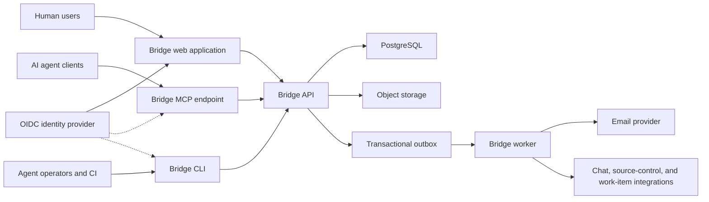
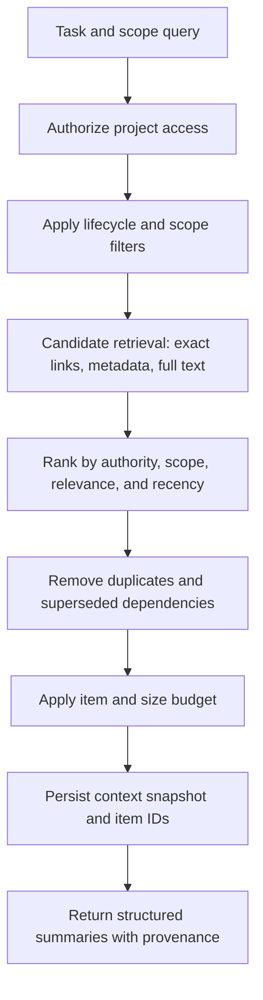

# Bridge Technical Architecture Specification

| Field | Value |
|---|---|
| Status | Approved MVP baseline; implementation validation required |
| Version | 0.1 |
| Last updated | 2026-08-20 |
| Related documents | [Bridge PRD](./bridge-prd.md), [Pilot Decisions](./pilot-decisions.md) |
| Architecture stage | MVP and controlled pilot |

## 1. Purpose

This document translates the Bridge PRD into a buildable technical design. It defines system boundaries, deployable components, data ownership, interfaces, security controls, execution flows, and the recommended MVP implementation shape.

> **Identity scope update (2026-08-24):** Configurable OIDC web/API authentication, interactive CLI PKCE, durable membership administration, bounded provider-group membership synchronization, revocable scoped service identities, coarse plus mapped least-privilege REST/MCP bearer-capability enforcement, MCP protected-resource metadata, forced RLS on the core tenant data plane, security-definer bootstrap-directory lookups, and repeatable PostgreSQL role/grant reconciliation are active; fixed principals remain development-only. External token issuance, MCP-side authorization-server/token issuance, provider invitations/SCIM hosting, and live deployment/provider/isolation evidence are still incomplete and must not be represented as production-ready.

The design optimizes for:

- A complete human-to-agent decision loop.
- Strong tenant isolation and approval authorization.
- A stable vendor-neutral MCP contract.
- Traceability between requirements, decisions, specifications, and agent runs.
- Low operational complexity during the pilot.
- Clear paths to split or scale components after usage validates the need.

## 2. Architecture principles

1. **Modular monolith first:** Keep domain logic in one application core and deploy separate process types only where runtime behavior differs.
2. **One source of truth:** PostgreSQL owns transactional state. Search indexes, notification systems, and integrations are derived projections.
3. **Server-side authority:** Agent prompts and client UI never determine authorization.
4. **Immutable approval history:** Accepted decisions, approved artifact versions, and audit events cannot be silently mutated.
5. **Asynchronous external effects:** Notifications, indexing, and integrations run from a transactional outbox.
6. **Protocol independence:** MCP, REST, CLI, and web UI call the same application services and enforce the same policies.
7. **Structured context:** Agents receive ranked records and provenance, not unbounded conversation transcripts.
8. **Progressive enforcement:** Instruction adapters are best-effort; hooks and orchestrated execution add deterministic enforcement later.
9. **No premature infrastructure:** Use PostgreSQL full-text search and a PostgreSQL-backed job queue until measured scale requires dedicated systems.

## 3. Selected implementation stack

The founder-delegated pilot decisions select the following stack. A component should change only when an implementation spike produces evidence that it cannot satisfy the architecture or pilot requirements.

| Concern | Recommended MVP choice | Reason |
|---|---|---|
| Primary language | TypeScript | Shared types across web, API, MCP, CLI, and workers |
| Monorepo | pnpm workspaces with Turborepo | Shared contracts, cached checks, and atomic changes |
| Web application | Next.js with React | Prototype human-review UI, accessible routing, and server rendering |
| API | Fastify with schema-first routing | Strong request validation and predictable REST endpoints |
| MCP server | TypeScript MCP SDK over Streamable HTTP | Cross-client agent interface for Codex and Claude Code |
| CLI | Node.js/TypeScript package; local or checksummed GitHub Release tarball, registry later | Provides an MCP-independent adapter over the same API |
| Database | PostgreSQL | Transactions, relational integrity, JSONB, text search, and row-level security |
| SQL access | Drizzle ORM plus reviewed SQL migrations | Typed queries with control over constraints and tenant policies |
| Job queue | Typed PostgreSQL outbox claim/lease/retry cycle now; pg-boss remains an optional scheduler/queue adapter | Durable downstream intents without requiring MCP or a separate broker in the prototype |
| Artifact storage | Amazon S3 | Durable versioned bodies and attachments |
| Email | Amazon SES behind a notification adapter | Assignment and decision notifications |
| Authentication | OIDC web/API plus public-client CLI PKCE, revocable service credentials, and coarse/mapped REST/MCP bearer capabilities | Server-side membership remains authoritative; external scope issuance and MCP-side token issuance remain |
| Hosting | AWS ECS Fargate, RDS PostgreSQL, S3, and an Application Load Balancer | One credible hosted deployment boundary for the pilot |
| Observability | OpenTelemetry with CloudWatch | End-to-end MCP/API/job correlation in the selected cloud |

### 3.1 Current persistence implementation checkpoint

The prototype now ships two implementations of the application-owned `BridgeRepository` contract:

- A seeded in-memory repository used when `DATABASE_URL` is absent.
- A PostgreSQL repository using Drizzle ORM and Postgres.js when `DATABASE_URL` is present.

The reviewed migrations normalize projects, agent runs, continuation locators, assumptions, questions, responses, threaded question comments, decisions, artifacts, immutable artifact versions and their append-only review feedback, context snapshots, audit events, idempotency records, durable in-app notifications, notification preferences, and transactional outbox events. Deferred foreign keys preserve aggregate integrity for acceptance and approval flows that create circular references inside one transaction. Organization/project composite constraints prevent stored tenant identifiers from disagreeing with their parent project. The additive run migration backfills pre-existing question run IDs into metadata-only legacy runs before enforcing run foreign keys. The additive assumption migration enforces low-risk/reversible policy, expiry bounds, lifecycle metadata, and same-project provenance links. The additive project-registration audit migration extends the audit subject constraint to project events. The role-aware question migration adds a backward-compatible `owner_roles` JSON array for lightweight role routing; later additive migrations persist protected reviews, clarification comments, notification records, outbox delivery state, versioned decision-lifecycle provenance with same-project replacement links, specification review comments/change requests, and governed question collaboration metadata. Migration `0032_bitter_lethal_legion.sql` adds first-class related links plus mention IDs and append-only revision-history arrays for responses and comments. Migration `0036_clammy_paper_doll.sql` extends the organization audit stream for successful human web authentication and logout without widening the stream to untrusted or non-human session establishment. Migration `0037_aberrant_ezekiel.sql` adds tenant-scoped human email notification preferences with membership ownership and enables their tenant policy; forward-only corrective migration `0041_force_notification_preferences_rls.sql` also forces that policy after isolated-PostgreSQL CI exposed the missing table-owner restriction. Migration `0038_natural_puppet_master.sql` adds the bounded approval count frozen onto each artifact version; legacy versions default safely to one required approval. Migration `0039_concerned_wrecking_crew.sql` adds deferred-email digest due/lease timestamps, backfills existing deferred receipts, and indexes maintenance claims. Migration `0040_big_black_crow.sql` adds the one-time blocking-question escalation timestamp and the matching notification type.

Project registration, repository linking, run registration/status/provenance, assumption creation/resolution/expiry, question creation, response proposal/edit, threaded comment creation/edit, clarification/reopen, decision acceptance/lifecycle transition, artifact publication, artifact approval, notification and preference commands plus outbox creation/read updates, and context-snapshot creation execute through a repository transaction boundary. The PostgreSQL implementation uses serializable transactions and locks run, assumption, question, decision, artifact, notification, and claimed outbox rows before concurrency-sensitive updates. API startup never runs migrations automatically; migrations remain an explicit operator/release action.

Forward-only migration `0020_tenant_row_security.sql` enables and forces fail-closed RLS on the initial 18 tenant/project tables; migrations `0024_amazing_blindfold.sql` through `0027_vengeful_lady_ursula.sql` apply the same forced policy boundary to adapter diagnostics, repository metadata, ownership configuration, and policy configuration. Every principal-bearing application operation now runs in a transaction that sets a transaction-local organization context. Idempotency records gained explicit organization ownership and tenant-composite keys; pre-existing rows are backfilled before the column becomes non-null, while orphaned cache-only records are discarded. Cross-tenant outbox operations require a separately opted-in maintenance repository and PostgreSQL `BYPASSRLS` role; normal application readiness rejects superuser or bypass-capable connections. The organization, principal-identity, and service-credential directories remain narrow pre-tenant authentication bootstrap exceptions, but migration `0021_bootstrap_directory_security.sql` removes ambient runtime table reads and exposes only bounded security-definer lookups. The repeatable `scripts/provision-postgres-roles.sql` reconciles the runtime/migrator/maintenance role attributes and grants without handling passwords. The Slack delivery adapter and bounded worker runtime are repository-implemented; live email, identity-provider, workspace, and deployment validation remain future work, so these controls do not establish full production readiness.

## 4. System context



## 5. Deployable components

### 5.1 Web application

Responsibilities:

- Prototype navigation and dynamic registered-project selection.
- Inbox, question discussion, decision acceptance, artifact review, assumptions, and run views.
- Administrative configuration for ownership, roles, policy, and integrations.
- No direct database access from the browser.

The web application calls the public API with an encrypted OIDC session cookie in authenticated mode. Local development can instead use a fixed principal identifier; production startup rejects that mechanism.

### 5.2 Public API

Responsibilities:

- REST API under `/v1`.
- Idempotent project registration plus project list/detail reads for fresh-repository bootstrap, and project-scoped repository link/list commands with provider, owner, name, and canonical URL metadata.
- Local principal resolution, authorization policy, validation, and rate limiting seams.
- Transactional domain commands and read models.
- Idempotency for all externally retryable writes.
- Creation of audit and outbox events inside the same database transaction.
- Signed upload and download operations for object storage.

The API is the canonical business boundary. MCP and CLI must not bypass it by writing directly to PostgreSQL.

### 5.3 MCP gateway

Responsibilities:

- Expose the approved Bridge MCP tools through Streamable HTTP.
- Translate tool calls into application commands or queries using the fixed prototype agent principal.
- Attach agent identity, organization, project scope, correlation ID, and idempotency metadata.
- Return stable structured errors suitable for agent recovery.
- Publish concise server instructions that describe mandatory Bridge behavior.

The MCP gateway may share a process with the API during local development, but it should have a separately deployable entry point so it can receive independent rate limits, timeouts, and monitoring.

In the implemented standalone process, MCP and API use the same migrated PostgreSQL repository. MCP deliberately refuses to start without `DATABASE_URL`; running an independent in-memory MCP repository would make agent writes invisible to REST and the web UI. This durable requirement applies only when MCP is enabled—the default API/web/CLI demo remains MCP-independent and may use the seeded in-memory repository.

### 5.4 Worker

Responsibilities:

- Claim and process transactional outbox events with leases, bounded retries, and dead-letter state; `runOutboxCycle` accepts an injected delivery handler and the worker runtime supplies bounded polling, graceful shutdown, and a maintenance-role PostgreSQL composition.
- Deliver email and team-channel notifications.
- Maintain full-text search documents and optional derived embeddings later.
- Perform duplicate suggestions, conflict scans, scheduled assumption expiry, overdue blocking-question escalation, and impact analysis.
- Synchronize external links and integration metadata.
- Retry transient failures with bounded exponential backoff and dead-letter handling.

### 5.5 CLI

Responsibilities:

- Repository-to-project initialization.
- Fixed-principal fresh-project registration for the local prototype.
- Interactive authorized-project selection, repository metadata detection, and API-validated project mapping during bridge init.
- Client-native instruction generation with managed-block safe merging.
- Adapter-only activation/switching through `bridge install` without project registration.
- Safe `init --dry-run` previews for project registration and adapter files.
- Local tarball packaging, isolated installed-binary smoke coverage, and tag-driven checksummed GitHub Release creation; registry publication remains future work.
- `doctor` diagnostics for API reachability, project mapping, generated instructions, and adapter markers.
- Human-friendly access to context, questions, assumptions, and artifact publishing.
- Interactive `login`, `logout`, and authentication status through public-client Authorization Code + S256 PKCE, a hardened exact loopback callback, and API-side bearer-token/membership validation.
- API-specific human-token storage in macOS Keychain or Linux Secret Service, with refresh-or-login behavior and no repository credential files; organization-admin service-identity create/list/rotate/revoke commands use the REST boundary and do not persist one-time bearer tokens.
- Noninteractive CI reads can receive a narrowly scoped opaque service token through the runner's masked `BRIDGE_SERVICE_TOKEN`; the CLI sends it only as a bearer header and never falls back to a human credential store.
- Filtered human inbox reads through `bridge inbox` for operators who do not use the web UI.
- Bounded polling for accepted decisions.
- Stable JSON output by default, opt-in human-readable success output, JSON errors with stable exit codes, and repository snapshots for CI and restricted environments.
- Approved-specification drift capture/check commands that bind canonical approved version hashes to explicit repository files, reject path/symlink escape, and fail CI deterministically without changing approval state.

### 5.6 Agent adapters

Responsibilities:

- Generate client-specific project instructions, project-scoped Codex/Claude MCP configuration when an approved endpoint is supplied, and bounded endpoint probes; MCP authentication, vendor discovery, and non-Codex/Claude vendor configuration remain future adapter work.
- State the required preflight, search-before-question, and protected-action rules.
- Declare integration capability level: instructions, MCP, hooks, and continuation.
- Preserve unrelated user configuration and support a dry-run diff.

Adapters do not own canonical policy. They project policy from `.bridge/` and the server.

The implemented bootstrap supports Codex `AGENTS.md`, Claude Code `CLAUDE.md`, Cursor `.cursor/rules/bridge.mdc`, and Copilot `.github/copilot-instructions.md`. When `mcp_url` is configured, Codex receives a project-scoped `.codex/config.toml` and Claude Code receives a project-scoped `.mcp.json`; these files preserve unrelated settings, carry Bridge ownership markers, and refuse an unrelated `bridge` server collision. The marked instruction block is safely replaced on regeneration while unrelated content is retained. `bridge init --interactive` lists only projects returned by the canonical authorized REST project list and asks the operator to choose one; selected and explicit project IDs are read back through REST before any repository file is written. Existing Bridge-owned changes are shown as a file plan and require interactive confirmation, while `--force` remains an explicit noninteractive override. `bridge init --dry-run` previews create/update/unchanged actions without API mutation or filesystem mutation, and `bridge doctor` verifies the API, project mapping, generated instructions, selected adapter marker, and—only when configured—an MCP JSON-RPC `initialize` response. Packaged entrypoint detection resolves pnpm symlinks to the real module path, and the generated workflow documents `./node_modules/.bin/bridge` as a no-reinstall fallback when unrelated dependency policy blocks `pnpm exec`. `bridge conformance` verifies observable run/context/question/specification provenance and the human boundary. This instruction-driven layer is best-effort: it cannot universally intercept a vendor-native clarification prompt when the client exposes no hook.

## 6. Repository structure

Recommended monorepo layout:

```text
bridge/
  apps/
    web/                 # authenticated React application
    api/                 # REST API entry point
    mcp/                 # Streamable HTTP MCP entry point
    worker/              # background jobs and integrations
    cli/                 # bridge command-line client
  packages/
    domain/              # entities, state machines, domain errors
    application/         # commands, queries, authorization policies
    database/            # schema, migrations, repositories, transactions
    contracts/           # REST/MCP schemas and generated client types
    auth/                # token verification, principals, scopes
    audit/               # audit-event creation and serialization
    search/              # ranking and query pipeline
    integrations/        # email/chat/source-control interfaces
    adapters/            # agent-specific generators
    observability/       # logging, tracing, metrics helpers
    test-support/        # factories, fixtures, tenant test helpers
  config/
    policy-templates/
  docs/
  infra/
    containers/
    deployment/
  package.json
  pnpm-workspace.yaml
```

Package boundaries must be enforced by lint rules or dependency tests:

```text
transport/UI -> application -> domain
                         \-> repository interfaces
infrastructure implements repository and integration interfaces
```

The domain package must not depend on web frameworks, MCP transports, SQL clients, or vendor SDKs.

## 7. Tenant and identity model

The web/API foundation implements the human OIDC portion of this model and a coarse-compatible, mapped capability gate for non-human bearer principals. External authorization-server scope issuance and other principal flows remain the target architecture and are identified below where incomplete.

### 7.1 Principal types

| Principal | Authentication | Typical permissions |
|---|---|---|
| Human user | Browser/CLI OAuth | Project membership and role-based actions |
| Agent identity | OAuth client or delegated agent token | Read approved context; create questions, assumptions, drafts, and run events |
| CI identity | Client credentials or workload identity | Restricted artifact publishing, linking, and checks |
| Integration identity | Signed webhook or OAuth installation | Restricted synchronization operations |
| Internal worker | Workload identity | Consume outbox and invoke internal application services |

### 7.2 Token claims

Access tokens should provide or resolve:

- `subject`
- `principal_type`
- `organization_id`
- `audience`
- scopes
- optional project restrictions
- authentication method
- expiry and token ID

MCP tokens must use a dedicated audience and should not be reusable as unrestricted web sessions.

### 7.3 Selected authentication flows

- Web: Auth0 Authorization Code flow.
- CLI: Authorization Code with PKCE and a localhost callback.
- MCP: Auth0-backed OAuth using protected-resource and authorization-server metadata.
- CI: a short-lived, scoped Bridge service identity created by an organization administrator; workload-identity exchange remains a later deployment option.
- Enterprise SSO: Auth0 federation to the customer's identity provider.

The CLI does not use Device Authorization Flow because organization-scoped behavior is required for Bridge tenancy.

The implemented CLI flow uses a separate native/public client ID and never receives the confidential web client secret. The API publishes only public CLI configuration. The CLI binds an exact `http://127.0.0.1:<port>/<path>` redirect, validates state, exchanges the code with S256 PKCE, asks Bridge to validate the resulting bearer token and active membership, then stores a bounded versioned session in macOS Keychain or Linux Secret Service. Near-expiry access tokens refresh when an offline refresh token is available; rejected or non-refreshable sessions are removed and require login. Logout attempts provider refresh-token revocation before clearing local storage. Web callback success and cookie-backed logout append organization-scoped metadata audit events only after a trusted human principal is resolved; failed or unknown authentication attempts remain safe logs without tenant attribution. CI and unattended agents use a separate REST-administered Bridge service identity; they must not copy a human's keychain credential.

### 7.3 Authorization model

Use RBAC for broad capabilities and ABAC/policy checks for record-specific authority. Non-human bearer principals may use coarse compatibility grants or a bounded mapped scope such as `bridge:questions:read`, `bridge:runs:write`, or `bridge:project:admin`; the transport checks the mapped capability before application policy runs. A fine-grained scope never broadens a human-only application command, and human principals continue to rely on membership and role policy rather than provider scopes.

Examples:

- A contributor can create a question in a project where they are a member.
- An agent can create a draft but cannot approve it.
- A decision owner can accept an ordinary decision only when the question scope overlaps their configured authority.
- A protected approval may require two distinct roles.
- An organization administrator inherits project-administrator authority only inside their organization. An administrative acceptance or approval remains an explicit application command recorded under the administrator's own identity; Bridge never rewrites the actor as a decision owner.

Every application command receives an immutable `PrincipalContext` and a resolved `AuthorizationContext`.

The executable mapping from PRD roles to implemented commands, denial behavior, and transport exposure is maintained in [`authorization-matrix.md`](authorization-matrix.md).

## 8. Tenant isolation

Every tenant-owned table includes `organization_id`; project-owned tables also include `project_id`.

Defense in depth:

1. Token audience and organization validation at the edge.
2. Organization and project membership checks in application services.
3. Repository methods require tenant scope explicitly.
4. PostgreSQL row-level security on tenant-owned tables.
5. Composite foreign keys include tenant identity where practical.
6. Object-storage keys begin with an opaque organization and project prefix.
7. Queue payloads contain record IDs, not sensitive record bodies.
8. Automated cross-tenant tests run against every externally accessible query and command.

At the application boundary, inaccessible project and object identifiers are deliberately masked as the same resource-specific `404` returned for absent identifiers. Same-project role failures remain `403`, so clients can distinguish missing action authority without learning whether another tenant's record exists.

The application sets `bridge.organization_id` through transaction-local `set_config` before accessing tenant rows. Policies read it with the missing-value form of `current_setting`; an absent scope therefore exposes no protected rows and rejects protected writes. Nested repository transactions cannot change their organization or elevate to maintenance access.

The API and MCP services must use a non-superuser `NOBYPASSRLS` role. Cross-tenant worker, restore, or approved maintenance tasks use a different connection and an explicitly configured `BYPASSRLS` role; the application role cannot opt itself into that path. The complete protected-table list, security-definer bootstrap lookups, repeatable role reconciliation script, and verification procedure are documented in [`database-security.md`](database-security.md).

## 9. Data architecture

### 9.1 Identifier and timestamp conventions

- Use sortable globally unique identifiers such as UUIDv7.
- Store timestamps in UTC with timezone-aware database types.
- Expose opaque IDs; never expose sequential tenant record counts.
- Add `created_at`, `created_by`, and where applicable `version` to mutable records.
- Use optimistic concurrency with an integer `version` or explicit expected state.

### 9.2 Core tables

The following is the logical schema. Physical names may change during migrations.

#### Organization and access

```text
organizations
users
organization_memberships
organization_audit_events
teams
team_memberships
roles
role_assignments
projects
project_memberships
repositories
components
ownership_rules
agent_identities
service_identities
```

The current implementation uses versioned organization and project membership rows, a separate `bridge_service_credentials` table that stores only token hashes and expiry/revocation metadata, plus an organization-level audit stream for member and service-identity changes. Organization administrators may manage membership and service credentials but do not gain decision-owner or specification-approver authority merely from that role.

Project role definitions, reusable teams, and owner/reviewer rules are persisted atomically in `bridge_project_ownership_configurations`. The aggregate has one optimistic version per project, records its last human administrator, and rejects ambiguous equal-priority rules separately for owner and reviewer responsibility. Rules may narrow from the implicit project scope by repository, component, and category. Team membership and direct principal targets accept only active humans with project access; organization/project role assignments remain in the membership model.

Limited declarative risk/routing policy is persisted atomically in `bridge_project_policy_configurations`. Each version contains ordered rules with an exact optional category and scope selector, minimum risk, interruption action, required human owner/reviewer roles, and optional per-reviewer-role quorum. Application evaluation selects the first matching custom rule, then takes the stronger outcome across declared risk, the custom rule, and code-owned pilot safety floors. Equal-priority overlapping custom rules fail activation; exact attempts to weaken a protected default fail explicitly. Questions retain policy action/version/rule, required owner/reviewer-role requirements, effective reviewer quorum, approval-status summaries, and any audited human administrative override, while relevant audit records retain policy version and supplied protected-action reason. Migrations `0027_vengeful_lady_ursula.sql` and `0028_cold_tombstone.sql` add the original provenance with safe legacy backfills; `0031_deep_vampiro.sql` adds quorum/override storage and audit reasons.

Question assignment remains part of the question aggregate rather than a separately mutable authority store. The current owner and reviewer IDs/roles, the resolved owner/reviewer source and matched rule keys, ownership/policy versions, and append-only assignment history are persisted on `bridge_questions`. Forward-only migration `0029_unknown_madame_hydra.sql` safely backfills legacy assignments before enforcing non-null routing/history shape constraints and extends the outbox event type constraint for reassignment.

An optional UTC `due_at` remains question metadata, indexed with project scope by migration `0030_gray_smasher.sql`. Inbox reads derive `overdue`, `due_soon` (within seven days), `scheduled`, or `none` from the application clock rather than persisting a stale calculated state. Every shared-list, detail, and inbox question representation also derives current `canAccept`, available policy-review roles, and `canReassign` authority from the authenticated principal; the browser never manufactures these permissions from local role labels or filtered collection membership.

Protected question approval is still part of the question aggregate. `required_reviewer_quorum` stores the effective count per normalized reviewer role, while `reviews` remains append-only and counts distinct human reviewer IDs. Reads expose each requirement's approved, rejected, remaining, and satisfied/pending/rejected state. `approval_override` is written only by a project administrator through the REST command after a version check and reason validation; it never creates reviewer evidence and is separately recorded in `bridge_audit_events.reason`. Reviewer-only reassignment keeps the same human coordination boundary and uses the existing append-only assignment history.

#### Work and knowledge

```text
work_items
agent_runs
questions
question_options
question_assignments
responses
question_comments
decisions
decision_dependencies
assumptions
artifacts
artifact_versions
artifact_reviews
record_links
context_snapshots
context_snapshot_items
policies
policy_versions
```

#### Reliability and governance

```text
idempotency_keys
audit_events
outbox_events
outbox_deliveries
job_failures
integration_installations
notification_preferences
notifications
```

Questions keep related work links as bounded typed metadata (`repository`, `work_item`, `branch`, `artifact`, `run`, or `external`). Human discussion records keep current content plus mention IDs and append-only revision snapshots. A revision records the prior content, author, timestamp, and mentions; it does not replace the authoritative accepted response.

### 9.3 Important constraints

- A question has at most one accepted response at a time.
- A question may target explicit principal IDs, normalized role names, or both; an assigned matching human role can accept it.
- Human responses and clarification comments expose a current editable value with append-only revision history; final acceptance creates a separate authoritative response/Decision.
- Discussion edits require the current question version, preserve the prior value before updating, and are limited to the original human author while the question remains unresolved.
- Clarification comments are optionally threaded, mention only active human project members, and require the current question version.
- Only a question owner or project administrator may request clarification on an open question or reopen a cancelled/expired question. Accepted questions are not reopened through this discussion command; decision lifecycle remains a separate governed workflow.
- Accepting a decision does not overwrite the source response.
- A decision is immutable except for lifecycle metadata; replacement content creates a superseding decision.
- Only one artifact version can be current and approved for the same artifact and exact scope.
- Artifact bodies are content-addressed to prevent accidental duplicate storage.
- Agent identities cannot appear as human approvers.
- A response used as an accepted answer must belong to the same organization and question.
- A Decision is sourced either from an accepted question response or from an explicit human confirmation of an assumption; assumption-sourced decisions have no question/response pointers and remain linked from the confirmed assumption.
- A protected reviewer requirement is satisfied only by its configured count of distinct approved human reviewers; a rejection blocks ordinary acceptance until the requirement is satisfied or an authorized override is recorded.
- Administrative override is limited to unresolved protected questions, requires a project administrator, expected version, decision rationale, and non-empty reason, and creates both an override audit event and the ordinary accepted decision event.
- Every dependency and link must remain within the tenant unless its type explicitly represents an external URL.
- Audit events and accepted records cannot be hard-deleted through ordinary application APIs.

### 9.4 Content storage

Small Markdown bodies may remain in PostgreSQL for MVP simplicity. Attachments and large bodies use object storage with:

- Content hash
- Media type
- Byte size
- Encryption metadata
- Organization/project prefix
- Malware/secret scan status
- Retention class

The database stores immutable artifact-version metadata and the object key. Signed URLs must be short-lived and authorized per request.

## 10. Domain state transitions

State transitions are domain commands, not arbitrary update endpoints.

### 10.1 Question commands

```text
CreateQuestion
OpenQuestion
RequestClarification
ReopenQuestion
AssignQuestion
ProposeAnswer
EditQuestionResponse
EditQuestionComment
RejectProposedAnswer
ReviewQuestion
AcceptAnswer
OverrideQuestionApproval
MarkDuplicate
CancelQuestion
ExpireQuestion
```

### 10.2 Decision commands

```text
ReviewDecision
SupersedeDecision
ExpireDecision
RevokeDecision
```

### 10.3 Artifact commands

```text
CreateArtifact
PublishArtifactVersion
RequestArtifactReview
SubmitArtifactReview
ApproveArtifactVersion
SupersedeArtifactVersion
ArchiveArtifact
```

The API returns `409 Conflict` when an expected version or state no longer matches.

## 11. Critical transaction flows

### 11.1 Accept answer

The `AcceptAnswer` command performs one database transaction:

1. Lock or version-check the question.
2. Verify it is accept-capable and the proposed response belongs to it.
3. Resolve decision authority from principal, scope, ownership, and policy.
4. Verify every protected reviewer-role quorum, unless the same transaction is an explicitly authorized administrative override with a recorded reason.
5. Mark the response accepted and the question accepted/closed.
6. Insert an immutable decision referencing the question and response.
7. Insert dependency/link rows.
8. Insert an audit event.
9. Insert `decision.accepted` and `question.closed` outbox events.
10. Commit and return the decision.

If any step fails, no partial acceptance is visible.

### 11.2 Approve artifact version

Artifact publication accepts optional direct reviewer IDs, project roles, and configured team keys through the canonical REST contract. The application resolves these targets from the current active human organization/project directory, expands role and team membership, removes duplicates, and persists concrete reviewer IDs. When publication has no explicit target, an existing artifact retains its active reviewers; a new artifact uses the first matching scoped or project-default ownership reviewer rule and then the project decision owners as a fallback. Unknown teams, inaccessible/non-human direct targets, and target sets that resolve to no active human fail before the artifact is written. The CLI exposes the same contract, and optional MCP publication reuses it without creating a separate authority path.

1. Lock the artifact and proposed current version.
2. Confirm review and approval requirements, including that no append-only `changes_requested` review exists on this exact version.
3. Confirm human approver authority and reject a second vote from the same principal.
4. Append the human approval and rationale, then derive distinct-human progress against the version's frozen required count.
5. If quorum remains pending, keep the version in review and write the approval-progress audit/notification atomically.
6. When quorum is satisfied, mark the previous current approved version superseded when appropriate and mark the proposed version approved/current.
7. Record cited decisions and assumptions.
8. Write final approval audit and outbox events.

Formal specification reviewers may append `commented` or `changes_requested` feedback to the current draft/in-review version, while the approval command appends an `approved` review carrying that human's rationale. Approval status is server-derived as pending, blocked, or satisfied from distinct human IDs; partial quorum never enters context. A change request never edits the Markdown body and permanently blocks approval of that exact version; the author publishes a new version with an empty review history, while any previously approved version remains authoritative until a replacement is approved.

### 11.3 Change decision lifecycle

1. Lock and version-check the active decision.
2. Require its human owner, a configured project decision owner, or a project administrator.
3. For supersession, require a different active replacement with the same project, category, and exact scope.
4. Change only lifecycle metadata; the accepted answer, rationale, source question, and response remain immutable.
5. Traverse the bounded dependency graph from the decision through its source question, citing artifact versions, decision-confirmed assumptions, context snapshots, producing/consuming/continuing runs, records produced by affected runs, and stored work links. Record shortest paths, typed edges, scope identifiers, and whether depth/node bounds truncated the result.
6. Persist the transition, audit event, `decision.lifecycle_changed` outbox event, and any recipient notifications plus `notification.created` delivery intents in one transaction.
7. Exclude the retired decision from subsequent default context while preserving it in history reads.

`GET /v1/projects/:projectId/decision-conflicts` provides the read-only DEC-05 advisory scan. It compares active same-category decisions only when their scopes can overlap: a missing scope field is broader, while unequal values in the same field are disjoint. Pairs are returned when answers differ in exact scope or use a bounded set of explicit opposing terms across broader/narrower scopes. Results include stable pair IDs, confidence, scope relation, overlapping fields, signals, and immutable decision summaries. The scanner deliberately avoids claiming semantic certainty, performs no lifecycle write, and never selects a winner; a human owner must use the separately version-checked lifecycle command to resolve a real conflict.

`GET /v1/decisions/:decisionId/impact` exposes the same DEC-06 graph before mutation. Breadth-first traversal deduplicates cycles, retains each record's shortest discovered path, and defaults to depth five and 200 nodes with bounded overrides. Nodes cover decisions, questions, artifacts/versions, assumptions, context snapshots, and runs; edges explain source, citation, confirmation, context consumption, production, and continuation relationships. Repository/work-item/branch scopes and existing typed question or run result links are summarized without fetching source-provider content. The lifecycle command calculates the graph again inside its transaction after the authorized version-checked state change, so its returned evidence reflects the committed canonical record set.

### 11.4 Record assumption

1. Validate scope, risk, reversibility, expiry, and source run.
2. Apply server policy; reject assumptions for protected categories.
3. Search for direct contradiction with active exact-scope decisions.
4. Insert assumption, audit event, and optional review notification event.

Current prototype behavior adds these conservative rules:

- Only `low` risk and `reversible: true` are accepted.
- Protected categories cannot use assumption behavior.
- Non-human creators must supply a source run.
- Expiry defaults to seven days and cannot exceed 30 days.
- Exact normalized duplicates and direct textual negations of active same-category/exact-scope decisions return `CONFLICT` with the decision ID.
- Human decision owners/project administrators resolve assumptions with an expected version and rationale. Confirmation may link an active same-project decision or explicitly create an authoritative decision from the assumption statement.
- Active due assumptions are durably expired during reads and by the maintenance-role worker. The scheduled cycle is idempotent because only active records transition, and it notifies project decision owners plus the assumption creator through durable in-app records and outbox intents.

## 12. REST API

### 12.1 Conventions

- Base path: `/v1`
- JSON request and response bodies.
- Schema validation at the transport boundary.
- Cursor or explicitly bounded offset pagination for collections.
- RFC-style problem details with stable Bridge error codes.
- `Idempotency-Key` required for agent and integration create operations.
- `If-Match` or expected-version field for concurrency-sensitive commands.
- Correlation ID accepted from trusted clients or generated at ingress.
- All timestamps use ISO 8601 UTC.

### 12.2 Initial endpoint groups

```text
GET    /v1/auth/config
GET    /v1/auth/login
GET    /v1/auth/callback
GET    /v1/auth/logout
GET    /v1/auth/me
GET    /v1/principals
GET    /v1/organizations/:organizationId/projects
POST   /v1/projects
GET    /v1/projects/:projectId
POST   /v1/projects/:projectId/repositories
GET    /v1/projects/:projectId/repositories
GET    /v1/projects/:projectId/context
GET    /v1/admin/projects/:projectId/ownership
POST   /v1/admin/projects/:projectId/ownership
GET    /v1/admin/projects/:projectId/policy
POST   /v1/admin/projects/:projectId/policy

POST   /v1/projects/:projectId/questions
POST   /v1/projects/:projectId/questions/matches
GET    /v1/questions/:questionId
GET    /v1/projects/:projectId/questions
POST   /v1/questions/:questionId/responses
POST   /v1/questions/:questionId/comments
PATCH  /v1/questions/:questionId/responses/:responseId
PATCH  /v1/questions/:questionId/comments/:commentId
POST   /v1/questions/:questionId/clarification
POST   /v1/questions/:questionId/reopen
POST   /v1/questions/:questionId/reviews
POST   /v1/questions/:questionId/assignments
POST   /v1/questions/:questionId/accept
POST   /v1/questions/:questionId/override
POST   /v1/questions/:questionId/duplicate

GET    /v1/projects/:projectId/decisions
GET    /v1/decisions/:decisionId
POST   /v1/decisions/:decisionId/supersede
POST   /v1/decisions/:decisionId/expire
POST   /v1/decisions/:decisionId/revoke
POST   /v1/decisions/:decisionId/lifecycle

POST   /v1/projects/:projectId/assumptions
GET    /v1/projects/:projectId/assumptions
POST   /v1/assumptions/:assumptionId/resolve

POST   /v1/projects/:projectId/artifacts
GET    /v1/artifacts/:artifactId
GET    /v1/artifacts/:artifactId/diff?fromVersionId=&toVersionId=
POST   /v1/artifacts/:artifactId/versions
POST   /v1/artifact-versions/:versionId/reviews
POST   /v1/artifact-versions/:versionId/approve

POST   /v1/projects/:projectId/runs
GET    /v1/projects/:projectId/runs
PATCH  /v1/runs/:runId
GET    /v1/runs/:runId
POST   /v1/runs/:runId/continuation

POST   /v1/projects/:projectId/adapter-diagnostics
POST   /v1/projects/:projectId/integrations/github/pull-requests
GET    /v1/projects/:projectId/integrations/github/pull-requests?repositoryId=&state=&limit=
GET    /v1/projects/:projectId/integrations/github/pull-requests/:pullRequestNumber/context?repositoryId=
POST   /v1/projects/:projectId/integrations/github/issues
GET    /v1/projects/:projectId/integrations/github/issues?repositoryId=&state=&label=&limit=
GET    /v1/projects/:projectId/integrations/github/issues/:issueNumber/context?repositoryId=
GET    /v1/projects/:projectId/inbox?status=&risk=&category=&role=&due=
GET    /v1/notifications?projectId=&unreadOnly=
POST   /v1/notifications/:notificationId/read
POST   /v1/notifications/read-all
GET    /v1/projects/:projectId/search
GET    /v1/projects/:projectId/audit-events
GET    /v1/admin/projects/:projectId/outbox?status=&type=&limit=
POST   /v1/admin/outbox/:eventId/replay
GET    /v1/admin/projects/:projectId/analytics?client=&startedFrom=&startedTo=
GET    /v1/admin/projects/:projectId/support
GET    /v1/admin/projects/:projectId/audit?action=&actorId=&subjectType=&subjectId=&correlationId=&createdFrom=&createdTo=&offset=&limit=
POST   /v1/admin/projects/:projectId/audit/export
POST   /v1/admin/projects/:projectId/export
GET    /v1/admin/organization/audit?action=&actorId=&subjectType=&subjectId=&correlationId=&createdFrom=&createdTo=&offset=&limit=
POST   /v1/admin/organization/audit/export
GET    /v1/admin/organization/directory-groups
POST   /v1/admin/organization/directory-groups
POST   /v1/admin/organization/directory-groups/:groupId/sync
```

Decision collection semantics are intentionally conservative: `GET /v1/projects/:projectId/decisions` returns active decisions unless the caller supplies `includeHistory=true` or an explicit lifecycle `status`. `search` queries answer, rationale, and category text after tenant/project authorization; PostgreSQL uses a weighted `simple` text-search vector with answer weighted above rationale and category, while the in-memory adapter applies deterministic all-token matching with the same field weights. Authorized callers can combine search with exact case-insensitive category, owner, inclusive creation-time range, and any supplied exact scope dimensions (`repository`, `component`, `branch`, `environment`, and `workItem`). `createdFrom` must not be later than `createdTo`. Lifecycle history remains an explicit human browsing concern; agent context retrieval continues to include active decisions only. The MCP decision-search tool delegates to this application query and does not define a separate authority or matching path.

Artifact version comparison is an authorized, derived read over two immutable versions of the same artifact. The application layer verifies artifact access and version ownership before comparing normalized lines. It uses an exact longest-common-subsequence diff within a fixed one-million-cell and 5,000-line-per-side budget; larger inputs fall back to deterministic removed/added regions. Responses include complete counts and provenance but cap rendered lines at 2,000 so the browser degrades predictably. Comparison does not write an artifact, version, audit event, or outbox event, and it never changes stored Markdown or hashes.

Administrative endpoints are separated under `/v1/admin`. Outbox operations and project analytics require a human project administrator for the target project whether the principal came from OIDC or development fixtures. Non-human bearer requests first pass the mapped REST capability boundary (`bridge:project:admin`, `bridge:organization:admin`, or the explicit `bridge:admin` wildcard), with coarse `bridge:read`/`bridge:write` compatibility grants retained; application role and human-approval checks remain authoritative.

Directory-group creation/listing remains human organization-administrator-only. The one lifecycle reconciliation route is an explicit exception for `integration` principals carrying `bridge:directory:sync`; coarse `bridge:write` is deliberately insufficient. A configured group is bound to the application's exact OIDC issuer. Sync accepts at most 1,000 unique subject/display-name pairs plus provider timestamp/status, creates human identities and active organization memberships with `provisioning=directory`, zero roles, no all-project grant, and no project memberships, and records versioned group/member lifecycle rows. Removal disables a directory-provisioned organization membership only after the principal has no active synchronized group membership. Any human administrator update changes provenance to `manual`, so provider removal preserves that access. The operation never assigns a role/project, mutates an approval, or exposes an MCP tool; provider discovery, SCIM hosting, invitations, and live webhook/token validation remain outside this slice.

Project audit browsing/export requires a human project administrator after tenant/project access checks; organization audit browsing/export requires a human organization administrator. The application maps existing append-only project and organization streams into one metadata-only read model, applies exact controlled filters, sorts newest-first, and caps pages at 200 and exports at 5,000 records. Export is a write command because it appends an `audit.exported` record atomically before returning the file. JSON and CSV contain only audit envelope identifiers, action/type, optional numeric policy version, timestamp, and correlation metadata.

The separate project-data export is a human-project-administrator-only REST command that returns a versioned JSON archive of canonical decision and artifact aggregates, including artifact version bodies/reviews, plus project audit events. Decisions, artifacts, and audit events have independent bounded offsets and limits and stable oldest-first ordering, so later appends do not shift already-consumed pages. The command appends `project.exported` before reading the audit collection, sets `humanApprovalChanged: false`, and never mutates decision lifecycle or artifact approval state. The archive is sensitive governed project data rather than the metadata-only audit export; MCP has no alternate export path.

`GET /v1/principals` returns active same-organization human directory summaries after authentication. Development mode uses those summaries for the **Reviewing as** policy switcher; OIDC mode hides impersonation and keeps the signed-in identity. The inbox endpoint applies validated status, risk, category, owner-or-reviewer role, and due-state filters only after project authorization and personalized routing. Web filters round-trip through prefixed URL query parameters without becoming a separate authority boundary. Protected questions expose a separate human policy-review command for each required reviewer role before an owner lacking that reviewer role may finalize acceptance. Notifications are human-only, project-scoped, and readable through REST/web whether or not MCP is approved; ordinary agent principals receive a deterministic denial.

Project repository metadata is managed through the canonical REST endpoints, the administrator-only web **Repositories** view, or the equivalent CLI `repository list` and `repository link` commands. These surfaces exchange only provider, owner, repository name, canonical URL, project scope, and timestamps. They do not fetch source or infer provider connectivity from a caller-supplied URL; provider-backed validation and synchronization remain integration work.

The first source-control integration adds canonical REST synchronization and reads for GitHub pull-request metadata. A project administrator or project-scoped `ci`/`integration` service identity may submit the repository reference, number, title/state, canonical URL, branch names, head SHA, provider timestamp, and explicit active-decision/approved-specification links. Ordinary agents cannot synchronize. Provider timestamps reject stale or conflicting events, deterministic IDs make exact retries idempotent, and authorized project members receive bounded guidance summaries with `humanApprovalChanged: false`. Bridge does not request or retain source, diffs, pull-request bodies/comments, or credentials, and MCP exposes no alternate integration surface.

GitHub Issues use the same canonical integration boundary and authorization model. Bridge persists only repository/issue identity, title/state, canonical URL, labels, provider timestamp, and explicit guidance links; GitHub remains authoritative and Bridge performs no provider mutation. Each item exposes a deterministic `github:owner/repository#number` reference. Exact matches against `ContextQuery.scope.workItem`—or the canonical issue URL—add a bounded ranking boost to linked active decisions and the currently approved linked specification without excluding normal context candidates. The direct issue context read can also show a linked superseded specification as provenance. No issue body, comments, assignees, source, or provider credentials are retained.

Project ownership configuration is managed through canonical administrator REST endpoints and the web **Ownership** view. The application validates active human team membership and direct targets, normalizes role/team/rule keys, detects equal-priority overlap per responsibility lane, performs an optimistic aggregate-version write, and appends the project audit event in one transaction. Question creation resolves each owner lane in this order: explicit owner, repository/component-scoped rule, category rule, project-wide rule or configured project decision owner, then an empty administrator-visible fallback. Required policy roles are always retained. Reviewer targets resolve independently through scoped, category, project-wide, then policy routes so reviewer visibility never becomes owner acceptance authority. The question records the selected source, rule keys, and ownership/policy versions.

Only a human project administrator may replace the owner/reviewer assignment on an unresolved question through canonical `POST /v1/questions/:questionId/assignments`. Direct targets must be active human project members, policy-required roles cannot be removed, and optimistic concurrency prevents stale reassignment. The aggregate update, append-only assignment-history entry, `question.reassigned` audit, typed outbox event, and directory-resolved notifications share one transaction. MCP exposes neither ownership management nor reassignment, remains optional, and gains no separate authority path.

Project policy configuration is managed through canonical administrator REST endpoints and the web **Policy** view. The limited matcher supports `assume_and_log`, `ask_async`, `block`, and `protected_approval`; category and each supplied scope dimension are normalized exact matches, with lower priority numbers winning. Policy can raise but cannot lower caller-declared risk or interruption, and the code-owned PILOT-008 matrix remains an immutable floor. Policy-required owner roles join explicit question owners but must be held by the accepting human; reviewer roles remain separate and require a configured quorum of distinct approved human reviews. Question reads expose the approval summary, while only a project administrator can use the versioned REST override command when ordinary acceptance cannot complete; the override's reason is included in the metadata audit stream and exports. Policy provenance remains attached to question lifecycle audits. MCP has no policy-management or human approval-mutation surface.

## 13. MCP architecture

### 13.1 Endpoint and session behavior

- Serve Streamable HTTP at a versioned endpoint such as `/mcp` with protocol negotiation handled by the MCP library.
- Authenticate before MCP initialization completes.
- In OIDC mode, validate `Authorization: Bearer` through the shared issuer/JWKS verifier, require the dedicated `BRIDGE_MCP_OIDC_AUDIENCE`, resolve the subject and organization claim through active Bridge membership, and expose protected-resource metadata at `/.well-known/oauth-protected-resource/mcp`.
- Enforce the mapped capability for each tool family, retaining `bridge:read`/`bridge:write` compatibility grants and the explicit `bridge:admin` wildcard. Human principals remain governed by server-side membership and role policy.
- In local development only, permit the explicit fixed principal fallback when OIDC is not configured. Production startup fails closed without MCP OIDC configuration.
- Attach a stable agent identity and optional delegated human operator.
- Keep MCP sessions stateless with respect to domain data; durable state lives in Bridge.
- Enforce shorter read timeouts and bounded write timeouts.
- Return URLs for human review but never require the agent to scrape the web UI.

### 13.2 Tool-to-application mapping

| MCP tool | Application operation |
|---|---|
| `bridge_start_run` | `StartAgentRun` command |
| `bridge_report_run` | `ReportAgentRun` command |
| `bridge_get_run` | `GetAgentRun` query |
| `bridge_get_continuation` | `GetRunContinuation` query/audited read |
| `bridge_get_context` | `GetProjectContext` query |
| `bridge_get_assumption` | `GetAssumption` query |
| `bridge_list_assumptions` | `ListAssumptions` query |
| `bridge_search_decisions` | `SearchDecisions` query |
| `bridge_find_question_matches` | `FindQuestionMatches` query |
| `bridge_get_question` | `GetQuestion` query |
| `bridge_list_pending` | `ListPendingForRunOrWorkItem` query |
| `bridge_list_inbox` | `ListQuestionInbox` query with status/risk/category/role filters |
| `bridge_create_question` | `CreateQuestion` command |
| `bridge_record_assumption` | `RecordAssumption` command |
| `bridge_publish_artifact` | `PublishArtifactVersion` command |
| `bridge_get_artifact` | `GetArtifactVersion` query |
| `bridge_request_artifact_review` | `RequestArtifactReview` command |

Human acceptance and approval operations are intentionally absent from ordinary agent tool lists.

### 13.3 Tool metadata and approvals

Tools should declare accurate read/write behavior so clients can apply approval policies. The server must still enforce authorization even if a client auto-approves a tool call.

The capability boundary supports these coarse compatibility scopes:

```text
bridge:read
bridge:write
bridge:admin
```

The mapped least-privilege catalog additionally includes:

```text
bridge:projects:read
bridge:projects:write
bridge:repositories:read
bridge:repositories:write
bridge:context:read
bridge:runs:read
bridge:runs:write
bridge:questions:read
bridge:questions:write
bridge:assumptions:read
bridge:assumptions:write
bridge:decisions:read
bridge:decisions:write
bridge:artifacts:read
bridge:artifacts:write
bridge:notifications:read
bridge:notifications:write
bridge:diagnostics:write
bridge:directory:sync
bridge:organization:read
bridge:organization:admin
bridge:project:admin
```

REST routes and MCP tools require the matching mapped family before application policy. Coarse read/write grants remain compatible except that the high-impact directory reconciliation command requires explicit `bridge:directory:sync`; `bridge:admin` remains the explicit wildcard. Bridge does not issue these scopes itself.

### 13.4 Idempotency

The MCP gateway derives or accepts an idempotency key from:

```text
organization + agent identity + run ID + tool + client idempotency key
```

The stored idempotency record includes request hash, response status, response reference IDs, and expiry. Reuse with a different request hash returns `CONFLICT`.

## 14. Context retrieval pipeline



### 14.1 MVP ranking formula

Use a deterministic weighted score initially:

```text
score = authority_weight
      + scope_match_weight
      + explicit_link_weight
      + full_text_relevance
      + bounded_recency_weight
```

Active approved decisions receive the highest authority weight. Active assumptions are clearly labeled and rank below approved context. Superseded, revoked, and expired records are excluded by default.

### 14.2 Context snapshots

Persist the IDs and versions returned to an agent run. This makes it possible to explain which context was available without storing or replaying the model's hidden reasoning.

## 15. Search and duplicate detection

### 15.1 Implemented pilot matching

- Eligible candidates are unresolved questions and accepted questions whose decisions remain active.
- Exact comparison uses Unicode normalization, case/punctuation folding, category, type, and exact scope.
- Related scoring uses deterministic title/context token overlap plus category, type, and scope signals.
- Results include the question ID, lifecycle state, decision ID when present, scope, score, match kind, and explainable reasons.
- The current repository-service scan is appropriate for the pilot corpus and keeps behavior identical in memory and PostgreSQL.

### 15.2 Duplicate suggestion

The read-only match query and question-creation guard perform a bounded pre-check:

1. Compare normalized title and context within category, type, and exact scope.
2. Rank related lexical candidates above the conservative threshold.
3. Return active accepted decisions and unresolved questions.
4. On creation, require risk, reversibility, and blocking policy to match before exact reuse.
5. Atomically link a reused question to the new run and preserve the existing human review/decision path.

Exact policy-equivalent questions are automatically reused. Semantic or merely related candidates remain advisory and are never merged automatically. The submission response distinguishes `created`, `idempotent_replay`, `reused_pending`, and `reused_accepted`.

### 15.3 Role-aware question presentation

`GET /v1/questions/:questionId/audience-view` is the canonical derived-query boundary for QST-08. It requires normal question-read authorization and returns the selected role, source question version, an exact copy of the recorded title/context/impact/options, and a separate deterministic explanation or rewrite. The role lens can highlight security, quality, product, operations, design, or architecture concerns, but it does not call an external model, persist a paraphrase, edit the question, change options or recommendation, or grant acceptance authority. The response explicitly marks itself derived-only and human-approval-required; the web uses this REST route and MCP is not required.

### 15.4 Low-risk decision digests

`GET /v1/projects/:projectId/question-digests` builds a personalized, read-only QST-09 projection from canonical questions. Candidates must already route to the caller's inbox, remain open or in discussion, be non-blocking and low risk, and share normalized category plus exact scope with at least one other candidate. Stable privacy-safe digest IDs derive from project, principal, and grouping key; bounded responses sort scheduled work first and include only question navigation/impact metadata. Digests are not persisted, do not copy question context into another store, and are separate from notification email digests. There is deliberately no batch-accept endpoint: every question still passes through its own existing version, policy, and human-authority checks.

### 15.5 Later retrieval enhancement

BRG-130 makes the vector threshold executable without changing production retrieval. `config/context-retrieval-evaluation.json` contains 20 synthetic Bridge-style records and 12 curated relevance queries. `pnpm retrieval:evaluate` compares a proxy of the current weighted lexical ranker with a deterministic hashed sparse TF-IDF vector while preserving the same category eligibility, authority weights, and exact-scope boosts. It reports Recall@5, MRR, nDCG@5, and per-query top-five evidence without network, database, or model access.

The 2026-08-24 result is 1.0000 Recall@5 for both rankers: zero recall gain, below the predeclared 0.10 material-gain threshold. The sparse candidate improves nDCG@5 from 0.9773 to 0.9875 but does not change MRR from 1.0000. The architectural decision therefore remains: do not add a vector database, pgvector, or an embedding provider from this evidence. The synthetic benchmark is a repeatable engineering gate, not production or dense-embedding validation. Re-evaluate with privacy-reviewed labeled pilot queries that expose lexical recall failures. Any later derived search index must contain tenant scope, remain rebuildable from canonical records, and preserve lifecycle, authority, explicit-link, and scope rules.

## 16. Event and job architecture

### 16.1 Transactional outbox

Every material command writes domain state, audit events, and outbox events in one transaction. Workers claim events using database locking and record delivery attempts.

Event envelope:

```json
{
  "event_id": "evt_...",
  "event_type": "decision.accepted.v1",
  "occurred_at": "2026-08-07T10:30:00Z",
  "organization_id": "org_...",
  "project_id": "prj_...",
  "actor": {
    "type": "human",
    "id": "usr_..."
  },
  "subject": {
    "type": "decision",
    "id": "dec_..."
  },
  "correlation_id": "cor_...",
  "payload": {
    "question_id": "qst_..."
  }
}
```

Avoid placing complete artifact bodies, secrets, or raw tokens in events.

The implemented prototype persists `notification.created` for each durable in-app notification and `decision.lifecycle_changed` for every authoritative supersede, expire, or revoke transition. Notification payloads contain the notification ID, recipient, notification type, target pointer, and—when the event is question-related—a bounded question context containing only question ID, status, risk, and owner IDs; the full notification body remains in the canonical notification table. Automatic assumption expiry uses the `assumption_expired` notification type with an assumption target and no agent transcript content. Decision lifecycle payloads contain only decision/replacement IDs, terminal state, and the human actor ID. `0008_transactional_outbox.sql` adds `pending`, `processing`, `processed`, `failed`, and `dead_letter` state, an availability timestamp, a five-minute lease, attempt count, and the tenant/project boundary; later additive migrations support assumption-sourced decisions and the expiry notification type.

### 16.2 Initial event types

```text
question.created.v1
question.assigned.v1
question.clarification_requested.v1
question.closed.v1
decision.accepted.v1
decision.superseded.v1
assumption.recorded.v1
assumption.expiring.v1
assumption.rejected.v1
artifact.version_published.v1
artifact.review_requested.v1
artifact.version_approved.v1
run.waiting_for_human.v1
run.completed.v1
policy.updated.v1
```

### 16.3 Delivery guarantees

- At-least-once job delivery.
- Idempotent handlers keyed by event ID and integration installation.
- Bounded retry with exponential backoff and jitter.
- Dead-letter state after configured attempts.
- Operator-visible failure and replay controls.
- No external notification failure may roll back an accepted decision.

The worker slice claims with leases, records attempts, completes successes, reschedules failures with capped exponential backoff and configurable proportional jitter, and dead-letters events at the configured budget. The deployable worker also runs scheduled assumption-expiry and overdue-blocker escalation application cycles at bounded intervals before delivery polling and exposes the same bounded scheduling seam for an injected email-digest cycle; all use the maintenance boundary and emit safe completion/failure logs. Project administrators can inspect a project-scoped queue snapshot with status counts, total attempts, ready work, expired leases, oldest-ready age, and privacy-minimized per-channel delivery receipts. Failed or dead-letter events can be requeued with an optimistic attempt-count check; replay preserves the event ID for downstream idempotency, resets delivery state, and writes an audit event in the same transaction. Immediate email and Slack handlers pass stable event/channel idempotency keys to injected providers. Deferred email receipts are maintenance-claimed by due time with a recoverable lease, grouped by recipient/project, assigned a persisted stable digest batch key before send, and completed from one provider result; Slack persists its separate semantic dedupe key. Live email provider implementation and deployment validation remain follow-up work.

## 17. Notification architecture

Notification generation is separate from delivery:

1. The application command resolves direct owner/reviewer targets plus role targets from the active organization directory, retaining only human principals with current project access.
2. In one repository transaction it creates the durable in-app notification and a `notification.created` outbox intent.
3. The worker claims the intent, applies retry/dead-letter policy, and invokes an injected channel handler.
4. The provider-neutral email handler resolves the recipient through an injected directory, reads the tenant-scoped human email preference from the repository when available, falls back to the directory's default, renders bounded plain text, and calls an injected sender without persisting the address.
5. The Slack Incoming Webhook handler resolves the project channel through deployment configuration, renders bounded status/risk/owner metadata with a Bridge link, and calls an injected sender without persisting the webhook URL.
6. `outbox_deliveries` records the destination hash, optional semantic dedupe key, preference outcome, attempt, delivery status, sanitized error, and provider message ID. The in-app notification remains the canonical human read model.
7. The worker runtime schedules an injected email-digest cycle at a bounded interval. Digest receipts persist only due/lease times, destination hashes, and batch keys; live email directories/senders remain deployment inputs rather than credentials or addresses stored in the outbox.

Protected-review email bypasses muted/digest preferences in the current policy seam. Ordinary notifications support immediate delivery, explicit suppression, or durable digest batching. Human email preferences are managed through `GET/POST /v1/notifications/preferences`; the provider-neutral scheduler/delivery cycle is implemented, while a live provider, recipient directory, and deployment composition remain future work. Slack remains a project-wide channel rather than a per-user preference surface.

Team-channel messages link to Bridge for final acceptance. The Slack pilot adapter uses Slack's supported Incoming Webhooks installation model and treats the webhook URL as deployment secret material. Accepting a consequential decision directly from chat is intentionally unsupported; Slack delivery is idempotent for repeated processed events through the durable outbox receipt, while provider/network failure windows remain subject to the existing at-least-once delivery model.

## 18. Agent run and continuation design

### 18.1 Run record

An agent run stores:

- Agent identity and client/adaptor type
- Optional delegated human operator
- Project, repository, component, branch, and work item
- Concise task summary
- Capability level
- Status and timestamps
- Context snapshot IDs consumed
- Questions, assumptions, artifacts, and external links produced
- Completion summary and result links

It does not require raw prompts, outputs, or hidden reasoning.

### 18.2 Continuation locator

When a run blocks, Bridge returns a durable continuation descriptor:

```json
{
  "runId": "run_42",
  "status": "waiting_for_human",
  "remainingQuestionIds": ["qst_184"],
  "acceptedDecisionIds": [],
  "canContinue": false
}
```

The caller supplies the opaque locator with this query. It maps to project and run state but grants no authority by itself. Project access is checked independently. Ordinary run get/list operations do not return the key; it is returned by the idempotent run-start registration and supplied explicitly to continuation operations.

Creating a linked blocking question changes the run from `running` to `waiting_for_human` atomically. Accepting an answer does not silently resume a client. A continuation read returns accepted decision IDs, unresolved blocker IDs, and whether a new run may begin. Once all blockers resolve, the later session supplies both `continuesRunId` and the locator when registering its new run.

### 18.3 Adapter-specific auto-resume

The first adapter is an explicit Codex CLI integration. A run may select `continuationMode=automatic` only with `client=codex`, `capability=hooks|orchestrated`, and a validated vendor session UUID. The vendor UUID is stored beside the tenant-protected continuation locator and is excluded from ordinary run reads. When human acceptance resolves the final linked blocking question, the same transaction appends a metadata-only `run.continuation_ready` outbox event and `run.continuation_queued` audit event. The event carries run/session identifiers and the triggering decision ID, never the decision body or Bridge continuation locator.

The maintenance worker resolves an operator-configured absolute workspace for the project and invokes `codex exec resume --json <session-id> <bounded-prompt>` with `shell=false`, ignored process output, a bounded timeout, and no approval- or sandbox-bypass flags. The prompt tells the existing session to use its retained Bridge locator, re-check canonical continuation, retrieve approved context, and continue only when `canContinue=true`. Outbox attempts, processed status, sanitized failures, retry budget, and dead-letter state are the continuation attempt/result record. Process exit success means the vendor turn completed; it does not itself change the Bridge run from `waiting_for_human`, accept a decision, or prove task completion. The resumed principal must still call Bridge through its normal REST/CLI/MCP authorization boundary and explicitly report run state.

Missing project mapping, unavailable local vendor session/authentication state, approval requirements, command failure, or timeout fails closed through ordinary outbox retry/dead-letter handling. Claude Code, Cursor, Copilot, custom clients, and Codex runs without explicit automatic opt-in retain the manual continuation flow. Deployment must colocate the worker with an approved checkout and the matching Codex session store; live provider conformance remains deployment evidence rather than a repository claim.

### 18.4 Current implementation checkpoint

The prototype implements the manual continuation baseline across the application service, in-memory repository, PostgreSQL repository, REST, MCP, and CLI, plus the explicit Codex CLI adapter described above:

- Run start is idempotent and returns a metadata-only run plus a 32-byte random base64url locator.
- Context snapshots, questions, and artifact versions are linked to a non-terminal run in the same transaction that creates them.
- Run status changes require `expectedVersion`; terminal states cannot transition again.
- Unresolved blocking questions prevent both `running` and `completed` outcomes.
- `completed` and `failed` require a concise summary; all statuses may add result links.
- The locator is stored separately from the public run record. It is currently stored as a value to allow exact replay of an idempotent start response; hashing or encryption at rest belongs to a future production identity/security slice.
- The implementation never persists raw prompts, full outputs, transcripts, repository source, or hidden reasoning.

The web application provides a read-only run list/detail, continuation-mode visibility, and source-record navigation. Manual continuation remains available for every client; only explicitly configured Codex CLI sessions receive a worker trigger. In-app human notifications and their transactional outbox intents are implemented for core question/review/specification events; human email preferences, provider-neutral immediate/digest email, scheduled expiry/escalation, Slack delivery, and process-local worker telemetry export are implemented, while live Codex/email/provider/collector deployment evidence remains future work.

## 19. Audit design

Audit events record:

- Actor and effective principal
- Action and subject
- Organization and project
- Timestamp and correlation ID
- Authentication method
- Before/after state identifiers or version numbers
- Reason supplied for protected actions, including administrative protected-approval overrides and reviewer-lane changes
- Request source: web, API, MCP, CLI, worker, integration

Successful human web sign-in and logout are represented as `authentication.succeeded` and `authentication.logged_out` organization audit actions with `principal_identity` subjects. The callback rejects non-human principals before establishing a browser session. Failed, malformed, expired, or otherwise untrusted authentication attempts are not durably attributed because no trusted tenant/principal context exists; they remain correlation-aware safe operational logs.

Avoid placing full sensitive content in the audit log. Use immutable record IDs and content hashes. Override/reassignment reasons are bounded operational explanations, not prompts, answers, raw transcripts, or private reasoning. Exports are themselves audited.

## 20. Security design

### 20.1 Threat boundaries

- Browser to web/API
- Agent client to MCP gateway
- CLI/CI to API
- API to identity provider
- API/worker to database and object storage
- Worker to external integrations
- Untrusted artifact or linked content entering Bridge

### 20.2 Required controls

- TLS for all network communication.
- Strict token audience, issuer, signature, expiry, and scope-claim validation. Non-human REST and MCP requests require a mapped resource/admin scope, a compatible coarse `bridge:read`/`bridge:write` capability, or the explicit `bridge:admin` wildcard; external scope issuance and MCP-side token issuance remain future work.
- CSRF protection for cookie-backed web commands.
- Content Security Policy and output encoding in the web UI.
- Input size limits and schema validation on every transport.
- Rate limits by organization, principal, endpoint, and tool.
- High-confidence secret blocking at the shared application boundary for durable text writes; broader DLP and malware scanning remain deployment/content-pipeline controls.
- Signed webhook verification and replay protection.
- SSRF protection for integration and external-link fetchers.
- Parameterized SQL and migration review.
- Dependency and container scanning in CI.
- Encryption using managed keys, with a path to tenant-specific keys later.
- Break-glass administration that is time-bound, justified, and audited.

The implemented secret policy rejects recognized Bridge/service-provider tokens, private-key headers, bearer credentials, credential-bearing connection URLs, and long secret URL parameters before persistence. It deliberately does not mutate immutable questions, decisions, assumptions, runs, or specification versions. Errors expose only a controlled content type, detector type, and field path. The operational counter uses those bounded labels and never includes organization, project, principal, record, or matched content. Detection is an accidental-leak guardrail rather than a claim of entropy-based scanning, comprehensive DLP, or malware inspection.

### 20.3 Agent-specific threats

| Threat | Control |
|---|---|
| Agent attempts self-approval | Approval commands absent from agent scopes and rejected server-side |
| Prompt injection requests protected action | Protected policy always requires authorized human approval |
| Agent leaks retrieved tenant context | Project-scoped tokens, minimal context, output guidance, and audit |
| Agent floods questions | Tool rate limits, per-run budgets, batching policy, and quality metrics |
| Malicious artifact becomes instruction | Trust labels and separation of data content from server instructions |
| Forged provenance | Server assigns actor and timestamps; clients cannot supply authoritative values |

## 21. Privacy and retention

- Minimize collection to structured project knowledge and lifecycle metadata.
- Raw session capture is out of scope and disabled.
- Support organization-configurable retention for drafts, run metadata, notifications, and audit events.
- Preserve accepted decision and approval history according to governance policy.
- Provide export before destructive tenant deletion.
- Delete object bodies and derived indexes through a verifiable asynchronous workflow.
- Keep deleted-record tombstones only where required for audit, security, or referential integrity.
- Document model-provider data flows separately for any AI-assisted explanation, routing, or summarization feature.

## 22. Observability

### 22.1 Correlation

Propagate one correlation ID across:

```text
agent/client -> MCP/API -> application command -> database/outbox -> worker -> integration
```

The current vendor-neutral implementation validates or generates `x-bridge-correlation-id` at web/CLI/API/MCP boundaries, establishes async request context, creates a context at the repository transaction boundary for direct application use, persists the ID on audit/outbox rows, restores it per worker event, and supplies it explicitly to the email and Slack integration seams. Correlation is diagnostic metadata and never replaces principal or tenant authorization.

### 22.2 Metrics

Initial technical metrics:

- Request count, latency, and error rate by bounded endpoint/tool operation.
- Authentication and authorization failures.
- Database pool usage and transaction latency.
- Context retrieval candidate count, latency, and result size.
- Outbox age, queue depth, retry count, and dead-letter count.
- Notification delivery latency and failure rate.
- MCP session and tool-call counts by adapter.
- Idempotency hits and conflicts.
- Cross-tenant test and policy-denial counts.

`@bridge/observability` now implements a dependency-free, process-local metrics registry with fixed recording methods and Prometheus text rendering. Standalone API/MCP runtimes share one registry with the application and PostgreSQL repository and expose `GET /metrics`; the worker exposes its injected registry from a separate loopback-default HTTP listener. In-memory test/runtime paths use the same transaction instrumentation. Outbox, email, and Slack handlers accept the registry explicitly, preserving the worker/integration boundary. Labels exclude tenant, project, principal, record, and content dimensions; HTTP operations are bounded route names, unmatched paths collapse to one label, and a 128-operation process budget collapses excess values to `overflow`.

The implemented portable subset covers HTTP request/outcome/duration and `401`/`403` denials, bounded MCP initialize and tool-call outcome/duration, repository transaction outcome/duration, context outcome/duration/candidate/result counts, outbox processing/retry/dead-letter and oldest-claimed age, and email/Slack handling outcomes/duration. Database pool utilization and idempotency/conflict counters remain follow-up instrumentation. The selected PostgreSQL/deployment provider must supply pool-saturation telemetry rather than relying on unstable driver internals.

Provider-neutral operational assets are `config/observability/bridge-pilot-dashboard.json`, `config/observability/bridge-pilot-alerts.yml`, and `docs/service-objectives.md`. They are initial definitions requiring a real metrics backend, rule evaluator, notification route, and pilot calibration; repository presence is not evidence that production monitoring is active.

### 22.3 Logging

Use structured logs with record IDs and correlation IDs. Redact tokens, secrets, authorization headers, artifact bodies, and free-form content by default. Production log access is role-restricted and audited.

`@bridge/observability` implements the local safe JSON logger with an operational-field allowlist, recursive sensitive-key redaction, exception-message removal, and an injectable sink. Standalone API/MCP runtimes avoid framework-default request logging. Production export, access control, retention, dashboard hosting, and alert delivery remain deployment work.

### 22.4 Product analytics

`GET /v1/admin/projects/:projectId/analytics` computes privacy-conscious pilot outcomes from the existing repository boundary. The mandatory path scope plus optional controlled client and inclusive run-start timestamps define a run cohort. The application then aggregates linked context snapshots, questions, responses, decisions, assumptions, and artifact versions. The response contains only counts, rates, durations, controlled client enums, and a collection/exclusion notice; it never returns stored task or record content.

The web **Analytics** view is the pilot product dashboard for the technically available PRD metrics. It shows context compliance, question creation/reuse/routing coverage, response and acceptance activity, later-run decision reuse, assumption resolution, specification approval, question-volume/context-size guardrails, and client breakdowns. This read-time approach adds no schema or duplicate analytics store and works with in-memory or PostgreSQL repositories without MCP.

`POST /v1/projects/:projectId/adapter-diagnostics` is the canonical write path for a client adapter to record a bounded doctor result: client, capabilities, MCP state, check names/statuses, reporter envelope, correlation ID, and observation time. PostgreSQL keeps only the latest result per project/client behind tenant RLS; it does not store URLs, check details, repository content, secrets, or an approval decision. `GET /v1/admin/projects/:projectId/support` reuses the application repository boundary to report active unrouted questions, overdue protected decisions, active assumptions due within seven days, runs waiting for human input with remaining blocking-question counts, dead-letter/pending delivery counts, recorded agent client/capability observations, and those latest diagnostic summaries. The web **Support** view links each signal back to the canonical Assumptions, Agent Runs, Questions, Decisions, or Outbox view without exposing assumption statements or run task summaries. Persisted doctor metadata is an operational observation, not provider connectivity proof or human approval.

Routing coverage is owner/role presence, not a claim that the assigned expert was correct. Decision retrieval proves that Bridge returned approved context, not that an agent followed it. Cohorts select runs by start time and report current outcomes rather than immutable historical as-of state. The full definitions, exclusions, and later materialization boundary are in `docs/product-analytics.md`.

## 23. Reliability and performance

### 23.1 Availability model

- API, MCP, and web processes remain stateless and horizontally replaceable.
- PostgreSQL is the primary availability dependency.
- Workers may lag without preventing core decision writes.
- Notification and integration failures degrade asynchronously.
- Object-storage failure prevents large-body access but not metadata and decision operations.

### 23.2 Timeouts

Suggested starting budgets:

| Operation | Server budget |
|---|---:|
| Ordinary API metadata read/write | 5 seconds |
| Context retrieval | 10 seconds |
| MCP read tool | 15 seconds |
| MCP write tool | 20 seconds |
| External integration call | 10 seconds per attempt |
| CLI wait | User-configurable and bounded; default 60 seconds |

These are implementation defaults, not product SLAs, and must be tuned from pilot telemetry.

### 23.3 Backups and recovery

- Production must use automated encrypted PostgreSQL backups with point-in-time recovery and deployment-owned evidence; repository code cannot assert that an external provider control is enabled.
- Current specification bodies live in PostgreSQL and are covered by the same recovery boundary. If object storage is introduced, it must use versioning or equivalent immutable recovery plus lifecycle controls.
- Restores must occur in a new isolated database with workers and external delivery adapters disabled. `pnpm restore:verify` performs read-only schema, migration-history, row-count, artifact-hash, tenant-scope, and artifact-pointer checks.
- Recovery point and recovery time objectives, retention, a dated restore exercise, and exceptions must be documented before the production pilot.
- The canonical operator procedure is `docs/runbooks/backup-restore.md`; repository validation is not a substitute for an actual restore.

### 23.4 Health semantics

- `GET /health/live` reports only that the API or MCP HTTP process can serve a request. The API's legacy `GET /health` remains a liveness alias.
- `GET /health/ready` calls the application repository health boundary. It returns `200` when the dependency responds and a sanitized `503` when it does not.
- Liveness must not depend on PostgreSQL, because restarting a healthy process does not repair a database outage. Traffic routing and rollout gates use readiness.
- Notification-provider failure is degraded delivery, not core API unavailability while canonical PostgreSQL state remains writable. Queue/provider telemetry belongs to BRG-104.
- Worker and CLI are command/process surfaces rather than HTTP services; long-running worker health reporting remains deployment/observability work.

### 23.5 Pilot readiness evidence boundary

BRG-112 has a repository-side readiness manifest at `config/pilot-readiness.json`, a read-only `pnpm pilot:readiness` report, and an operator runbook at `docs/runbooks/pilot-readiness.md`. The report validates that all six readiness criteria have named evidence sources and distinguishes repeatable repository/CI evidence from deployment-owned evidence. Strict mode returns exit code `10` while any staging, live tenant/security, backup/restore, provider-failure, onboarding, or ownership evidence remains external. The command never opens a database connection, starts a worker, or mutates canonical state; a repository-green report is not a production or pilot approval.

## 24. Environment and deployment model

### 24.1 Environments

```text
local -> shared development -> staging -> production
```

Each environment has separate databases, object-storage namespaces, OAuth clients, encryption keys, and integration credentials.

### 24.2 Local development

The local development mode needs no infrastructure when `DATABASE_URL` is absent and uses seeded in-memory state plus the fixed reviewer switcher. For durable OIDC development, provide PostgreSQL, run `pnpm db:migrate`, configure the issuer/audience/client/session variables documented in `docs/authentication.md`, and start the API. Production mode fails startup without OIDC; the fixed principal header is development-only.

### 24.3 Deployment units

Build one source revision into separately runnable images or commands:

```text
bridge-web
bridge-api
bridge-mcp
bridge-worker
```

Migrations run as an explicit release job before compatible application rollout. Prefer backward-compatible expand/migrate/contract database changes.

### 24.4 Selected production infrastructure

The private pilot runs in AWS `ap-south-1`:

- ECS Fargate services for `bridge-web`, `bridge-api`, and `bridge-mcp`.
- An ECS Fargate worker service for background jobs.
- Application Load Balancer with TLS termination and service routing.
- RDS PostgreSQL with automated backups and point-in-time recovery.
- S3 with versioning and lifecycle rules for artifact objects.
- SES for transactional email.
- Secrets Manager and KMS for credentials and encryption keys.
- CloudWatch with OpenTelemetry collection for logs, metrics, and traces.

The pilot is hosted-only and single-region. Dedicated, regional, and self-hosted deployment remain architectural options but are not MVP deliverables.

## 25. Testing strategy

### 25.1 Unit tests

- Domain state transitions.
- Risk policy evaluation.
- Decision authority checks.
- Scope matching and context ranking.
- Adapter file generation and merge behavior.

### 25.2 Integration tests

- PostgreSQL repositories and row-level security.
- Transactional acceptance and artifact approval.
- Idempotency and optimistic concurrency.
- Outbox processing and retry.
- OAuth token validation and scopes.
- Object-storage authorization.

### 25.3 Contract tests

- REST request/response schemas.
- MCP tool names, schemas, errors, and read/write annotations.
- CLI-to-API compatibility.
- Integration adapter events and signed webhooks.

### 25.4 End-to-end tests

1. Agent authenticates and retrieves context.
2. Agent creates a blocking question.
3. Human receives and accepts an answer.
4. Decision is committed and notification dispatched.
5. A new agent run retrieves the decision.
6. Agent publishes a specification and human approves it.
7. Agent attempts self-approval and receives a deterministic denial.
8. A packaged CLI initializes a fresh repository, registers a distinct project, installs client-recognized instructions, and the project appears in the UI with its questions and specifications.

### 25.5 Security tests

- Cross-tenant isolation for every externally accessible operation.
- Role and protected-approval matrix.
- Token audience and scope confusion.
- Webhook replay and signature validation.
- Stored and reflected content injection.
- Malicious external URLs and attachment handling.
- Rate limiting and question flooding.

## 26. Requirement traceability

| Architecture area | PRD requirements |
|---|---|
| Identity, principals, token model | AUTH-01 through AUTH-05 |
| Tenant/project boundaries | AUTH-04, PRJ-01 through PRJ-04 |
| Question domain and routing | QST-01 through QST-09 |
| Decision transactions and lifecycle | DEC-01 through DEC-06 |
| Assumptions | ASM-01, ASM-02 |
| Artifact storage and review | ART-01 through ART-07 |
| Context pipeline | CTX-01 through CTX-04 |
| Agent runs and continuation | RUN-01 through RUN-03 |
| Notifications | NTF-01, NTF-02 |
| Audit and administration | AUD-01, ADM-01, ADM-02 |

## 27. Architecture decision records to create

Before production implementation, record these as formal ADRs:

1. TypeScript modular monolith and monorepo.
2. PostgreSQL tenancy and row-level security strategy.
3. OIDC/OAuth provider and agent authorization flow.
4. Remote MCP server boundary and tool versioning.
5. PostgreSQL-backed queue and transactional outbox.
6. Artifact bodies in PostgreSQL versus object storage thresholds.
7. Context ranking algorithm and evaluation dataset.
8. Agent adapter file-generation and merge safety.
9. Audit retention and tenant deletion behavior.
10. First notification and source-control integrations.

## 28. Technical validation gates

The founder-level choices are resolved in the pilot decision record. Implementation must now validate:

1. Codex and Claude Code can invoke the same MCP tool schemas using the prototype principal seam.
2. CLI-only agents can complete the same context, question, wait, and accepted-answer loop without MCP.
3. Repository snapshots preserve decision IDs, provenance, freshness metadata, and approved content accurately.
4. RDS PostgreSQL row-level security and application scope checks prevent every tested cross-tenant path.
5. ECS and the Application Load Balancer preserve the required Streamable HTTP MCP behavior and timeouts.
6. PostgreSQL full-text and trigram retrieval meet the pilot relevance benchmark without embeddings.
7. The limited declarative policy schema expresses every protected-category rule in the pilot decision record.
8. The 256 KiB PostgreSQL artifact-body threshold behaves correctly across API, MCP, diff, and approval workflows.
9. GitHub metadata access is sufficient for links and direct impact without repository source-content access.
10. AWS `ap-south-1` satisfies the selected design partners' latency and data-location expectations.

Repository validation now adds a dependency-free baseline around this architecture: `pnpm check` runs the format, package-boundary, REST/MCP transport-surface, and high-confidence secret gates before the workspace checks, while CI runs `pnpm dependency:check` against production dependencies. `config/package-boundaries.json` makes the allowed workspace dependency direction executable, and `config/transport-contract-baseline.json` requires an intentional review update when a REST route or MCP tool is added, removed, or renamed. These gates protect the transport surface and package direction; they do not yet provide a generated OpenAPI/JSON-schema compatibility report or replace a full formatter/linter toolchain.

The fresh-repository portion of gate 2 is now validated twice for the local Codex-first path. The packaged simulation proved registration, transport, and project-aware presentation. A separate ephemeral Codex CLI session then received only `Build a Hospital Management System.`, used the repository-installed CLI without MCP, linked a context snapshot, published all four required specification types, corrected a missing-question failure reported by `bridge conformance`, routed a protected production-boundary question to human roles, and entered `waiting_for_human`. This proves observable adherence for that Codex client/version/environment, not universal vendor instruction compliance or interception of an unexposed native clarification UI; Claude Code remains the second conformance client.

The shared-response portion of the question loop is also validated locally: a human contributor can add an option-linked answer and rationale, post a version-checked root comment or reply, edit either record with an explicit revision snapshot, mention another active human project member, request clarification as an owner, and reopen a cancelled/expired discussion under the same server authority. The configured owner or matching assigned role sees the complete discussion, and only that authorized principal can create the authoritative decision. The personalized inbox routes direct owners, direct reviewers, assigned owner/reviewer roles, project administrators, and protected-review principals, with status/risk/category/role/due filters and protected, overdue, blocking, then due-soon prioritization. Shared list/detail reads carry the same server-derived action authority, so a filter cannot hide an owner's acceptance capability. Protected questions retain an append-only security-review history and require an approved security review before a non-security owner can finalize acceptance; accepted decisions are not reopened by the discussion command. Durable in-app notifications now record the core assignment/discussion/review/specification events in the same application transaction, resolve role targets through the active human project directory, enqueue typed outbox intents, expose scoped REST/web read state, and pass worker retry/dead-letter tests.

Explainable role-aware routing is validated locally across explicit, scoped, category, project-default, and administrator-fallback paths. A question assigned to `qa-lead` can be accepted by a matching member, separately routed reviewers receive review visibility without acceptance authority, and an ordinary contributor or agent receives a deterministic reassignment denial. OIDC memberships support project-specific role data and administrators can manage project role/team/ownership configuration.

## 29. Recommended first vertical slice

Build one end-to-end workflow before broadening the schema:

1. Create an organization, project, human owner, and agent identity from development fixtures.
2. Authenticate an MCP client.
3. Call `bridge_get_context` and receive an empty but valid context snapshot.
4. Call `bridge_create_question` and persist a structured blocking question.
5. Display the question in the owner's web inbox.
6. Submit and accept an answer with human authority.
7. Commit the decision, audit event, and outbox events atomically.
8. Notify the operator in-app or by email.
9. Start a second run and retrieve the accepted decision through MCP.
10. Verify the agent cannot accept its own answer and cannot access another tenant.

This slice proves the product's central promise before specifications, rich integrations, semantic search, or automatic continuation are added.
