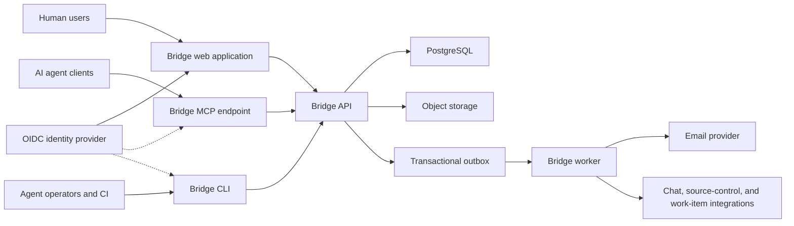
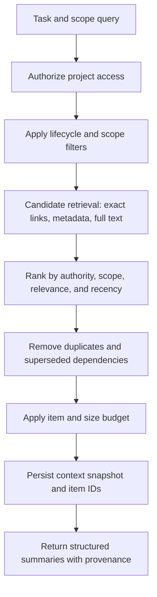

# Bridge Technical Architecture Specification

| Field | Value |
|---|---|
| Status | Approved MVP baseline; implementation validation required |
| Version | 0.1 |
| Last updated | 2026-08-08 |
| Related documents | [Bridge PRD](./bridge-prd.md), [Pilot Decisions](./pilot-decisions.md) |
| Architecture stage | MVP and controlled pilot |

## 1. Purpose

This document translates the Bridge PRD into a buildable technical design. It defines system boundaries, deployable components, data ownership, interfaces, security controls, execution flows, and the recommended MVP implementation shape.

> **Identity scope update (2026-08-10):** The founder reopened authentication and organization work. Configurable OIDC web/API authentication and durable membership resolution are active; fixed principals remain development-only. CLI/MCP OAuth, enterprise provisioning, and PostgreSQL RLS are still incomplete and must not be represented as production-ready.

The design optimizes for:

- A complete human-to-agent decision loop.
- Strong tenant isolation and approval authorization.
- A stable vendor-neutral MCP contract.
- Traceability between requirements, decisions, specifications, and agent runs.
- Low operational complexity during the pilot.
- Clear paths to split or scale components after usage validates the need.

## 2. Architecture principles

1. **Modular monolith first:** Keep domain logic in one application core and deploy separate process types only where runtime behavior differs.
2. **One source of truth:** PostgreSQL owns transactional state. Search indexes, notification systems, and integrations are derived projections.
3. **Server-side authority:** Agent prompts and client UI never determine authorization.
4. **Immutable approval history:** Accepted decisions, approved artifact versions, and audit events cannot be silently mutated.
5. **Asynchronous external effects:** Notifications, indexing, and integrations run from a transactional outbox.
6. **Protocol independence:** MCP, REST, CLI, and web UI call the same application services and enforce the same policies.
7. **Structured context:** Agents receive ranked records and provenance, not unbounded conversation transcripts.
8. **Progressive enforcement:** Instruction adapters are best-effort; hooks and orchestrated execution add deterministic enforcement later.
9. **No premature infrastructure:** Use PostgreSQL full-text search and a PostgreSQL-backed job queue until measured scale requires dedicated systems.

## 3. Selected implementation stack

The founder-delegated pilot decisions select the following stack. A component should change only when an implementation spike produces evidence that it cannot satisfy the architecture or pilot requirements.

| Concern | Recommended MVP choice | Reason |
|---|---|---|
| Primary language | TypeScript | Shared types across web, API, MCP, CLI, and workers |
| Monorepo | pnpm workspaces with Turborepo | Shared contracts, cached checks, and atomic changes |
| Web application | Next.js with React | Prototype human-review UI, accessible routing, and server rendering |
| API | Fastify with schema-first routing | Strong request validation and predictable REST endpoints |
| MCP server | TypeScript MCP SDK over Streamable HTTP | Cross-client agent interface for Codex and Claude Code |
| CLI | Node.js/TypeScript package; local or checksummed GitHub Release tarball, registry later | Provides an MCP-independent adapter over the same API |
| Database | PostgreSQL | Transactions, relational integrity, JSONB, text search, and row-level security |
| SQL access | Drizzle ORM plus reviewed SQL migrations | Typed queries with control over constraints and tenant policies |
| Job queue | Typed PostgreSQL outbox claim/lease/retry cycle now; pg-boss remains an optional scheduler/queue adapter | Durable downstream intents without requiring MCP or a separate broker in the prototype |
| Artifact storage | Amazon S3 | Durable versioned bodies and attachments |
| Email | Amazon SES behind a notification adapter | Assignment and decision notifications |
| Authentication | Deferred | Not part of the active prototype implementation scope |
| Hosting | AWS ECS Fargate, RDS PostgreSQL, S3, and an Application Load Balancer | One credible hosted deployment boundary for the pilot |
| Observability | OpenTelemetry with CloudWatch | End-to-end MCP/API/job correlation in the selected cloud |

### 3.1 Current persistence implementation checkpoint

The prototype now ships two implementations of the application-owned `BridgeRepository` contract:

- A seeded in-memory repository used when `DATABASE_URL` is absent.
- A PostgreSQL repository using Drizzle ORM and Postgres.js when `DATABASE_URL` is present.

The reviewed migrations normalize projects, agent runs, continuation locators, assumptions, questions, responses, threaded question comments, decisions, artifacts, immutable artifact versions and their append-only review feedback, context snapshots, audit events, idempotency records, durable in-app notifications, and transactional outbox events. Deferred foreign keys preserve aggregate integrity for acceptance and approval flows that create circular references inside one transaction. Organization/project composite constraints prevent stored tenant identifiers from disagreeing with their parent project. The additive run migration backfills pre-existing question run IDs into metadata-only legacy runs before enforcing run foreign keys. The additive assumption migration enforces low-risk/reversible policy, expiry bounds, lifecycle metadata, and same-project provenance links. The additive project-registration audit migration extends the audit subject constraint to project events. The role-aware question migration adds a backward-compatible `owner_roles` JSON array for lightweight role routing; later additive migrations persist protected reviews, clarification comments, notification records, outbox delivery state, versioned decision-lifecycle provenance with same-project replacement links, and specification review comments/change requests.

Project registration, run registration/status/provenance, assumption creation/resolution/expiry, question creation, response proposal, threaded comment creation, decision acceptance/lifecycle transition, artifact publication, artifact approval, notification plus outbox creation/read updates, and context-snapshot creation execute through a repository transaction boundary. The PostgreSQL implementation uses serializable transactions and locks run, assumption, question, decision, artifact, notification, and claimed outbox rows before concurrency-sensitive updates. API startup never runs migrations automatically; migrations remain an explicit operator/release action.

Row-level security, production database roles, external delivery adapters, and live identity-provider/deployment validation remain future work. OIDC plus application membership checks materially improve the boundary but are not by themselves a complete production tenant-security implementation.

## 4. System context



## 5. Deployable components

### 5.1 Web application

Responsibilities:

- Prototype navigation and dynamic registered-project selection.
- Inbox, question discussion, decision acceptance, artifact review, assumptions, and run views.
- Administrative configuration for ownership, roles, policy, and integrations.
- No direct database access from the browser.

The web application calls the public API with an encrypted OIDC session cookie in authenticated mode. Local development can instead use a fixed principal identifier; production startup rejects that mechanism.

### 5.2 Public API

Responsibilities:

- REST API under `/v1`.
- Idempotent project registration plus project list/detail reads for fresh-repository bootstrap.
- Local principal resolution, authorization policy, validation, and rate limiting seams.
- Transactional domain commands and read models.
- Idempotency for all externally retryable writes.
- Creation of audit and outbox events inside the same database transaction.
- Signed upload and download operations for object storage.

The API is the canonical business boundary. MCP and CLI must not bypass it by writing directly to PostgreSQL.

### 5.3 MCP gateway

Responsibilities:

- Expose the approved Bridge MCP tools through Streamable HTTP.
- Translate tool calls into application commands or queries using the fixed prototype agent principal.
- Attach agent identity, organization, project scope, correlation ID, and idempotency metadata.
- Return stable structured errors suitable for agent recovery.
- Publish concise server instructions that describe mandatory Bridge behavior.

The MCP gateway may share a process with the API during local development, but it should have a separately deployable entry point so it can receive independent rate limits, timeouts, and monitoring.

In the implemented standalone process, MCP and API use the same migrated PostgreSQL repository. MCP deliberately refuses to start without `DATABASE_URL`; running an independent in-memory MCP repository would make agent writes invisible to REST and the web UI. This durable requirement applies only when MCP is enabled—the default API/web/CLI demo remains MCP-independent and may use the seeded in-memory repository.

### 5.4 Worker

Responsibilities:

- Claim and process transactional outbox events with leases, bounded retries, and dead-letter state; the current `runOutboxCycle` accepts an injected delivery handler.
- Deliver email and team-channel notifications.
- Maintain full-text search documents and optional derived embeddings later.
- Perform duplicate suggestions, conflict scans, expiry jobs, and impact analysis.
- Synchronize external links and integration metadata.
- Retry transient failures with bounded exponential backoff and dead-letter handling.

### 5.5 CLI

Responsibilities:

- Repository-to-project initialization.
- Fixed-principal fresh-project registration for the local prototype.
- Client-native instruction generation with managed-block safe merging.
- Adapter-only activation/switching through `bridge install` without project registration.
- Safe `init --dry-run` previews for project registration and adapter files.
- Local tarball packaging, isolated installed-binary smoke coverage, and tag-driven checksummed GitHub Release creation; registry publication remains future work.
- `doctor` diagnostics for API reachability, project mapping, generated instructions, and adapter markers.
- Human-friendly access to context, questions, assumptions, and artifact publishing.
- Filtered human inbox reads through `bridge inbox` for operators who do not use the web UI.
- Bounded polling for accepted decisions.
- Stable JSON output by default, opt-in human-readable success output, JSON errors with stable exit codes, and repository snapshots for CI and restricted environments.

### 5.6 Agent adapters

Responsibilities:

- Generate client-specific project instructions and record/probe an optional approved MCP endpoint; vendor-specific MCP configuration generation, discovery, and authentication remain future adapter work.
- State the required preflight, search-before-question, and protected-action rules.
- Declare integration capability level: instructions, MCP, hooks, and continuation.
- Preserve unrelated user configuration and support a dry-run diff.

Adapters do not own canonical policy. They project policy from `.bridge/` and the server.

The implemented bootstrap supports Codex `AGENTS.md`, Claude Code `CLAUDE.md`, Cursor `.cursor/rules/bridge.mdc`, and Copilot `.github/copilot-instructions.md`. The marked Bridge block is safely replaced on regeneration while unrelated file content is retained. `bridge init --dry-run` previews create/update/unchanged actions without API or filesystem mutation, and `bridge doctor` verifies the API, project mapping, generated instructions, selected adapter marker, and—only when configured—an MCP JSON-RPC `initialize` response. Packaged entrypoint detection resolves pnpm symlinks to the real module path, and the generated workflow documents `./node_modules/.bin/bridge` as a no-reinstall fallback when unrelated dependency policy blocks `pnpm exec`. `bridge conformance` verifies observable run/context/question/specification provenance and the human boundary. This instruction-driven layer is best-effort: it cannot universally intercept a vendor-native clarification prompt when the client exposes no hook.

## 6. Repository structure

Recommended monorepo layout:

```text
bridge/
  apps/
    web/                 # authenticated React application
    api/                 # REST API entry point
    mcp/                 # Streamable HTTP MCP entry point
    worker/              # background jobs and integrations
    cli/                 # bridge command-line client
  packages/
    domain/              # entities, state machines, domain errors
    application/         # commands, queries, authorization policies
    database/            # schema, migrations, repositories, transactions
    contracts/           # REST/MCP schemas and generated client types
    auth/                # token verification, principals, scopes
    audit/               # audit-event creation and serialization
    search/              # ranking and query pipeline
    integrations/        # email/chat/source-control interfaces
    adapters/            # agent-specific generators
    observability/       # logging, tracing, metrics helpers
    test-support/        # factories, fixtures, tenant test helpers
  config/
    policy-templates/
  docs/
  infra/
    containers/
    deployment/
  package.json
  pnpm-workspace.yaml
```

Package boundaries must be enforced by lint rules or dependency tests:

```text
transport/UI -> application -> domain
                         \-> repository interfaces
infrastructure implements repository and integration interfaces
```

The domain package must not depend on web frameworks, MCP transports, SQL clients, or vendor SDKs.

## 7. Tenant and identity model

The web/API foundation implements the human OIDC portion of this model. Other principal flows remain the target architecture and are identified below where incomplete.

### 7.1 Principal types

| Principal | Authentication | Typical permissions |
|---|---|---|
| Human user | Browser/CLI OAuth | Project membership and role-based actions |
| Agent identity | OAuth client or delegated agent token | Read approved context; create questions, assumptions, drafts, and run events |
| CI identity | Client credentials or workload identity | Restricted artifact publishing, linking, and checks |
| Integration identity | Signed webhook or OAuth installation | Restricted synchronization operations |
| Internal worker | Workload identity | Consume outbox and invoke internal application services |

### 7.2 Token claims

Access tokens should provide or resolve:

- `subject`
- `principal_type`
- `organization_id`
- `audience`
- scopes
- optional project restrictions
- authentication method
- expiry and token ID

MCP tokens must use a dedicated audience and should not be reusable as unrestricted web sessions.

### 7.3 Selected authentication flows

- Web: Auth0 Authorization Code flow.
- CLI: Authorization Code with PKCE and a localhost callback.
- MCP: Auth0-backed OAuth using protected-resource and authorization-server metadata.
- CI: Client Credentials for a dedicated Bridge service identity.
- Enterprise SSO: Auth0 federation to the customer's identity provider.

The CLI does not use Device Authorization Flow because organization-scoped behavior is required for Bridge tenancy.

### 7.3 Authorization model

Use RBAC for broad capabilities and ABAC/policy checks for record-specific authority.

Examples:

- A contributor can create a question in a project where they are a member.
- An agent can create a draft but cannot approve it.
- A decision owner can accept an ordinary decision only when the question scope overlaps their configured authority.
- A protected approval may require two distinct roles.
- An organization administrator can manage policy but should not silently impersonate a decision owner; administrative override is explicit and audited.

Every application command receives an immutable `PrincipalContext` and a resolved `AuthorizationContext`.

## 8. Tenant isolation

Every tenant-owned table includes `organization_id`; project-owned tables also include `project_id`.

Defense in depth:

1. Token audience and organization validation at the edge.
2. Organization and project membership checks in application services.
3. Repository methods require tenant scope explicitly.
4. PostgreSQL row-level security on tenant-owned tables.
5. Composite foreign keys include tenant identity where practical.
6. Object-storage keys begin with an opaque organization and project prefix.
7. Queue payloads contain record IDs, not sensitive record bodies.
8. Automated cross-tenant tests run against every externally accessible query and command.

The application sets the active tenant in the database transaction using a local transaction parameter. Database access without a tenant must fail closed except for narrowly defined administrative maintenance roles.

## 9. Data architecture

### 9.1 Identifier and timestamp conventions

- Use sortable globally unique identifiers such as UUIDv7.
- Store timestamps in UTC with timezone-aware database types.
- Expose opaque IDs; never expose sequential tenant record counts.
- Add `created_at`, `created_by`, and where applicable `version` to mutable records.
- Use optimistic concurrency with an integer `version` or explicit expected state.

### 9.2 Core tables

The following is the logical schema. Physical names may change during migrations.

#### Organization and access

```text
organizations
users
organization_memberships
teams
team_memberships
roles
role_assignments
projects
project_memberships
repositories
components
ownership_rules
agent_identities
service_identities
```

#### Work and knowledge

```text
work_items
agent_runs
questions
question_options
question_assignments
responses
question_comments
decisions
decision_dependencies
assumptions
artifacts
artifact_versions
artifact_reviews
record_links
context_snapshots
context_snapshot_items
policies
policy_versions
```

#### Reliability and governance

```text
idempotency_keys
audit_events
outbox_events
outbox_deliveries
job_failures
integration_installations
notification_preferences
notifications
```

### 9.3 Important constraints

- A question has at most one accepted response at a time.
- A question may target explicit principal IDs, normalized role names, or both; an assigned matching human role can accept it.
- Human responses are append-only in the pilot discussion surface; final acceptance creates a separate authoritative response/Decision.
- Clarification comments are append-only, optionally reference a same-question parent, and require the current question version.
- Accepting a decision does not overwrite the source response.
- A decision is immutable except for lifecycle metadata; replacement content creates a superseding decision.
- Only one artifact version can be current and approved for the same artifact and exact scope.
- Artifact bodies are content-addressed to prevent accidental duplicate storage.
- Agent identities cannot appear as human approvers.
- A response used as an accepted answer must belong to the same organization and question.
- Every dependency and link must remain within the tenant unless its type explicitly represents an external URL.
- Audit events and accepted records cannot be hard-deleted through ordinary application APIs.

### 9.4 Content storage

Small Markdown bodies may remain in PostgreSQL for MVP simplicity. Attachments and large bodies use object storage with:

- Content hash
- Media type
- Byte size
- Encryption metadata
- Organization/project prefix
- Malware/secret scan status
- Retention class

The database stores immutable artifact-version metadata and the object key. Signed URLs must be short-lived and authorized per request.

## 10. Domain state transitions

State transitions are domain commands, not arbitrary update endpoints.

### 10.1 Question commands

```text
CreateQuestion
OpenQuestion
RequestClarification
AssignQuestion
ProposeAnswer
RejectProposedAnswer
AcceptAnswer
MarkDuplicate
CancelQuestion
ExpireQuestion
```

### 10.2 Decision commands

```text
ReviewDecision
SupersedeDecision
ExpireDecision
RevokeDecision
```

### 10.3 Artifact commands

```text
CreateArtifact
PublishArtifactVersion
RequestArtifactReview
SubmitArtifactReview
ApproveArtifactVersion
SupersedeArtifactVersion
ArchiveArtifact
```

The API returns `409 Conflict` when an expected version or state no longer matches.

## 11. Critical transaction flows

### 11.1 Accept answer

The `AcceptAnswer` command performs one database transaction:

1. Lock or version-check the question.
2. Verify it is accept-capable and the proposed response belongs to it.
3. Resolve decision authority from principal, scope, ownership, and policy.
4. Verify required protected approvers, if any.
5. Mark the response accepted and the question accepted/closed.
6. Insert an immutable decision referencing the question and response.
7. Insert dependency/link rows.
8. Insert an audit event.
9. Insert `decision.accepted` and `question.closed` outbox events.
10. Commit and return the decision.

If any step fails, no partial acceptance is visible.

### 11.2 Approve artifact version

1. Lock the artifact and proposed current version.
2. Confirm review and approval requirements, including that no append-only `changes_requested` review exists on this exact version.
3. Confirm approver authority.
4. Mark the previous current approved version superseded when appropriate.
5. Mark the proposed version approved/current.
6. Record cited decisions and assumptions.
7. Write audit and outbox events.

Formal specification reviewers may first append `commented` or `changes_requested` feedback to the current draft/in-review version. A change request never edits the Markdown body and permanently blocks approval of that exact version; the author publishes a new version with an empty review history, while any previously approved version remains authoritative until a replacement is approved.

### 11.3 Change decision lifecycle

1. Lock and version-check the active decision.
2. Require its human owner, a configured project decision owner, or a project administrator.
3. For supersession, require a different active replacement with the same project, category, and exact scope.
4. Change only lifecycle metadata; the accepted answer, rationale, source question, and response remain immutable.
5. Collect directly cited artifacts, decision-confirmed assumptions, source/provenance runs, later runs whose context snapshots consumed the decision, and scoped work-item identifiers as potentially affected records.
6. Persist the transition, audit event, `decision.lifecycle_changed` outbox event, and any recipient notifications plus `notification.created` delivery intents in one transaction.
7. Exclude the retired decision from subsequent default context while preserving it in history reads.

### 11.4 Record assumption

1. Validate scope, risk, reversibility, expiry, and source run.
2. Apply server policy; reject assumptions for protected categories.
3. Search for direct contradiction with active exact-scope decisions.
4. Insert assumption, audit event, and optional review notification event.

Current prototype behavior adds these conservative rules:

- Only `low` risk and `reversible: true` are accepted.
- Protected categories cannot use assumption behavior.
- Non-human creators must supply a source run.
- Expiry defaults to seven days and cannot exceed 30 days.
- Exact normalized duplicates and direct textual negations of active same-category/exact-scope decisions return `CONFLICT` with the decision ID.
- Human decision owners/project administrators resolve assumptions with an expected version and rationale.
- Active due assumptions are durably expired during authoritative reads until the scheduled worker/outbox adapter exists.

## 12. REST API

### 12.1 Conventions

- Base path: `/v1`
- JSON request and response bodies.
- Schema validation at the transport boundary.
- Cursor pagination for collections.
- RFC-style problem details with stable Bridge error codes.
- `Idempotency-Key` required for agent and integration create operations.
- `If-Match` or expected-version field for concurrency-sensitive commands.
- Correlation ID accepted from trusted clients or generated at ingress.
- All timestamps use ISO 8601 UTC.

### 12.2 Initial endpoint groups

```text
GET    /v1/auth/config
GET    /v1/auth/login
GET    /v1/auth/callback
GET    /v1/auth/logout
GET    /v1/auth/me
GET    /v1/principals
GET    /v1/organizations/:organizationId/projects
POST   /v1/projects
GET    /v1/projects/:projectId
GET    /v1/projects/:projectId/context

POST   /v1/projects/:projectId/questions
POST   /v1/projects/:projectId/questions/matches
GET    /v1/questions/:questionId
GET    /v1/projects/:projectId/questions
POST   /v1/questions/:questionId/responses
POST   /v1/questions/:questionId/comments
POST   /v1/questions/:questionId/reviews
POST   /v1/questions/:questionId/assignments
POST   /v1/questions/:questionId/accept
POST   /v1/questions/:questionId/duplicate

GET    /v1/projects/:projectId/decisions
GET    /v1/decisions/:decisionId
POST   /v1/decisions/:decisionId/supersede
POST   /v1/decisions/:decisionId/expire
POST   /v1/decisions/:decisionId/revoke
POST   /v1/decisions/:decisionId/lifecycle

POST   /v1/projects/:projectId/assumptions
GET    /v1/projects/:projectId/assumptions
POST   /v1/assumptions/:assumptionId/confirm
POST   /v1/assumptions/:assumptionId/reject

POST   /v1/projects/:projectId/artifacts
GET    /v1/artifacts/:artifactId
GET    /v1/artifacts/:artifactId/diff?fromVersionId=&toVersionId=
POST   /v1/artifacts/:artifactId/versions
POST   /v1/artifact-versions/:versionId/reviews
POST   /v1/artifact-versions/:versionId/approve

POST   /v1/projects/:projectId/runs
GET    /v1/projects/:projectId/runs
PATCH  /v1/runs/:runId
GET    /v1/runs/:runId
POST   /v1/runs/:runId/continuation

GET    /v1/projects/:projectId/inbox?status=&risk=&category=&role=
GET    /v1/notifications?projectId=&unreadOnly=
POST   /v1/notifications/:notificationId/read
POST   /v1/notifications/read-all
GET    /v1/projects/:projectId/search
GET    /v1/projects/:projectId/audit-events
GET    /v1/admin/projects/:projectId/outbox?status=&type=&limit=
POST   /v1/admin/outbox/:eventId/replay
GET    /v1/admin/projects/:projectId/analytics?client=&startedFrom=&startedTo=
```

Decision collection semantics are intentionally conservative: `GET /v1/projects/:projectId/decisions` returns active decisions unless the caller supplies `includeHistory=true` or an explicit lifecycle `status`. `search` queries answer, rationale, and category text after tenant/project authorization; PostgreSQL uses a weighted `simple` text-search vector with answer weighted above rationale and category, while the in-memory adapter applies deterministic all-token matching with the same field weights. Authorized callers can combine search with exact case-insensitive category, owner, inclusive creation-time range, and any supplied exact scope dimensions (`repository`, `component`, `branch`, `environment`, and `workItem`). `createdFrom` must not be later than `createdTo`. Lifecycle history remains an explicit human browsing concern; agent context retrieval continues to include active decisions only. The MCP decision-search tool delegates to this application query and does not define a separate authority or matching path.

Artifact version comparison is an authorized, derived read over two immutable versions of the same artifact. The application layer verifies artifact access and version ownership before comparing normalized lines. It uses an exact longest-common-subsequence diff within a fixed one-million-cell and 5,000-line-per-side budget; larger inputs fall back to deterministic removed/added regions. Responses include complete counts and provenance but cap rendered lines at 2,000 so the browser degrades predictably. Comparison does not write an artifact, version, audit event, or outbox event, and it never changes stored Markdown or hashes.

Administrative endpoints are separated under `/v1/admin`. Outbox operations and project analytics require a human project administrator for the target project whether the principal came from OIDC or development fixtures. Additional OAuth admin scopes remain deferred.

`GET /v1/principals` returns active same-organization human directory summaries after authentication. Development mode uses those summaries for the **Reviewing as** policy switcher; OIDC mode hides impersonation and keeps the signed-in identity. The inbox endpoint accepts validated status, risk, category, and assigned-role filters after authority routing; it does not yet support due dates or saved filter state. Protected questions also expose a separate security-review command before a non-security owner may finalize acceptance. Notifications are human-only, project-scoped, and readable through REST/web whether or not MCP is approved; ordinary agent principals receive a deterministic denial.

## 13. MCP architecture

### 13.1 Endpoint and session behavior

- Serve Streamable HTTP at a versioned endpoint such as `/mcp` with protocol negotiation handled by the MCP library.
- Authenticate before MCP initialization completes.
- Attach a stable agent identity and optional delegated human operator.
- Keep MCP sessions stateless with respect to domain data; durable state lives in Bridge.
- Enforce shorter read timeouts and bounded write timeouts.
- Return URLs for human review but never require the agent to scrape the web UI.

### 13.2 Tool-to-application mapping

| MCP tool | Application operation |
|---|---|
| `bridge_start_run` | `StartAgentRun` command |
| `bridge_report_run` | `ReportAgentRun` command |
| `bridge_get_run` | `GetAgentRun` query |
| `bridge_get_continuation` | `GetRunContinuation` query/audited read |
| `bridge_get_context` | `GetProjectContext` query |
| `bridge_get_assumption` | `GetAssumption` query |
| `bridge_list_assumptions` | `ListAssumptions` query |
| `bridge_search_decisions` | `SearchDecisions` query |
| `bridge_find_question_matches` | `FindQuestionMatches` query |
| `bridge_get_question` | `GetQuestion` query |
| `bridge_list_pending` | `ListPendingForRunOrWorkItem` query |
| `bridge_list_inbox` | `ListQuestionInbox` query with status/risk/category/role filters |
| `bridge_create_question` | `CreateQuestion` command |
| `bridge_record_assumption` | `RecordAssumption` command |
| `bridge_publish_artifact` | `PublishArtifactVersion` command |
| `bridge_get_artifact` | `GetArtifactVersion` query |
| `bridge_request_artifact_review` | `RequestArtifactReview` command |

Human acceptance and approval operations are intentionally absent from ordinary agent tool lists.

### 13.3 Tool metadata and approvals

Tools should declare accurate read/write behavior so clients can apply approval policies. The server must still enforce authorization even if a client auto-approves a tool call.

Recommended logical scopes:

```text
bridge:context:read
bridge:questions:read
bridge:questions:create
bridge:assumptions:create
bridge:artifacts:read
bridge:artifacts:publish
bridge:runs:write
```

### 13.4 Idempotency

The MCP gateway derives or accepts an idempotency key from:

```text
organization + agent identity + run ID + tool + client idempotency key
```

The stored idempotency record includes request hash, response status, response reference IDs, and expiry. Reuse with a different request hash returns `CONFLICT`.

## 14. Context retrieval pipeline



### 14.1 MVP ranking formula

Use a deterministic weighted score initially:

```text
score = authority_weight
      + scope_match_weight
      + explicit_link_weight
      + full_text_relevance
      + bounded_recency_weight
```

Active approved decisions receive the highest authority weight. Active assumptions are clearly labeled and rank below approved context. Superseded, revoked, and expired records are excluded by default.

### 14.2 Context snapshots

Persist the IDs and versions returned to an agent run. This makes it possible to explain which context was available without storing or replaying the model's hidden reasoning.

## 15. Search and duplicate detection

### 15.1 Implemented pilot matching

- Eligible candidates are unresolved questions and accepted questions whose decisions remain active.
- Exact comparison uses Unicode normalization, case/punctuation folding, category, type, and exact scope.
- Related scoring uses deterministic title/context token overlap plus category, type, and scope signals.
- Results include the question ID, lifecycle state, decision ID when present, scope, score, match kind, and explainable reasons.
- The current repository-service scan is appropriate for the pilot corpus and keeps behavior identical in memory and PostgreSQL.

### 15.2 Duplicate suggestion

The read-only match query and question-creation guard perform a bounded pre-check:

1. Compare normalized title and context within category, type, and exact scope.
2. Rank related lexical candidates above the conservative threshold.
3. Return active accepted decisions and unresolved questions.
4. On creation, require risk, reversibility, and blocking policy to match before exact reuse.
5. Atomically link a reused question to the new run and preserve the existing human review/decision path.

Exact policy-equivalent questions are automatically reused. Semantic or merely related candidates remain advisory and are never merged automatically. The submission response distinguishes `created`, `idempotent_replay`, `reused_pending`, and `reused_accepted`.

### 15.3 Later retrieval enhancement

Add PostgreSQL full-text/trigram indexes after corpus and latency measurements justify them. Add vector retrieval only after evaluation shows material recall improvements. Any derived search index must contain tenant scope and be rebuildable from canonical records.

## 16. Event and job architecture

### 16.1 Transactional outbox

Every material command writes domain state, audit events, and outbox events in one transaction. Workers claim events using database locking and record delivery attempts.

Event envelope:

```json
{
  "event_id": "evt_...",
  "event_type": "decision.accepted.v1",
  "occurred_at": "2026-08-07T10:30:00Z",
  "organization_id": "org_...",
  "project_id": "prj_...",
  "actor": {
    "type": "human",
    "id": "usr_..."
  },
  "subject": {
    "type": "decision",
    "id": "dec_..."
  },
  "correlation_id": "cor_...",
  "payload": {
    "question_id": "qst_..."
  }
}
```

Avoid placing complete artifact bodies, secrets, or raw tokens in events.

The implemented prototype persists `notification.created` for each durable in-app notification and `decision.lifecycle_changed` for every authoritative supersede, expire, or revoke transition. Notification payloads contain the notification ID, recipient, notification type, and target pointer; the full notification body remains in the canonical notification table. Decision lifecycle payloads contain only decision/replacement IDs, terminal state, and the human actor ID. `0008_transactional_outbox.sql` adds `pending`, `processing`, `processed`, `failed`, and `dead_letter` state, an availability timestamp, a five-minute lease, attempt count, and the tenant/project boundary; the additive lifecycle migration extends its type constraint.

### 16.2 Initial event types

```text
question.created.v1
question.assigned.v1
question.clarification_requested.v1
question.closed.v1
decision.accepted.v1
decision.superseded.v1
assumption.recorded.v1
assumption.expiring.v1
assumption.rejected.v1
artifact.version_published.v1
artifact.review_requested.v1
artifact.version_approved.v1
run.waiting_for_human.v1
run.completed.v1
policy.updated.v1
```

### 16.3 Delivery guarantees

- At-least-once job delivery.
- Idempotent handlers keyed by event ID and integration installation.
- Bounded retry with exponential backoff and jitter.
- Dead-letter state after configured attempts.
- Operator-visible failure and replay controls.
- No external notification failure may roll back an accepted decision.

The worker slice claims with leases, records attempts, completes successes, reschedules failures with bounded exponential backoff, and dead-letters events at the configured budget. Project administrators can inspect a project-scoped queue snapshot with status counts, total attempts, ready work, expired leases, oldest-ready age, and privacy-minimized per-channel delivery receipts. Failed or dead-letter events can be requeued with an optimistic attempt-count check; replay preserves the event ID for downstream idempotency, resets delivery state, and writes an audit event in the same transaction. The email handler passes a stable event/channel idempotency key to an injected provider and skips an already delivered receipt. Jitter, live provider implementations, time-series telemetry, and scheduled runtime wiring remain deployment work.

## 17. Notification architecture

Notification generation is separate from delivery:

1. The application command resolves the current direct owner/reviewer recipients.
2. In one repository transaction it creates the durable in-app notification and a `notification.created` outbox intent.
3. The worker claims the intent, applies retry/dead-letter policy, and invokes an injected channel handler.
4. The provider-neutral email handler resolves the recipient and immediate/digest/muted preference through an injected directory, renders bounded plain text, and calls an injected sender without persisting the address.
5. `outbox_deliveries` records the destination hash, preference outcome, attempt, delivery status, sanitized error, and provider message ID. The in-app notification remains the canonical human read model.
6. A future scheduled runtime wires a live directory and SES sender; deferred digest receipts become inputs to a digest job rather than credentials or addresses stored in the outbox.

Protected-review email bypasses muted/digest preferences in the current policy seam. Ordinary notifications support immediate delivery, explicit suppression, or durable digest deferral. The actual digest scheduler and administrative preference store are not yet connected.

Team-channel messages should link to Bridge for final acceptance. Accepting a consequential decision directly from chat should be deferred until identity, replay, and confirmation semantics are proven.

## 18. Agent run and continuation design

### 18.1 Run record

An agent run stores:

- Agent identity and client/adaptor type
- Optional delegated human operator
- Project, repository, component, branch, and work item
- Concise task summary
- Capability level
- Status and timestamps
- Context snapshot IDs consumed
- Questions, assumptions, artifacts, and external links produced
- Completion summary and result links

It does not require raw prompts, outputs, or hidden reasoning.

### 18.2 Continuation locator

When a run blocks, Bridge returns a durable continuation descriptor:

```json
{
  "runId": "run_42",
  "status": "waiting_for_human",
  "remainingQuestionIds": ["qst_184"],
  "acceptedDecisionIds": [],
  "canContinue": false
}
```

The caller supplies the opaque locator with this query. It maps to project and run state but grants no authority by itself. Project access is checked independently. Ordinary run get/list operations do not return the key; it is returned by the idempotent run-start registration and supplied explicitly to continuation operations.

Creating a linked blocking question changes the run from `running` to `waiting_for_human` atomically. Accepting an answer does not silently resume a client. A continuation read returns accepted decision IDs, unresolved blocker IDs, and whether a new run may begin. Once all blockers resolve, the later session supplies both `continuesRunId` and the locator when registering its new run.

### 18.3 Adapter-specific auto-resume

Auto-resume adapters subscribe to accepted-decision events and invoke a vendor-supported continuation mechanism. Bridge records the attempt and result. Unsupported adapters notify the operator and rely on manual continuation.

### 18.4 Current implementation checkpoint

The prototype implements the manual continuation baseline across the application service, in-memory repository, PostgreSQL repository, REST, MCP, and CLI:

- Run start is idempotent and returns a metadata-only run plus a 32-byte random base64url locator.
- Context snapshots, questions, and artifact versions are linked to a non-terminal run in the same transaction that creates them.
- Run status changes require `expectedVersion`; terminal states cannot transition again.
- Unresolved blocking questions prevent both `running` and `completed` outcomes.
- `completed` and `failed` require a concise summary; all statuses may add result links.
- The locator is stored separately from the public run record. It is currently stored as a value to allow exact replay of an idempotent start response; hashing or encryption at rest belongs to a future production identity/security slice.
- The implementation never persists raw prompts, full outputs, transcripts, repository source, or hidden reasoning.

Automatic vendor-session resume is not implemented. The web application provides a read-only run list/detail and source-record navigation, while continuation itself remains an explicit CLI/API operation into a linked later run. In-app human notifications and their transactional outbox intents are implemented for core question/review/specification events; external channels, preferences, scheduled delivery, and telemetry export remain future work.

## 19. Audit design

Audit events record:

- Actor and effective principal
- Action and subject
- Organization and project
- Timestamp and correlation ID
- Authentication method
- Before/after state identifiers or version numbers
- Reason supplied for protected actions
- Request source: web, API, MCP, CLI, worker, integration

Avoid placing full sensitive content in the audit log. Use immutable record IDs and content hashes. Exports are themselves audited.

## 20. Security design

### 20.1 Threat boundaries

- Browser to web/API
- Agent client to MCP gateway
- CLI/CI to API
- API to identity provider
- API/worker to database and object storage
- Worker to external integrations
- Untrusted artifact or linked content entering Bridge

### 20.2 Required controls

- TLS for all network communication.
- Strict token audience, issuer, signature, expiry, and scope validation.
- CSRF protection for cookie-backed web commands.
- Content Security Policy and output encoding in the web UI.
- Input size limits and schema validation on every transport.
- Rate limits by organization, principal, endpoint, and tool.
- Secret and malware scanning for content and attachments.
- Signed webhook verification and replay protection.
- SSRF protection for integration and external-link fetchers.
- Parameterized SQL and migration review.
- Dependency and container scanning in CI.
- Encryption using managed keys, with a path to tenant-specific keys later.
- Break-glass administration that is time-bound, justified, and audited.

### 20.3 Agent-specific threats

| Threat | Control |
|---|---|
| Agent attempts self-approval | Approval commands absent from agent scopes and rejected server-side |
| Prompt injection requests protected action | Protected policy always requires authorized human approval |
| Agent leaks retrieved tenant context | Project-scoped tokens, minimal context, output guidance, and audit |
| Agent floods questions | Tool rate limits, per-run budgets, batching policy, and quality metrics |
| Malicious artifact becomes instruction | Trust labels and separation of data content from server instructions |
| Forged provenance | Server assigns actor and timestamps; clients cannot supply authoritative values |

## 21. Privacy and retention

- Minimize collection to structured project knowledge and lifecycle metadata.
- Raw session capture is out of scope and disabled.
- Support organization-configurable retention for drafts, run metadata, notifications, and audit events.
- Preserve accepted decision and approval history according to governance policy.
- Provide export before destructive tenant deletion.
- Delete object bodies and derived indexes through a verifiable asynchronous workflow.
- Keep deleted-record tombstones only where required for audit, security, or referential integrity.
- Document model-provider data flows separately for any AI-assisted explanation, routing, or summarization feature.

## 22. Observability

### 22.1 Correlation

Propagate one correlation ID across:

```text
agent/client -> MCP/API -> application command -> database/outbox -> worker -> integration
```

The current vendor-neutral implementation validates or generates `x-bridge-correlation-id` at web/CLI/API/MCP boundaries, establishes async request context, creates a context at the repository transaction boundary for direct application use, persists the ID on audit/outbox rows, restores it per worker event, and supplies it explicitly to the email integration seam. Correlation is diagnostic metadata and never replaces principal or tenant authorization.

### 22.2 Metrics

Initial technical metrics:

- Request count, latency, and error rate by bounded endpoint/tool operation.
- Authentication and authorization failures.
- Database pool usage and transaction latency.
- Context retrieval candidate count, latency, and result size.
- Outbox age, queue depth, retry count, and dead-letter count.
- Notification delivery latency and failure rate.
- MCP session and tool-call counts by adapter.
- Idempotency hits and conflicts.
- Cross-tenant test and policy-denial counts.

`@bridge/observability` now implements a dependency-free, process-local metrics registry with fixed recording methods and Prometheus text rendering. Standalone API/MCP runtimes share one registry with the application and PostgreSQL repository and expose `GET /metrics`; in-memory test/runtime paths use the same transaction instrumentation. Outbox and email handlers accept the registry explicitly, preserving the worker/integration boundary. Labels exclude tenant, project, principal, record, and content dimensions; HTTP operations are route templates, unmatched paths collapse to one label, and a 128-operation process budget collapses excess values to `overflow`.

The implemented portable subset covers HTTP request/outcome/duration and `401`/`403` denials, repository transaction outcome/duration, context outcome/duration/candidate/result counts, outbox processing/retry/dead-letter and oldest-claimed age, and email handling outcomes/duration. Database pool utilization, MCP tool-name/session counts, idempotency/conflict counters, and a durable worker exporter remain follow-up instrumentation. The selected PostgreSQL/deployment provider must supply pool-saturation telemetry rather than relying on unstable driver internals.

Provider-neutral operational assets are `config/observability/bridge-pilot-dashboard.json`, `config/observability/bridge-pilot-alerts.yml`, and `docs/service-objectives.md`. They are initial definitions requiring a real metrics backend, rule evaluator, notification route, and pilot calibration; repository presence is not evidence that production monitoring is active.

### 22.3 Logging

Use structured logs with record IDs and correlation IDs. Redact tokens, secrets, authorization headers, artifact bodies, and free-form content by default. Production log access is role-restricted and audited.

`@bridge/observability` implements the local safe JSON logger with an operational-field allowlist, recursive sensitive-key redaction, exception-message removal, and an injectable sink. Standalone API/MCP runtimes avoid framework-default request logging. Production export, access control, retention, dashboard hosting, and alert delivery remain deployment work.

### 22.4 Product analytics

`GET /v1/admin/projects/:projectId/analytics` computes privacy-conscious pilot outcomes from the existing repository boundary. The mandatory path scope plus optional controlled client and inclusive run-start timestamps define a run cohort. The application then aggregates linked context snapshots, questions, responses, decisions, assumptions, and artifact versions. The response contains only counts, rates, durations, controlled client enums, and a collection/exclusion notice; it never returns stored task or record content.

The web **Analytics** view is the pilot product dashboard for the technically available PRD metrics. It shows context compliance, question creation/reuse/routing coverage, response and acceptance activity, later-run decision reuse, assumption resolution, specification approval, question-volume/context-size guardrails, and client breakdowns. This read-time approach adds no schema or duplicate analytics store and works with in-memory or PostgreSQL repositories without MCP.

Routing coverage is owner/role presence, not a claim that the assigned expert was correct. Decision retrieval proves that Bridge returned approved context, not that an agent followed it. Cohorts select runs by start time and report current outcomes rather than immutable historical as-of state. The full definitions, exclusions, and later materialization boundary are in `docs/product-analytics.md`.

## 23. Reliability and performance

### 23.1 Availability model

- API, MCP, and web processes remain stateless and horizontally replaceable.
- PostgreSQL is the primary availability dependency.
- Workers may lag without preventing core decision writes.
- Notification and integration failures degrade asynchronously.
- Object-storage failure prevents large-body access but not metadata and decision operations.

### 23.2 Timeouts

Suggested starting budgets:

| Operation | Server budget |
|---|---:|
| Ordinary API metadata read/write | 5 seconds |
| Context retrieval | 10 seconds |
| MCP read tool | 15 seconds |
| MCP write tool | 20 seconds |
| External integration call | 10 seconds per attempt |
| CLI wait | User-configurable and bounded; default 60 seconds |

These are implementation defaults, not product SLAs, and must be tuned from pilot telemetry.

### 23.3 Backups and recovery

- Production must use automated encrypted PostgreSQL backups with point-in-time recovery and deployment-owned evidence; repository code cannot assert that an external provider control is enabled.
- Current specification bodies live in PostgreSQL and are covered by the same recovery boundary. If object storage is introduced, it must use versioning or equivalent immutable recovery plus lifecycle controls.
- Restores must occur in a new isolated database with workers and external delivery adapters disabled. `pnpm restore:verify` performs read-only schema, migration-history, row-count, artifact-hash, tenant-scope, and artifact-pointer checks.
- Recovery point and recovery time objectives, retention, a dated restore exercise, and exceptions must be documented before the production pilot.
- The canonical operator procedure is `docs/runbooks/backup-restore.md`; repository validation is not a substitute for an actual restore.

### 23.4 Health semantics

- `GET /health/live` reports only that the API or MCP HTTP process can serve a request. The API's legacy `GET /health` remains a liveness alias.
- `GET /health/ready` calls the application repository health boundary. It returns `200` when the dependency responds and a sanitized `503` when it does not.
- Liveness must not depend on PostgreSQL, because restarting a healthy process does not repair a database outage. Traffic routing and rollout gates use readiness.
- Notification-provider failure is degraded delivery, not core API unavailability while canonical PostgreSQL state remains writable. Queue/provider telemetry belongs to BRG-104.
- Worker and CLI are command/process surfaces rather than HTTP services; long-running worker health reporting remains deployment/observability work.

## 24. Environment and deployment model

### 24.1 Environments

```text
local -> shared development -> staging -> production
```

Each environment has separate databases, object-storage namespaces, OAuth clients, encryption keys, and integration credentials.

### 24.2 Local development

The local development mode needs no infrastructure when `DATABASE_URL` is absent and uses seeded in-memory state plus the fixed reviewer switcher. For durable OIDC development, provide PostgreSQL, run `pnpm db:migrate`, configure the issuer/audience/client/session variables documented in `docs/authentication.md`, and start the API. Production mode fails startup without OIDC; the fixed principal header is development-only.

### 24.3 Deployment units

Build one source revision into separately runnable images or commands:

```text
bridge-web
bridge-api
bridge-mcp
bridge-worker
```

Migrations run as an explicit release job before compatible application rollout. Prefer backward-compatible expand/migrate/contract database changes.

### 24.4 Selected production infrastructure

The private pilot runs in AWS `ap-south-1`:

- ECS Fargate services for `bridge-web`, `bridge-api`, and `bridge-mcp`.
- An ECS Fargate worker service for background jobs.
- Application Load Balancer with TLS termination and service routing.
- RDS PostgreSQL with automated backups and point-in-time recovery.
- S3 with versioning and lifecycle rules for artifact objects.
- SES for transactional email.
- Secrets Manager and KMS for credentials and encryption keys.
- CloudWatch with OpenTelemetry collection for logs, metrics, and traces.

The pilot is hosted-only and single-region. Dedicated, regional, and self-hosted deployment remain architectural options but are not MVP deliverables.

## 25. Testing strategy

### 25.1 Unit tests

- Domain state transitions.
- Risk policy evaluation.
- Decision authority checks.
- Scope matching and context ranking.
- Adapter file generation and merge behavior.

### 25.2 Integration tests

- PostgreSQL repositories and row-level security.
- Transactional acceptance and artifact approval.
- Idempotency and optimistic concurrency.
- Outbox processing and retry.
- OAuth token validation and scopes.
- Object-storage authorization.

### 25.3 Contract tests

- REST request/response schemas.
- MCP tool names, schemas, errors, and read/write annotations.
- CLI-to-API compatibility.
- Integration adapter events and signed webhooks.

### 25.4 End-to-end tests

1. Agent authenticates and retrieves context.
2. Agent creates a blocking question.
3. Human receives and accepts an answer.
4. Decision is committed and notification dispatched.
5. A new agent run retrieves the decision.
6. Agent publishes a specification and human approves it.
7. Agent attempts self-approval and receives a deterministic denial.
8. A packaged CLI initializes a fresh repository, registers a distinct project, installs client-recognized instructions, and the project appears in the UI with its questions and specifications.

### 25.5 Security tests

- Cross-tenant isolation for every externally accessible operation.
- Role and protected-approval matrix.
- Token audience and scope confusion.
- Webhook replay and signature validation.
- Stored and reflected content injection.
- Malicious external URLs and attachment handling.
- Rate limiting and question flooding.

## 26. Requirement traceability

| Architecture area | PRD requirements |
|---|---|
| Identity, principals, token model | AUTH-01 through AUTH-05 |
| Tenant/project boundaries | AUTH-04, PRJ-01 through PRJ-04 |
| Question domain and routing | QST-01 through QST-09 |
| Decision transactions and lifecycle | DEC-01 through DEC-06 |
| Assumptions | ASM-01, ASM-02 |
| Artifact storage and review | ART-01 through ART-07 |
| Context pipeline | CTX-01 through CTX-04 |
| Agent runs and continuation | RUN-01 through RUN-03 |
| Notifications | NTF-01, NTF-02 |
| Audit and administration | AUD-01, ADM-01, ADM-02 |

## 27. Architecture decision records to create

Before production implementation, record these as formal ADRs:

1. TypeScript modular monolith and monorepo.
2. PostgreSQL tenancy and row-level security strategy.
3. OIDC/OAuth provider and agent authorization flow.
4. Remote MCP server boundary and tool versioning.
5. PostgreSQL-backed queue and transactional outbox.
6. Artifact bodies in PostgreSQL versus object storage thresholds.
7. Context ranking algorithm and evaluation dataset.
8. Agent adapter file-generation and merge safety.
9. Audit retention and tenant deletion behavior.
10. First notification and source-control integrations.

## 28. Technical validation gates

The founder-level choices are resolved in the pilot decision record. Implementation must now validate:

1. Codex and Claude Code can invoke the same MCP tool schemas using the prototype principal seam.
2. CLI-only agents can complete the same context, question, wait, and accepted-answer loop without MCP.
3. Repository snapshots preserve decision IDs, provenance, freshness metadata, and approved content accurately.
4. RDS PostgreSQL row-level security and application scope checks prevent every tested cross-tenant path.
5. ECS and the Application Load Balancer preserve the required Streamable HTTP MCP behavior and timeouts.
6. PostgreSQL full-text and trigram retrieval meet the pilot relevance benchmark without embeddings.
7. The limited declarative policy schema expresses every protected-category rule in the pilot decision record.
8. The 256 KiB PostgreSQL artifact-body threshold behaves correctly across API, MCP, diff, and approval workflows.
9. GitHub metadata access is sufficient for links and direct impact without repository source-content access.
10. AWS `ap-south-1` satisfies the selected design partners' latency and data-location expectations.

The fresh-repository portion of gate 2 is now validated twice for the local Codex-first path. The packaged simulation proved registration, transport, and project-aware presentation. A separate ephemeral Codex CLI session then received only `Build a Hospital Management System.`, used the repository-installed CLI without MCP, linked a context snapshot, published all four required specification types, corrected a missing-question failure reported by `bridge conformance`, routed a protected production-boundary question to human roles, and entered `waiting_for_human`. This proves observable adherence for that Codex client/version/environment, not universal vendor instruction compliance or interception of an unexposed native clarification UI; Claude Code remains the second conformance client.

The shared-response portion of the question loop is also validated locally: a human contributor can add an option-linked answer and rationale, post a version-checked root comment or reply, the configured owner or matching assigned role sees the complete discussion, and only that authorized principal can create the authoritative decision. The personalized inbox now routes direct owners, assigned roles, project administrators, and protected-review principals, with status/risk/category/role filters. Protected questions retain an append-only security-review history and require an approved security review before a non-security owner can finalize acceptance; comment editing, notification preferences, due-date filtering, and reassignment remain future work. Durable in-app notifications now record the core assignment/discussion/review/specification events in the same application transaction, enqueue typed outbox intents, expose scoped REST/web read state, and pass worker retry/dead-letter tests.

Role-aware routing is validated locally: a question assigned to `qa-lead` can be accepted by a matching member, while an ordinary contributor receives a deterministic denial. OIDC memberships now support project-specific role data; administrator-managed role configuration remains deferred.

## 29. Recommended first vertical slice

Build one end-to-end workflow before broadening the schema:

1. Create an organization, project, human owner, and agent identity from development fixtures.
2. Authenticate an MCP client.
3. Call `bridge_get_context` and receive an empty but valid context snapshot.
4. Call `bridge_create_question` and persist a structured blocking question.
5. Display the question in the owner's web inbox.
6. Submit and accept an answer with human authority.
7. Commit the decision, audit event, and outbox events atomically.
8. Notify the operator in-app or by email.
9. Start a second run and retrieve the accepted decision through MCP.
10. Verify the agent cannot accept its own answer and cannot access another tenant.

This slice proves the product's central promise before specifications, rich integrations, semantic search, or automatic continuation are added.
